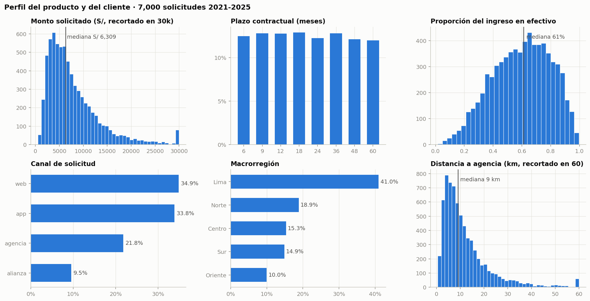
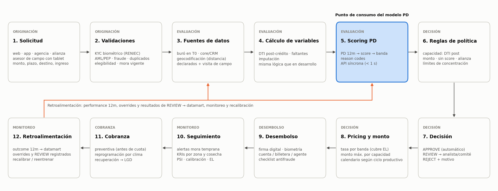
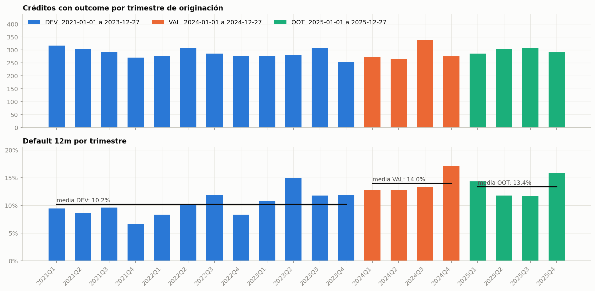

# Documento técnico del modelo

## Sistema de scoring de riesgo crediticio · Caso 15 · Caja Rural 360

**Producto:** microcrédito rural amortizable sin garantía para trabajadores independientes con ingresos parcialmente en efectivo
**Alcance:** secciones 6.1 a 6.15 del Trabajo Integrador Final · Credit Risk & Scoring Analytics · DMC Institute
**Versión del documento:** 1.0 · 2026-09-20
**Modelo champion:** `scorecard_pd_v1` · **PD de producción:** `Platt(PD del scorecard)` · **Política:** `politica_decision_v1`

*Este documento se **genera** desde los quince reportes de sección con `python -m src.techdoc`. No se edita a mano: cualquier
corrección se hace en el reporte de la sección y se vuelve a generar, para que no exista una segunda versión de la verdad.*

---

## Cómo está organizado

Quince secciones en el orden del enunciado, cada una con su propio resumen, evidencia y trazabilidad:

1. **Sección 6.1** — negocio y arquitectura crediticia
2. **Sección 6.2** — definicion modelo y poblacion
3. **Sección 6.3** — data strategy calidad features
4. **Sección 6.4** — eda orientado a riesgo
5. **Sección 6.5** — scorecard tradicional
6. **Sección 6.6** — modelos pd
7. **Sección 6.7** — validacion calibracion
8. **Sección 6.8** — explainability fairness
9. **Sección 6.9** — decision engine
10. **Sección 6.10** — ead
11. **Sección 6.11** — lgd
12. **Sección 6.12** — expected loss stress
13. **Sección 6.13** — arquitectura api mlops
14. **Sección 6.14** — gobierno model risk
15. **Sección 6.15** — monitoring

Después, tres anexos: decisiones y supuestos, trazabilidad de requisitos y reproducibilidad.

**Dónde está la evidencia.** Cada afirmación del documento se apoya en una tabla o figura generada por los notebooks:
90 tablas en `reports/tables/`, 35 figuras en `reports/figures/` y 10 artefactos versionados en `models/`.
Nada se escribió a mano sobre los resultados.

---

## Resumen del trabajo

El encargo era construir el sistema de decisión de crédito para un producto de microcrédito rural: estimar la probabilidad de
incumplimiento, integrarla con exposición y severidad, y convertirla en una política de originación defendible ante un comité
y ante un validador independiente.

**Lo que se construyó.** Un scorecard de tres características (score de buró, capacidad de pago post-crédito y ahorro sobre
monto) con Gini de 0.44 en desarrollo y 0.42 fuera de tiempo, calibrado con Platt, más un motor de decisión que devuelve
APPROVE, REVIEW o REJECT con monto y tasa recomendados, servido por una API con interfaz web y verificado con 103 pruebas
automáticas.

**Los tres hallazgos que cambiaron el trabajo.** Primero, el deterioro de la cartera entre 2021 y 2024 fue de **nivel y no de
mezcla**: la población que llega es la misma, lo que cambió es el riesgo a igual perfil, y eso convierte la calibración en un
control permanente y no en un paso de cierre. Segundo, la pérdida es un problema de **frecuencia y no de severidad**: la LGD
apenas se movió entre cosechas mientras la tasa de default subió 5.4 puntos, así que la palanca es la PD. Tercero, el punto de
corte expresado en PD calibrada funciona como **estabilizador automático**: ante un escenario severo la aprobación cae sola de
64.7% a 36.5% y absorbe 1.5 puntos de pérdida esperada.

**La recomendación.** Aprobación automática con PD calibrada hasta 18%, rechazo sobre 20%, contraoferta automática de monto
cuando la capacidad de pago no alcanza, y revisión manual solo para cuatro reglas verificables. En la cosecha 2025 esa política
aprueba 64.6% con 9.3% de default esperado, contra 81.6% y 13.4% de la política histórica.

**Lo que no se puede prometer.** No existe un punto de corte que cumpla a la vez el objetivo de aprobación de 70% y el límite
de default de 11%: la política llega a 67.2% de aprobación. Ese conflicto se resuelve con la regla de precedencia del apetito
—prevalece el límite de riesgo— y se escala al Comité con los números en la mano, no se disimula moviendo el corte.

---

## Decisiones que definieron el trabajo

| tema                                | decisión                                                                                  | por qué                                                                                              | sección     |
|:------------------------------------|:------------------------------------------------------------------------------------------|:-----------------------------------------------------------------------------------------------------|:------------|
| Población y target                  | Solo créditos con performance observable (5,783 de 7,000); default a 90+ días en 12 meses | Es la definición oficial del caso; los 1,217 rechazados no tienen target observable                  | 6.2         |
| Partición                           | Temporal: 2021-2023 desarrollo, 2024 validación, 2025 out-of-time                         | Un split aleatorio ocultaría el deterioro del entorno, que es el hallazgo central                    | 6.2         |
| Tasa ofrecida                       | Excluida del modelo PD                                                                    | Es endógena: la fija la propia política de crédito                                                   | 6.2         |
| Estacionalidad                      | Descartada la hipótesis de campaña agrícola                                               | Chi² p = 0.89: el rango observado entre meses es menor que el del azar                               | 6.1 y 6.4   |
| Variables sensibles                 | Región, edad, distancia, dependientes e ingreso en efectivo fuera del modelo              | Sin señal estable y con riesgo de fair lending; el veto se aplica también a los challengers          | 6.5 y 6.6   |
| Mora previa                         | Excluida del scorecard pese a tener señal en desarrollo                                   | Se invierte en validación (IV negativo): criterio S6 pre-registrado                                  | 6.5         |
| Champion                            | Scorecard WOE de 3 características sobre modelos de boosting                              | Mejor Gini fuera de muestra, menor brecha de sobreajuste y explicación local exacta                  | 6.6         |
| Calibración                         | Platt (intercepto y pendiente) ajustado en validación, sobre isotónica                    | Preserva el orden y el Gini; la isotónica gana 0.005 de ECE pero cuesta 1.8 puntos de Gini           | 6.7         |
| Punto de corte                      | PD calibrada ≤ 18% automático, rechazo sobre 20%                                          | Máxima aprobación sujeta a default ≤ 11% y pérdida esperada dentro del apetito                       | 6.9         |
| Capacidad de pago                   | Exceder el DTI dispara contraoferta automática de monto, no revisión manual               | La contraoferta es aritmética, no juicio: libera capacidad de análisis para lo verificable           | 6.9         |
| EAD y LGD                           | Baselines globales (0.415 y 0.616) en lugar de modelos                                    | Ningún modelo supera al baseline fuera de muestra con 351 defaults de desarrollo                     | 6.10 y 6.11 |
| Base de la LGD                      | Económica (descontada), con el umbral del apetito restateado en la misma base             | La LGD contable no descuenta 12 meses de workout; cambiar la métrica sin el umbral rompe el semáforo | 6.12        |
| Stress                              | Shock sobre las odds de la PD, no sobre la PD                                             | Reproduce el desplazamiento de nivel observado y no se sale del rango [0, 1]                         | 6.12        |
| Umbral de calibración del monitoreo | ECE medido en ventana móvil de 12 meses                                                   | Con cosechas de 300 créditos, una calibración perfecta ya produce ECE de 0.046 por ruido muestral    | 6.15        |

## Supuestos declarados

| supuesto                                                           | fundamento                                                      | sección   |
|:-------------------------------------------------------------------|:----------------------------------------------------------------|:----------|
| Monto desembolsado = monto solicitado                              | El archivo no distingue ambos                                   | 6.10      |
| Los rechazados históricos se comportan según su PD estimada        | Parceling; el filtro histórico fue débil                        | 6.1 y 6.9 |
| El analista aprueba el 60% de las revisiones                       | Sin dato del proceso; sensibilidad documentada (40% y 80%)      | 6.9       |
| Costo de fondos 6%, gasto operativo 5%, factor de saldo 0.55       | Parámetros de negocio, no estimados del dato                    | 6.9       |
| Capital aproximado con la fórmula IRB de other retail              | Vara comparativa entre escenarios, no requerimiento regulatorio | 6.12      |
| Tasa de descuento de la LGD = tasa efectiva de la política (20.2%) | Se descuenta al rendimiento de lo que se colocaría              | 6.12      |

## Limitaciones conocidas

| limitación                                 | detalle                                                                                                     | sección     |
|:-------------------------------------------|:------------------------------------------------------------------------------------------------------------|:------------|
| Datos sintéticos                           | La LGD es unimodal y ninguna variable de T0 explica EAD ni LGD: no es el comportamiento de una cartera real | 6.11        |
| Exposición incoherente con la amortización | El 49.3% de los defaults implica más de 12 cuotas pagadas (hallazgo V-01)                                   | 6.10        |
| Muestra de defaults chica                  | 351 en desarrollo: impide segmentar EAD y LGD y limita modelos complejos                                    | 6.10 y 6.11 |
| Sin fecha de default                       | No se puede reconstruir la exposición por mes de vida ni modelar el perfil de saldo                         | 6.10        |
| Capacidad de revisión insuficiente         | La política genera 23.2% de revisiones contra 20% declarado (hallazgo V-05)                                 | 6.9         |
| Sin datos protegidos                       | No hay sexo ni etnia: el análisis de fairness se limita a los proxies disponibles                           | 6.8         |

---


# 6.1 Entendimiento del negocio y arquitectura crediticia


> **Evidencia:** las cifras provienen de `notebooks/00_negocio_y_poblacion.ipynb` (tablas en `reports/tables/`, figuras en `reports/figures/`). Los datos son 100% sintéticos y los montos se interpretan en soles (S/) como supuesto. La matriz de etapas parte del trabajo del equipo en `Ciclo_End_To_End.xlsx`.


### 1. Resumen

- **Problema de negocio.** Caja Rural 360 quiere crecer fuera de sus agencias hacia clientes rurales con ingresos parcialmente en efectivo, **sin excluir automáticamente a quien no tiene trazabilidad bancaria** y sin deteriorar la cartera. Hoy el 68.7% de las solicitudes ya llega por web o app.
- **El riesgo se deteriora por frecuencia, no por severidad.** El default 12m subió de **8.6% (2021) a 14.0% (2024) y 13.4% (2025)**, y la pérdida realizada pasó de 1.9% a 4.0% del monto desembolsado. En cambio, la LGD (≈62%), la exposición al default (≈42% del monto) y la composición de la población se mantienen estables.
- **La política histórica no controlaba la capacidad de pago.** Aprobó 82.6% de las solicitudes con un filtro débil basado sobre todo en buró. Aprobó igual a clientes con DTI post-crédito > 60% (default 16.8%), que representan 21.6% del monto aprobado.
- **Qué resuelve el modelo.** Estima la **PD a 12 meses de cada solicitud nueva** y se consume **en línea en el paso 5 del ciclo**: después de las validaciones y del enriquecimiento de datos, antes de las reglas de capacidad, la decisión APPROVE / REVIEW / REJECT, la tasa y el monto.
- **Risk Appetite.** Se proponen 14 métricas con semáforo en cinco dimensiones. La cosecha 2025 queda en **rojo** en default, en tickets > S/ 20,000 y en capacidad de pago. La meta es volver a un default ≤ 11% y un EL ≤ 3% manteniendo la aprobación en al menos 70%. Se verificó que esas metas son compatibles entre sí en 2021-2024; en 2024 el margen es chico (aprobación máxima de 72%, limitada por la EL), así que el apetito fija que **los límites de riesgo prevalecen sobre el objetivo de aprobación**.

---

### 2. Ficha del negocio

| Elemento | Descripción | Evidencia en los datos |
|---|---|---|
| **Entidad** | Caja Rural 360: entidad microfinanciera regulada (ficticia, tipo Caja Rural de Ahorro y Crédito). Opera con agencias, asesores de negocio de campo, canales digitales y alianzas locales. | `entity` constante |
| **Producto** | Microcrédito rural amortizable en cuotas fijas, **no revolvente y sin garantía real**. | Los 7 campos de garantía y de producto revolvente están 100% vacíos (`collateral_value`, `ltv`, `credit_limit`, `ccf_observed`, etc.) |
| **Cliente objetivo** | Hogares rurales con actividad económica propia o mixta (agricultura, ganadería, comercio, oficios, transporte), con ingresos estacionales y en parte en efectivo. Muchos no tienen historial en la Caja y algunos tampoco en buró. | Edad mediana 38 años (18-72); 2.2 dependientes en promedio; **60% del ingreso en efectivo** (mediana 61%); 44.5% clientes nuevos; 3.3% sin score de buró |
| **Necesidad financiera** | Capital de trabajo para el ciclo productivo (insumos, semillas, animales, mercadería) y activo productivo menor (moto, herramientas, mejoras). La necesidad es estacional y exige respuesta rápida. | La necesidad puede ser estacional, pero el default no depende del mes de originación (chi² p = 0.89): el mes no se usa como variable ni como regla |
| **Canal** | Web (34.9%), app (33.8%), agencia (21.8%) y alianza (9.5%: cooperativas, asociaciones de productores, comercios). La app puede usarse asistida por el asesor de campo. | 68.7% digital; alianza = 667 solicitudes |
| **Monto** | Ticket bajo. Rango propuesto: de S/ 500 a S/ 20,000 con decisión automática; entre S/ 20,000 y S/ 30,000 solo con revisión manual; por encima de S/ 30,000 corresponde a otro producto. | Mediana S/ 6,309; p5-p95 S/ 2,065-18,937; 4.2% de las solicitudes pasa de S/ 20,000 (14.5% del monto aprobado); máximo S/ 78,915 |
| **Plazo** | De 6 a 60 meses. Conviene que el calendario de pagos siga el ciclo de ingresos (cuotas estacionales o periodo de gracia en la siembra). | 8 plazos, cada uno con ≈12% de las solicitudes; 38% a 12 meses o menos; 24.1% a más de 36 meses |
| **Tasa** | Tasa efectiva anual (TEA) fijada según el riesgo por la política histórica. | Mediana 29.3% (p5 18.2%, p95 41.9%) |
| **Garantías** | Sin garantía real. Mitigantes posibles, no registrados en los datos: aval o garante solidario, ahorro vinculado o un aliado que retiene parte de la venta de la cosecha. | LGD observada 62.3%; se recupera 42% de la EAD en ≈12 meses; costo de recuperación 4.4% de la EAD |
| **Moneda** | Soles (supuesto del equipo, contexto peruano). | — |



---

### 3. Principales fuentes de riesgo

| # | Riesgo | Descripción | Evidencia | Dónde se mitiga en el ciclo |
|---|---|---|---|---|
| R1 | **Capacidad de pago** | Ingreso volátil y estacional, en gran parte en efectivo y difícil de verificar; sobreendeudamiento. | Default de 17.3% en el quintil más alto de DTI vs 9.2% en el más bajo; 16.8% con DTI post-crédito 60-80% | Paso 4 (DTI post-crédito), paso 6 (regla de capacidad), paso 8 (monto máximo) |
| R2 | **Deterioro del entorno** | Shocks macroeconómicos o climáticos que elevan el default de toda la cartera. | Default de 8.6% a 14.0% con la población estable; sube en todos los quintiles de buró | Pasos 10 y 12 (seguimiento por cosecha y recalibración) |
| R3 | **Información incompleta** | Solicitudes sin score de buró o sin relación previa, e ingresos declarados. | 229 sin score (3.3%), que sí tienen historial de buró (no son thin-file); clientes nuevos con default de 12.7% vs 10.7%; 2.4% sin ingreso. Los faltantes son compatibles con MCAR (6.3) | Pasos 3 y 7 (re-consulta de buró, verificación de campo y revisión manual) |
| R4 | **Fraude e intermediario** | Suplantación en canales remotos; aliados que inflan datos para colocar. | Alianza: default de 11.9% (similar al promedio), pero la **mayor pérdida realizada por canal (3.5% del monto)** | Paso 2 (KYC biométrico, antifraude); límite de concentración por canal |
| R5 | **Concentración geográfica y climática** | Default correlacionado por un evento común en una zona (FEN, sequía, heladas). | Lima concentra 41.6% del monto; el default de Centro subió de 6.4% a 15.5% entre 2021 y 2024 | Límite por macrorregión; alertas por zona (paso 10) |
| R6 | **Recuperación sin garantía** | Solo queda la cobranza, con costo y tiempo altos. | LGD de 62.3% (entre 0.61 y 0.63 cada año); 12 meses de recuperación | Paso 11 (cobranza preventiva); paso 8 (una tasa que cubra la pérdida esperada) |
| R7 | **Sesgo de selección** | La cartera histórica solo tiene resultados de los aprobados. | 1,217 rechazados (17.4%) con buró medio de 639 vs 671 | Banda de revisión manual; seguimiento de la población de solicitudes |
| R8 | **Fair lending territorial** | Excluir por ruralidad, informalidad o región sin evidencia de mayor riesgo. | Oriente y Sur: la menor aprobación (78.8% y 81.8%) con el **menor** default (9.5% y 9.4%). Es un indicio: las diferencias entre regiones tienen p ≈ 0.05 | Métricas AIR en el apetito |
| R9 | **Pricing circular** | La tasa histórica ya incorpora la evaluación de riesgo anterior. | Spearman de −0.43 con buró; el default sube de 7.3% a 18.8% entre quintiles de tasa | Tasa excluida como variable del modelo |
| R10 | **Plazo vs. ventana** | Los plazos de 48-60 meses superan la ventana de 12 meses y el ciclo productivo. | 24.1% del monto aprobado está en plazos > 36 meses | Límite de concentración por plazo |

---

### 4. Ciclo de crédito end-to-end



| Paso | Etapa (matriz del equipo) | ¿Qué se decide? | Datos / sistemas | Modelo o regla | Riesgo clave | Salida |
|---|---|---|---|---|---|---|
| 1. Solicitud | Originación | ¿Se registra la solicitud? ¿Canal remoto o asistido? | Formulario web o app, asesor de campo con tablet, aliado: monto, plazo, destino, ingreso declarado, % en efectivo, dependientes | Validaciones de formato y rango al capturar | Datos inflados (alianza), errores de captura | Solicitud con ID y `observation_date` (T0) |
| 2. Validaciones | Originación | ¿Continúa la evaluación? | RENIEC (biometría facial y huella), listas AML/PEP, dispositivo y geolocalización, duplicados, mora vigente en la Caja o en el sistema | KYC, reglas de fraude y AML, **elegibilidad** (edad de 18 a 75 años al vencimiento, documento válido, sin mora vigente > 30 días, sin fraude confirmado) | Suplantación en zonas sin agencia; selección adversa | Continúa, o se rechaza por política (no llega al modelo) |
| 3. Fuentes de datos | Evaluación y scoring | ¿Qué información existe en T0? | Buró (score, moras 24m, consultas 6m, deudas y cuota), core y CRM (relación, ahorros), geocodificación (distancia a agencia), verificación de campo si hace falta | Consultas archivadas con la fecha de la solicitud | Usar datos que no existían en T0 (leakage); buró incompleto | Registro enriquecido y archivado |
| 4. Cálculo de variables | Evaluación y scoring | — | Variables en T0 | Mismas transformaciones que en el desarrollo: DTI post-crédito, indicadores de faltantes, imputación | Diferencias entre el cálculo del desarrollo y el de producción | Variables listas para el modelo |
| **5. Scoring PD** | Evaluación y scoring | **¿Cuál es la PD a 12 meses?** | Variables del paso 4 | **Modelo PD de originación** | Descalibración por cambio de nivel; sesgo de selección | **PD, score, banda de riesgo, motivos (reason codes)** |
| 6. Reglas de política | Decisión y pricing | ¿Se cumplen la capacidad de pago y los límites? | PD o banda, DTI post-crédito, monto, score de buró faltante, canal, concentración vigente | Reglas duras y blandas (§5 y §8) | Sobreendeudamiento; concentración | Indicadores de política |
| 7. Decisión | Decisión y pricing | APPROVE / REVIEW / REJECT | Banda de riesgo, capacidad de pago e indicadores | Motor de decisión | Exclusión injusta; overrides sin control | Decisión y motivos |
| 8. Pricing y monto | Decisión y pricing | Tasa, monto máximo y plazo o calendario | PD, exposición y severidad esperadas, costo de servir | Tasa ≥ costo de fondeo + costo operativo + pérdida esperada + costo de capital; monto dentro de la capacidad de pago | Precio mal fijado; cuota desalineada con la cosecha | Oferta (monto, tasa, plazo) |
| 9. Desembolso | Desembolso | ¿Se libera el monto total o una parte? | Firma digital, cuenta, billetera o agente, nueva verificación biométrica | Checklist antifraude | Cambio de cuenta, desvío del uso, intermediario que retiene fondos | Crédito activo |
| 10. Seguimiento | Monitoreo | ¿Hay alerta temprana? ¿Conviene reprogramar? | Pagos propios, buró periódico, eventos climáticos por zona | Indicadores de mora temprana por cosecha y seguimiento de la estabilidad y calibración del score | Deterioro silencioso; contagio entre clientes de una zona | Alertas y acciones preventivas |
| 11. Cobranza | Cobranza | ¿Cuándo y por qué canal contactar? ¿Reprogramar? | Días de mora, contactabilidad, ciclo productivo, distancia | Priorización por monto y probabilidad de recuperación | Costo de cobranza mayor que lo recuperado | Recuperación, reprogramación o castigo |
| 12. Retroalimentación | Monitoreo | ¿Recalibrar o reentrenar el modelo? | Resultado a 12 meses de cada cosecha, casos de REVIEW y overrides | Recalibración o reentrenamiento del modelo | Aprender solo de los aprobados | Nueva versión del modelo o de la política |

#### 4.1 Decisión que resolverá el modelo y punto de consumo

| Pregunta | Respuesta |
|---|---|
| **Pregunta de negocio** | *¿Cuál es la probabilidad de que esta solicitud nueva, si se aprueba y desembolsa, llegue a 90 o más días de mora en los 12 meses siguientes?* |
| **Tipo de modelo** | Scoring de originación (application scoring): PD a 12 meses con la información disponible en T0. |
| **Momento de consumo** | **Paso 5**, en línea (servicio consultado al momento, con objetivo de menos de 1 segundo), después de las validaciones y del enriquecimiento de datos y antes de las reglas de capacidad y de la decisión. |
| **Salida** | PD calibrada, score, banda de riesgo y motivos principales del score (reason codes). |
| **Decisiones que alimenta** | (i) APPROVE / REVIEW / REJECT, junto con la capacidad de pago; (ii) tasa por banda y monto máximo; (iii) pérdida esperada (PD × EAD × LGD) para el apetito y el pricing. |
| **Quién decide** | El motor decide solo en los extremos. La banda intermedia y los casos de §8 pasan a un analista o al comité de agencia. Los overrides se documentan y se monitorean (hasta 5%). |
| **Qué NO decide** | Fraude o identidad (paso 2), cobranza, gestión de la cartera vigente y provisiones. Tampoco rechaza a nadie por no tener score de buró. |

Los puntos de corte entre APPROVE, REVIEW y REJECT se fijan cuando el modelo ya está desarrollado y calibrado.

---

### 5. Risk Appetite

El apetito se expresa en métricas cuantitativas con tres zonas: **Verde** (dentro del apetito), **Ámbar** (tolerancia: alerta y plan de acción) y **Rojo** (límite: se escala al Comité de Riesgos y la acción es obligatoria). Las columnas "Histórico" y "2025" miden la cartera aprobada por la política anterior con los mismos umbrales (`reports/tables/risk_appetite.csv`, `src/risk_appetite.py`).

| Dimensión | Métrica | Verde | Rojo | Histórico 2021-25 | Cosecha 2025 | Racional |
|---|---|---|---|---|---|---|
| Crecimiento | Aprobación sobre solicitudes (TTD) | ≥ 70% | < 65% | 82.6% · Verde | 81.6% · Verde | Mandato de crecimiento; no caer más de 13 pp |
| Riesgo | Default 12m de cosechas aprobadas | ≤ 11% | > 13% | 11.6% · Ámbar | **13.4% · Rojo** | Volver a la media histórica |
| Riesgo | Expected Loss / monto desembolsado | ≤ 3.0% | > 3.5% | 2.9% · Verde | 3.4% · Ámbar | La pérdida realizada de 2024 fue 4.0% |
| Riesgo | LGD media de defaults | ≤ 65% | > 70% | 62.3% · Verde | 63.4% · Verde | Sin garantía; estable |
| Concentración | Mayor macrorregión (% del monto) | ≤ 45% | > 50% | 41.6% · Verde | 40.7% · Verde | Riesgo climático correlacionado |
| Concentración | Canal alianza (% del monto) | ≤ 15% | > 20% | 9.6% · Verde | 10.3% · Verde | Riesgo de intermediario |
| Concentración | Clientes nuevos (% del monto) | ≤ 50% | > 55% | 44.8% · Verde | 44.9% · Verde | Default de 12.7% vs 10.7% |
| Concentración | Sin score de buró (% del monto) | ≤ 5% | > 8% | 3.2% · Verde | 2.5% · Verde | Score no disponible: exposición acotada mientras se re-consulta el buró |
| Concentración | Plazo > 36 meses (% del monto) | ≤ 25% | > 30% | 24.1% · Verde | 22.4% · Verde | Supera la ventana y el ciclo productivo |
| Concentración | Monto > S/ 20,000 (% del monto) | ≤ 12% | > 15% | 14.5% · Ámbar | **15.7% · Rojo** | Fuera del rango de microcrédito |
| Concentración | Distancia > 50 km (% del monto) | ≤ 3% | > 5% | 1.7% · Verde | 1.6% · Verde | Costo de servir |
| Capacidad | Monto con DTI post-crédito > 60% | ≤ 5% | > 10% | **21.6% · Rojo** | **22.2% · Rojo** | Default de 16.8% con DTI post-crédito de 60-80% |
| Fair lending | AIR de aprobación entre macrorregiones | ≥ 0.90 | < 0.80 | 0.94 · Verde | 0.89 · Ámbar | Regla de 4/5 |
| Fair lending | AIR entre quintiles de ingreso en efectivo | ≥ 0.90 | < 0.80 | 0.99 · Verde | 0.97 · Verde | No excluir por informalidad |

La cosecha 2025 muestra dónde debe actuar la nueva política: default y capacidad de pago en rojo, tickets grandes en rojo y pérdida esperada y equidad territorial en ámbar. El resto de métricas está dentro del apetito.

#### 5.1 Tipo de métrica, factibilidad y precedencia

No todas las métricas pesan igual. La aprobación es un **objetivo de negocio**; default, EL, LGD y capacidad de pago son **límites de riesgo**; el resto son **límites de concentración** y **controles de fair lending** (`risk_appetite.METRIC_TYPE`).

**¿Los umbrales verdes se pueden cumplir a la vez?** Para cada año de DEV y VAL se simuló aprobar el mejor X% de todas las solicitudes, ordenando solo por buró. A los rechazados que entran se les imputa el default y la pérdida de los aprobados de su mismo decil de score y año (*parceling*). La cosecha 2025 no se usa: queda reservada para el OOT (`risk_appetite.appetite_feasibility`, `tables/risk_appetite_factibilidad.csv`).

| Año | Default histórico | Default con 70% de aprobación | EL con 70% de aprobación | Aprobación máxima con default ≤ 11% y EL ≤ 3% |
|---|---|---|---|---|
| 2021 | 8.6% | 5.8% | 1.4% | 100% |
| 2022 | 9.7% | 7.2% | 1.8% | 100% |
| 2023 | 12.4% | 7.9% | 2.1% | 93.3% |
| 2024 | 14.0% | 10.2% | 2.9% | **72.0%** |

El apetito es alcanzable en los cuatro años, pero en 2024 el margen es de apenas dos puntos y el límite que aprieta primero es la **EL**: con 80% de aprobación el default sube a 11.6% y la EL a 3.3%, ambos en Ámbar. Por eso se fija una **regla de precedencia**: si el objetivo de aprobación choca con un límite de riesgo, prevalece el límite y no se relaja el punto de corte para sostener la aprobación. Una aprobación en Ámbar o Rojo se escala al Comité, que decide acciones comerciales (canales, montos, pricing) o una revisión formal del apetito. Los controles de fair lending no se compensan con otras métricas.

Dos cautelas: el ordenamiento usa solo buró, así que el modelo final debería ordenar igual o mejor y ampliar el margen; y el *parceling* supone que un rechazado se comporta como un aprobado de igual score, lo que es razonable porque la política histórica fue un filtro débil (6.2), pero puede ser optimista.

**Límites por operación (reglas duras):**

| Límite | Valor propuesto | Racional |
|---|---|---|
| Monto automático máximo | S/ 20,000 | Rango de microcrédito |
| Monto máximo absoluto | S/ 30,000 (por encima del p99); más → otro producto | 71 solicitudes superan S/ 30,000 |
| DTI post-crédito | Hasta 45%: aprobación automática; 45-60%: revisión; más de 60%: solo si se reduce el monto o se amplía el plazo | El default sube de 9.4% a 13.4% y a 16.8% por tramo |
| Solicitud sin score de buró | Hasta S/ 5,000 y 12 meses mientras no se obtenga el score; se amplía al re-consultar el buró o tras 6 cuotas pagadas a tiempo | El modelo no puede usar su variable principal: exposición acotada sin excluir (mediana solicitada sin score: S/ 6,404) |
| Edad | 18 años al solicitar y hasta 75 al vencimiento | Elegibilidad legal y de política |

**Gobierno del apetito.** El Directorio lo aprueba a propuesta del Comité de Riesgos y se revisa cada semestre, o antes si ocurre un evento climático o macroeconómico relevante. Una métrica en Ámbar exige analizar la causa y presentar un plan de acción en 30 días. Una métrica en Rojo exige escalar de inmediato y cambiar la política: subir el punto de corte, bajar montos o restringir el segmento.

---

### 6. Supuestos

| # | Supuesto | Por qué es razonable / cómo se controla |
|---|---|---|
| S1 | `observation_date` es la fecha de solicitud o desembolso (T0), y todas las variables previas a la originación se miden en T0. | Así lo indica el diccionario. En producción, el buró y el core se archivan con la fecha de la solicitud |
| S2 | La ventana de 12 meses está completa para todo `outcome_available_flag = 1` (extracción posterior a diciembre de 2026). | Las últimas cosechas no muestran caída del default (2025T4 = 15.9%) |
| S3 | `requested_amount` ≈ monto desembolsado (no hay un monto aprobado distinto). | Base de la exposición y de la concentración |
| S4 | `term_months` es el plazo solicitado o propuesto antes de la decisión. | Existe también para los rechazados |
| S5 | Amortización francesa mensual. Para la capacidad de pago se usa una TEA de referencia de 30% (≈ la mediana), no la tasa ofrecida. | Evita incluir la tasa, que es endógena, en los cálculos |
| S6 | Los rechazados lo fueron por la política histórica, no porque desistieron. | `approved_flag = 0` ⇔ `outcome_available_flag = 0` |
| S7 | `employment_type` es la actividad principal declarada del hogar rural. | 52.9% figura como "dependiente" en un producto para independientes; no se excluye a nadie por esta variable |
| S8 | Moneda: soles. Los niveles absolutos (ingresos, montos) son sintéticos y no se comparan con estadísticas nacionales. | — |
| S9 | No hay variables protegidas explícitas (sexo, etnia). `age`, `region`, `distance_to_branch_km`, `household_dependents` y `cash_income_share` se tratan como posibles proxies. | Marcadas en el catálogo de variables (6.2) |
| S10 | La factibilidad del apetito se estima ordenando solo por buró y asignando a los rechazados el resultado de los aprobados de su mismo decil de score (*parceling*). | La política histórica fue un filtro débil (AUC 0.62), así que rechazados y aprobados de igual score son comparables; se recalculará con el modelo final |

---

### 7. Exclusiones

**Del proceso automático (validaciones del paso 2, antes del modelo):** menores de 18 años o edad mayor a 75 al vencimiento; identidad no verificada o fraude confirmado; coincidencia en listas AML/PEP sin debida diligencia reforzada; mora vigente mayor a 30 días en la Caja o calificación deficiente o peor en el sistema; créditos refinanciados o reestructurados (otro producto); colaboradores de la Caja (conflicto de interés); montos mayores a S/ 30,000.

**Del desarrollo del modelo PD (detalle en 6.2):** los 1,217 rechazados, porque no tienen resultado observado, y las 7 columnas que no aplican al producto. La tasa ofrecida y todos los campos posteriores a la decisión o al default quedan fuera como variables.

**Lo que NO es una exclusión:** no tener score de buró, cobrar la mayor parte del ingreso en efectivo, vivir lejos de una agencia o pertenecer a una región determinada. Ese es justamente el mercado objetivo del caso y se atiende con rutas de verificación, no con rechazo automático.

---

### 8. Situaciones que requieren revisión manual

| Disparador | Solicitudes (TTD) | Racional / evidencia | Qué valida el analista o asesor |
|---|---|---|---|
| **Banda de PD intermedia** | Se dimensiona al fijar los puntos de corte | La PD no es concluyente | Capacidad real, referencias, destino del crédito |
| **Sin score de buró** | 229 (3.3%) | Default de 6.7% (13 de 193), concentrado en 2021-2022 y sin diferencia desde 2023. Tienen el mismo historial de buró que el resto: no son thin-file, el score no está disponible | Re-consulta del buró; si sigue sin score, identidad reforzada y monto inicial acotado |
| **Ingreso faltante** | 170 (2.4%) | Sin ingreso no hay DTI ni capacidad de pago calculable (el pipeline no usa el `dti` que trae el archivo en esos casos). El faltante no predice default | Estimación del ingreso en campo |
| **Monto > S/ 20,000** | 294 (4.2%) | 14.5% del monto aprobado; fuera del rango de microcrédito | Flujo del negocio y endeudamiento total |
| **Alianza con ingreso atípico** (> p95) | 36 (0.5%) | Riesgo de datos inflados; es el canal con mayor pérdida | Verificación independiente del aliado |
| **Ingreso en efectivo > 80% y monto > S/ 10,000** | 308 (4.4%) | Riesgo de **medición** del ingreso declarado. El efecto sobre el default es débil e inestable: en DEV 11.3% vs 10.0% (p = 0.34), en 2024 20.3% vs 12.6%. Se verifica; no se penaliza por informalidad | Evidencia de ventas o cosecha; si el ingreso no se sustenta, se ajusta el monto en lugar de rechazar |
| **DTI post-crédito entre 45% y 60%** | 22.8% | Default de 13.4% | Primero se ofrece reducir el monto o ampliar el plazo; si no alcanza, pasa a revisión |
| **Distancia > 50 km** | 106 (1.5%) | Default (8.5%) y LGD no son peores. Que cueste más atenderlos es un **supuesto**: en los datos de 2021-2024, el costo de recuperación sobre la EAD no crece con la distancia (Spearman 0.03, p = 0.48) | Viabilidad de la cobranza remota o por agente local |
| **Evento climático activo en la zona** | Según la alerta | Default correlacionado por zona | Condiciones de la zona: monto, plazo, periodo de gracia |
| **Override pedido por negocio** | Hasta 5% | Disciplina de política | Justificación documentada y aprobación de un nivel superior |

Si se suman todos los disparadores basados en datos, llegan a **22.2%** de las solicitudes, más que el 20% que pueden atender los analistas. Por eso los disparadores "blandos" (efectivo, distancia, historial de buró estresado) solo deberían activar la revisión cuando la PD no sea concluyente. Las inconsistencias de datos (252 casos con antigüedad laboral o relación con la Caja mayor a lo que la edad permite) se corrigen al capturar la solicitud (paso 1), no en revisión manual.

---

### 9. Trazabilidad del requisito 6.1

| Requisito del enunciado | Dónde se evidencia |
|---|---|
| Entidad, producto, cliente, necesidad, canal, monto, plazo, garantías | §2 · notebook, secciones 1 y 2 · `fig02` |
| Principales fuentes de riesgo | §3 · notebook, secciones 4 a 6 |
| Ciclo de crédito end-to-end | §4 · `fig01_ciclo_credito.png` · `src/diagrams.py` |
| Decisión que resuelve el modelo y punto de consumo | §4.1 |
| Risk Appetite cuantitativo | §5 y §5.1 (tipo, factibilidad y precedencia) · `src/risk_appetite.py` · `tables/risk_appetite.csv`, `tables/risk_appetite_factibilidad.csv` |
| Supuestos, exclusiones y revisión manual | §6, §7, §8 |

---


# 6.2 Definición del modelo y población


> **Evidencia:** `notebooks/00_negocio_y_poblacion.ipynb` (secciones 5, 7, 8 y 9). Las definiciones están implementadas en `src/config.py` y `src/data.py`, y `tests/test_data.py` las verifica, de modo que todo el proyecto usa exactamente la misma población y el mismo split.


### 1. Resumen

| Elemento | Definición adoptada |
|---|---|
| Unidad de análisis | Una solicitud de crédito (`application_id`) observada en `observation_date` |
| Observation date (T0) | `observation_date` = fecha de originación; todas las variables se miden en T0 |
| Target | `default_12m_flag` = 1 si el crédito llega a **90 o más días de mora** en **(T0, T0 + 12 meses]** |
| Performance window | Los 12 meses posteriores a T0 |
| Población de desarrollo PD | Créditos aprobados y desembolsados con ventana observable (`outcome_available_flag = 1`): **5,783 créditos, 671 defaults (11.60%)** |
| Población de scoring (producción) | Toda solicitud nueva que pase las validaciones del paso 2 del ciclo (*through-the-door*) |
| Esquema temporal | **DEV 2021-2023 · VAL 2024 · OOT 2025** |
| Variables candidatas PD | 20 disponibles en T0 (5 de ellas con revisión de fairness); 10 prohibidas por leakage o endogeneidad |

---

### 2. Definiciones formales

**Target.** Para cada crédito aprobado *i* con fecha de originación $t_{0,i}$:

$$
Y_i = \mathbb{1}\Big[\max_{t \in (t_{0,i},\ t_{0,i} + 12m]} \mathrm{DPD}_i(t) \ge 90\Big]
$$

Solo está definido cuando el crédito se desembolsó y su ventana de 12 meses es observable (`outcome_available_flag = 1`). Para los rechazados **no existe** Y: su `default_12m_flag = 0` es solo un valor técnico del archivo.

**Observation date.** `observation_date` es el momento de la decisión. Una variable sirve como predictor solo si su valor se conocía en T0: lo declarado en la solicitud, la consulta de buró de ese día, la relación con la Caja a esa fecha y la geocodificación de la dirección. En producción, las consultas de buró y del core deben archivarse con la fecha de la solicitud para poder reproducir el score.

**Por qué una ventana de 12 meses:**
1. Es la definición oficial del enunciado (§5.2) y la convención de PD a un año de Basilea.
2. Cubre toda la vida del 38% de los créditos (plazos de 12 meses o menos) y el tramo de mayor riesgo del resto, porque en microcrédito el default se concentra en las primeras cuotas.
3. Deja cinco cosechas anuales con resultado observado, suficientes para validar en el tiempo.
4. **Limitación:** en plazos de 48 a 60 meses (24% de las solicitudes), la PD a 12 meses subestima el riesgo de toda la vida del crédito.

**Definición de "bueno".** Todo crédito con resultado observado que no llegó a 90 días de mora en la ventana. No existe una categoría "indeterminado" (ver §5).

---

### 3. Población elegible y filtros

Waterfall reproducible (`data.pd_population`, `tables/waterfall_poblacion.csv`):

| Paso | Criterio | Excluidos | Remanentes | % de la base |
|---|---|---|---|---|
| 0 | Solicitudes en `data.csv` (2021-01-01 a 2025-12-27) | — | 7,000 | 100.0% |
| 1 | Duplicados de `application_id` | 0 | 7,000 | 100.0% |
| 2 | `observation_date` nula o fuera de 2021-2025 | 0 | 7,000 | 100.0% |
| 3 | **Rechazados por la política histórica (`approved_flag = 0`), sin resultado observado** | **1,217** | 5,783 | 82.6% |
| 4 | Aprobados sin ventana de performance (`outcome_available_flag = 0`) | 0 | 5,783 | 82.6% |
| 5 | Target nulo o no binario | 0 | 5,783 | 82.6% |
| 6 | Edad menor a 18 años | 0 | 5,783 | 82.6% |
| | **Población PD final** | | **5,783** (671 defaults · 11.60%) | |

Los filtros 1, 2, 4, 5 y 6 no excluyen ningún registro de este archivo, pero se dejan en el código como controles: con otra extracción o en producción sí podrían activarse.

---

### 4. Exclusiones y tratamiento de casos especiales

| Caso | Registros | Tratamiento | Razón |
|---|---|---|---|
| Rechazados | 1,217 (17.4% de las solicitudes) | **Fuera del entrenamiento PD.** Se guardan aparte para analizar el sesgo de selección y la estabilidad de la población | No tienen resultado observado; tratarlos como "buenos" es un error descalificante |
| Columnas que no aplican (garantía, producto revolvente) | 7 columnas 100% vacías | Se eliminan | Producto amortizable sin garantía |
| Sin score de buró (`bureau_score` nulo) | 229 solicitudes / 193 con resultado | **Se mantienen**; el score se imputa con la mediana de DEV (riesgo neutral) | El faltante es compatible con MCAR y estas solicitudes tienen historial de buró (no son thin-file); excluirlas contradice el objetivo del caso |
| Ingreso faltante | 170 solicitudes / 145 con resultado | Se mantienen; el `dti` se recalcula desde sus insumos y queda faltante; en la política pasan a revisión manual | 2.4%, compatible con MCAR; su default (9.7%) no es mayor. El archivo trae `dti` aun sin ingreso, algo imposible en producción |
| Ahorro faltante | 7.7% | Se mantienen; imputación con la mediana de DEV | Compatible con MCAR: la tasa es igual en clientes nuevos y antiguos y entre canales, y no se relaciona con el default |
| Monto > S/ 20,000 | 294 (4.2%) | Se mantienen en la población; en la política pasan a revisión manual | Son solicitudes del mismo producto; excluirlas sesgaría la PD de los montos altos |
| Antigüedad laboral mayor a la edad laboral posible | 100 | Se mantienen; se marcan como inconsistentes | Es un error de captura en una variable, no en la operación |
| Relación con la Caja mayor a la edad adulta | 205 | Se mantienen; se marcan como inconsistentes | Puede ser una cuenta de ahorro abierta antes de los 18 años |
| Valores extremos de monto o ingreso (p. ej., un monto de S/ 78,915) | Por encima del p99 | Se mantienen | No son errores evidentes |

**Exclusiones de política que no pueden verificarse en este archivo**, porque ya viene depurado: fraude confirmado, refinanciados, colaboradores y clientes con mora vigente. Se asume que se filtraron antes de la extracción; en producción se aplican en el paso 2 del ciclo.

---

### 5. Muestras indeterminadas

- **No es posible construir un segmento indeterminado.** El archivo no trae mora máxima intermedia (30-89 días), curas ni cancelaciones anticipadas (notebook, §7). El target es binario puro.
- **Consecuencia:** los "buenos" incluyen créditos con mora leve que nunca llegaron a 90 días. Eso diluye un poco la separación entre buenos y malos; queda documentado como limitación.
- **Los rechazados no son indeterminados:** son solicitudes *sin resultado*, no con un resultado ambiguo. Por eso se excluyen y no se imputan ni como buenos ni como malos.
- **Ventanas inmaduras:** no hay aprobados sin resultado (`approved_flag` = `outcome_available_flag` en el 100% de los casos). Las cosechas de setiembre a diciembre de 2025 recién cumplen 12 meses entre setiembre y diciembre de 2026, así que se verificó que no muestran el default artificialmente bajo que produce una ventana cortada (2025T4 = 15.9%). Como control adicional puede evaluarse el OOT solo con enero-agosto 2025 (801 créditos, default 12.9%), que ya están maduros.

---

### 6. Sesgos potenciales

| Sesgo | Evidencia | Impacto esperado | Mitigación propuesta |
|---|---|---|---|
| **Selección (reject bias)** | Los rechazados tienen buró medio de 639 vs 671; se aprobó 73.6% en el quintil más bajo de buró vs 89.6% en el más alto | La PD puede **subestimar** el riesgo de perfiles parecidos a los rechazados | La política histórica fue un filtro débil (un logit que la replica logra AUC 0.62), así que la muestra sí cubre la zona de alto riesgo (1,011 aprobados en el quintil más bajo, con default de 24.7%). Además: banda de revisión manual y seguimiento de la población de solicitudes |
| **Cambio de nivel en el tiempo** | Default de 10.2% en DEV vs 13.4% en OOT, con PSI de las variables ≤ 0.02 | Una PD entrenada con años antiguos queda descalibrada hacia abajo (~30%) | Split temporal y recalibración con datos recientes (VAL) |
| **Calendario** | Default por mes de 9.7% a 13.9%, pero sin estacionalidad: chi² p = 0.89 y un rango menor al que produce el azar | Ninguno material | Igual se usan años calendario completos, por comparabilidad |
| **Política de pricing embebida** | Tasa ofrecida: Spearman de −0.43 con buró; su AUC sube de 0.57 a 0.64 en el tiempo | Leakage de la decisión anterior; el modelo sería inestable si cambia el pricing | `annual_interest_rate_offer` excluida del PD |
| **Medición del ingreso** | 60% del ingreso en efectivo; ingreso declarado o estimado | Ruido y posible inflado, sobre todo en alianza | Descuento sobre el ingreso no verificado; verificación de campo en revisión manual |
| **Muestras pequeñas por segmento** | Sin score de buró 193; distancia > 50 km 94; Oriente 549 | Estimaciones inestables por segmento | No extrapolar; reportar intervalos de confianza |
| **Proxies de grupos protegidos** | Región, distancia, efectivo, dependientes y edad | Discriminación indirecta (territorial o por informalidad) | Variables marcadas "con revisión de fairness" en el catálogo |
| **Definición del target** | No hay mora de 30-89 días; ventana de 12 meses | "Buenos" contaminados; en plazos largos la PD a 12 meses es menor que la de toda la vida del crédito | Limitación documentada |
| **Datos sintéticos** | 52.9% "dependiente" en un producto para independientes | Los hallazgos podrían no generalizar | Supuesto documentado; no se interpretan los niveles absolutos |

---

### 7. Esquema temporal Development / Validation / Out-of-Time

| Muestra | Periodo (`observation_date`) | Créditos con resultado | Defaults | Default rate | Solicitudes TTD | Error estándar del AUC* | Uso |
|---|---|---|---|---|---|---|---|
| **DEV** | 2021-01-01 a 2023-12-31 | 3,443 (59.5%) | 351 (52.3%) | 10.19% | 4,154 | ±0.016 | Ajuste del modelo (entrenamiento y tuning) |
| **VAL** | 2024-01-01 a 2024-12-31 | 1,151 (19.9%) | 161 (24.0%) | 13.99% | 1,389 | ±0.024 | Comparación de modelos y calibración |
| **OOT** | 2025-01-01 a 2025-12-31 | 1,189 (20.6%) | 159 (23.7%) | 13.37% | 1,457 | ±0.024 | Evaluación final, sin usarse en ninguna decisión previa |

\* Hanley-McNeil para un AUC de 0.70: con ≈160 defaults, el AUC del OOT se estima con un intervalo de ±0.05 (95%).



**Justificación:**
1. **El nivel de riesgo cambia en el tiempo.** El default pasa de 10.2% (DEV) a 14.0% (VAL) y 13.4% (OOT), aunque la población no cambia (PSI ≤ 0.02 en todas las candidatas). Un split aleatorio lo esconde: entrenamiento y prueba quedan con 11.7% y 11.4% y el modelo parecería perfectamente calibrado. El split temporal muestra la brecha real de +31% que el modelo enfrentará en producción.
2. **Años calendario completos.** Cada muestra es una o más cosechas anuales completas, fáciles de trazar y comparar. El corte no depende de un efecto estacional: se probó y no existe (chi² p = 0.89).
3. **Eventos suficientes.** Cada muestra tiene al menos 159 defaults, suficientes para estimar la discriminación y la calibración con un error acotado.
4. **Proporciones estándar** (≈60/20/20) sin sacrificar tamaño de desarrollo.
5. **Simula la operación real.** Se entrena con el pasado, se ajusta y calibra con el año siguiente y se prueba con la cosecha más reciente, que es la más parecida a la población que se va a puntuar.
6. **La relación de riesgo es estable.** El AUC univariado del buró se mueve entre 0.67 y 0.71 por año. Así, el OOT mide sobre todo si el modelo mantiene el ranking y la calibración ante el cambio de nivel, que es la prueba relevante para este caso.

**Reglas de uso de cada muestra (para evitar leakage):**
- **DEV:** aquí se ajusta todo lo que "aprende" del dato: imputaciones, agrupaciones, pre-selección de variables derivadas (6.3), parámetros e hiperparámetros. El tuning se hace con validación temporal dentro de DEV (por ejemplo, entrenar con 2021 y validar con 2022), nunca con un split aleatorio.
- **VAL:** se comparan modelos, se elige el definitivo y se ajusta la calibración. No se vuelven a estimar agrupaciones ni variables.
- **OOT:** se usa una sola vez, con el modelo y la política ya congelados. Si el resultado obliga a cambiar algo, el cambio se documenta y el OOT deja de ser "ciego" para esa versión.

**Alternativas descartadas:**

| Alternativa | Motivo |
|---|---|
| Split aleatorio estratificado | Mezcla periodos y oculta el cambio de nivel; el enunciado no lo acepta como única validación |
| OOT solo con el segundo semestre de 2025 | ~80 defaults: el intervalo del AUC queda demasiado ancho |
| DEV 2021-2024 y OOT 2025, sin VAL | La calibración y el modelo se tendrían que elegir con DEV (sobreajuste) o con OOT (leakage) |
| Cortes semestrales (p. ej., DEV hasta junio de 2023) | Resta eventos a VAL u OOT sin ganancia; el año calendario es el corte natural de las cosechas |

---

### 8. Variables disponibles en el momento de la decisión

El catálogo completo está en `reports/tables/catalogo_variables.csv`: 41 variables con rol, fuente, momento, disponibilidad en T0, uso en PD, uso oficial según el diccionario y % de faltantes. Resumen:

| Grupo | Variables | ¿Disponible en T0? | Uso en PD |
|---|---|---|---|
| **Solicitud (declarado)** | `employment_type`, `monthly_income`, `employment_tenure_months`, `requested_amount`, `term_months` | Sí | Candidatas |
| **Solicitud, sensibles o proxies** | `age`, `region`, `distance_to_branch_km`, `household_dependents`, `cash_income_share` | Sí | **Candidatas con revisión de fairness** |
| **Proceso** | `channel` | Sí | Candidata; uso preferente en reglas operativas |
| **Buró en T0** | `bureau_score`, `prior_delinquencies_24m`, `bureau_inquiries_6m`, `active_loans`, `monthly_debt_payment` | Sí (consulta del día) | Candidatas |
| **Derivada** | `dti` (deuda / ingreso, sin la nueva cuota) | Sí | Candidata |
| **Interno (CRM, core)** | `new_customer_flag`, `relationship_months`, `savings_balance` | Sí | Candidatas |
| **Política histórica** | `annual_interest_rate_offer` | Sí, pero es *resultado* de la evaluación de riesgo anterior | **Excluida** (endógena); solo para pricing |
| **Tiempo, ID, constantes** | `observation_date`, `application_id`, `entity`, `product` | Sí | No (la fecha solo sirve para el split) |
| **No aplican** | `collateral_value`, `ltv`, `credit_limit`, `balance_at_observation`, `utilization_at_observation`, `undrawn_amount_at_observation`, `ccf_observed` | — (100% vacías) | No |
| **Posteriores a la decisión, filtro o target** | `approved_flag`, `outcome_available_flag`, `default_12m_flag` | **No** | Prohibidas |
| **Posteriores al default** | `ead_at_default`, `balance_at_default`, `recovery_amount_total`, `recovery_cost_total`, `months_to_recovery`, `lgd_observed` | **No** | Prohibidas |

**Variables prohibidas como predictor PD** (`data.forbidden_pd_features()`): `annual_interest_rate_offer`, `approved_flag`, `outcome_available_flag`, `default_12m_flag`, `ead_at_default`, `balance_at_default`, `recovery_amount_total`, `recovery_cost_total`, `months_to_recovery`, `lgd_observed`. Un test verifica que ninguna esté entre las candidatas.

**Precisiones sobre la disponibilidad:**
- `dti` usa la deuda del buró en T0 y **no** incluye la cuota del crédito solicitado. El pipeline lo recalcula desde sus insumos, así que nunca existe sin ingreso. El DTI post-crédito que usa la regla de capacidad (6.1) se calcula con una **TEA de referencia** de 30%, no con la tasa ofrecida, para no volver a meter una variable endógena.
- `bureau_inquiries_6m` no debe contar la consulta que genera la propia solicitud; en producción se toma el conteo previo a T0.
- `term_months` y `requested_amount` son los valores **solicitados**. Si se hace una contraoferta, el score se recalcula con los valores ofrecidos.
- `monthly_income` y `cash_income_share` están disponibles, pero son declarados o estimados por el asesor. Son variables "blandas" y manipulables, que se controlan con la verificación en revisión manual y siguiendo su distribución por canal.
- El mes de originación está disponible en T0, pero **no** se usa: el default no depende de él (chi² p = 0.89). El año **tampoco**, porque extrapolaría la tendencia.

---

### 9. Trazabilidad del requisito 6.2

| Requisito del enunciado | Dónde se evidencia |
|---|---|
| Target, observation date, performance window, población elegible | §1 a §3 · `src/config.py` · `src/data.py::pd_population` |
| Filtros, exclusiones, indeterminados, sesgos | §3 a §6 · notebook, §5 y §7 · `tables/waterfall_poblacion.csv` |
| Esquema DEV / VAL / OOT justificado (no aleatorio) | §7 · notebook, §8 · `fig06` · `tables/split_temporal.csv`, `psi_variables_split.csv` |
| Variables disponibles en T0 | §8 · `tables/catalogo_variables.csv` · `data.forbidden_pd_features()` |
| Pruebas | `tests/test_data.py` (columnas, población, split, variables prohibidas, rangos) |

---


# 6.3 Data Strategy, calidad y feature engineering


> **Evidencia:** `notebooks/01_calidad_y_features.ipynb`; tablas en `reports/tables/` (prefijos `calidad_`, `faltantes_`, `features_`, `diccionario_`) y figuras `fig08` a `fig10`. El código vive en `src/quality.py`, `src/features.py`, `src/pipeline.py` y `src/data_dictionary.py`, y `tests/test_features.py` verifica las reglas. Parte de la población PD y del catálogo de variables definidos en 6.2.


### 1. Resumen

- **La base está limpia en lo estructural.** Sin duplicados de ningún tipo, sin valores imposibles y con solo tres variables con faltantes, ninguna por encima del 8%. De 20 reglas de consistencia y lógica de negocio, 15 se cumplen sin excepción. El hallazgo con más consecuencias es que el archivo trae `dti` incluso cuando falta el ingreso (145 créditos), algo imposible en producción: el pipeline lo corrige recalculando `dti` desde sus insumos.
- **Los faltantes son compatibles con MCAR.** Ninguno se puede predecir con las demás variables de la solicitud (AUC con validación cruzada 0.50-0.51) ni cambia por año o con la aprobación. Ingreso y ahorro no se relacionan con el default. Quien no tiene score **sí** tiene historial de buró, así que no es thin-file, y su menor default de 2021-2022 desaparece en 2023. Se imputan con la mediana de DEV y los indicadores se reservan para la política y el monitoreo.
- **El problema no es la calidad del dato, es la cola.** `savings_balance` llega a S/ 243,909 con una mediana de S/ 2,667 (asimetría 11.2). Se resuelve acotando a p1-p99 dentro del pipeline, sin eliminar registros.
- **Las variables son estables; el target no.** El PSI máximo entre DEV y OOT es 0.017, muy por debajo del umbral de 0.10, mientras el default sube de 8.6% a 13.4%. Confirma, ahora con métricas de calidad, que el deterioro es del entorno y no de la población que solicita.
- **Se evaluaron 10 variables derivadas con un protocolo decidido solo con DEV:** señal con dirección, estabilidad del signo, aporte sobre sus componentes, necesidad de negocio si usan una variable sensible y redundancia. Se conservan **2 candidatas**: `dti_post`, que es intercambiable con `dti` como predictor pero preferible porque reacciona al monto y plazo que se deciden, y `ahorro_sobre_monto`. Se descartan 8 con evidencia, entre ellas la estacional y la que castigaba por construcción el ingreso en efectivo.
- **Todo el tratamiento vive en un solo objeto** de scikit-learn, ajustado únicamente con DEV y capaz de puntuar una solicitud individual, que es como lo usará el servicio de scoring.

---

### 2. Perfilado de calidad

#### 2.1 Completitud

| Variable | DEV | VAL | OOT | Total | Mecanismo (ver abajo) |
|---|---|---|---|---|---|
| `savings_balance` | 7.4% | 7.8% | 8.5% | 7.7% | Compatible con MCAR; no informativo del riesgo |
| `bureau_score` | 3.7% | 3.1% | 2.6% | 3.3% | Compatible con MCAR; score no disponible (no thin-file) |
| `monthly_income` | 2.5% | 2.4% | 2.8% | 2.5% | Compatible con MCAR; no informativo del riesgo |

Las otras 17 variables candidatas no tienen ningún faltante. Lo relevante para producción es que **la tasa de faltantes es estable entre muestras**: la regla de imputación ajustada en DEV sigue siendo válida en las cosechas siguientes, y una subida repentina de estos porcentajes sería una alerta de monitoreo de datos.

##### Mecanismo de los faltantes

Antes de tratar un faltante hay que saber por qué falta: si depende de otras variables (MAR) o del propio riesgo, imputar sin más sesga el modelo; si es aleatorio (MCAR), basta con imputar (`quality.missingness_report`, `tables/faltantes_mecanismo.csv`).

| Prueba | `monthly_income` | `bureau_score` | `savings_balance` |
|---|---|---|---|
| ¿Cambia la tasa por año? (chi², solicitudes) | No (p = 0.52) | No (p = 0.15) | No (p = 0.65) |
| ¿Se relaciona con la aprobación histórica? | No (p = 0.41) | No (p = 0.54) | No (p = 1.00) |
| ¿Lo predicen las otras 26 variables de T0? (logit, test de razón de verosimilitud) | No (p = 0.54) | No (p = 0.38) | No (p = 0.34) |
| AUC con validación cruzada de ese logit | 0.50 | 0.51 | 0.51 |
| Default con / sin faltante en DEV | 8.2% / 10.2% | 4.8% / 10.4% | 9.0% / 10.3% |
| ¿Informativo controlando por el núcleo de riesgo? (DEV) | No (p = 0.70) | Sí (p = 0.02), pero... | No (p = 0.31) |
| Default con / sin faltante en 2021-2022 y en 2023 | 7.6% / 9.2% · 10.5% / 12.4% | **1.2% / 9.5% · 12.5% / 12.4%** | 8.1% / 9.2% · 10.8% / 12.5% |
| **Conclusión** | MCAR, no informativo | MCAR, efecto inestable | MCAR, no informativo |

**¿Quien no tiene score es thin-file?** No. Estas solicitudes tienen el mismo historial de buró que el resto: 2.0 deudas activas en promedio (88.6% con al menos una), 43.2% con mora previa y el mismo número de consultas; ninguna distribución difiere (KS con p > 0.5; `tables/faltantes_historial_buro.csv`). El buró sí las conoce: lo que no está disponible es el score.

**Tratamiento.** Imputación con la mediana de DEV, que para el score equivale a riesgo neutral. Los indicadores de faltante se calculan, pero **no entran al modelo**: con faltantes MCAR no aportan, y en el buró darle un peso propio trasladaría a producción un efecto concentrado en 2021-2022 (1 default en 86 solicitudes) que en 2023 ya no existe. Se usan en la política (re-consultar el buró, verificar el ingreso) y en el monitoreo de calidad de datos. En el scorecard de 6.5 los bins de faltante deben recibir WOE neutral.

#### 2.2 Duplicidad

| Control | Registros |
|---|---|
| Identificador duplicado (`application_id`) | 0 |
| Fila idéntica en todas las columnas | 0 |
| Clave de negocio duplicada (fecha + perfil + monto) | 0 |

No se requiere deduplicación. El control por clave de negocio es el que importa en producción: detecta la misma solicitud reingresada por otro canal, un patrón típico de fraude o de doble captura.

#### 2.3 Consistencia y lógica de negocio

De 20 reglas evaluadas sobre la población PD, **15 se cumplen sin excepción**. Los 5 hallazgos:

| Hallazgo | Casos | Severidad | Tratamiento |
|---|---|---|---|
| `relationship_months` mayor a la edad adulta posible | 160 (2.8%) | Baja | Se conservan: es plausible una cuenta de ahorros abierta antes de los 18 años. Se reporta al equipo de captura |
| `dti` informado con ingreso faltante | 145 (2.5%) | Media | Imposible en producción (dti = cuota / ingreso). El pipeline **recalcula `dti` desde sus insumos**: sin ingreso queda faltante y se imputa, como lo haría el servicio de scoring |
| Ingreso menor a la referencia de S/ 1,025 | 103 (1.8%) | Informativa | Se conservan: en el segmento rural informal es plausible, no es un error |
| Antigüedad laboral mayor a la vida laboral posible | 81 (1.4%) | Media | Se conserva el registro; la winsorización limita el extremo y se reporta al equipo de captura |
| Cuota estimada mayor al ingreso mensual | 1 | Alta | La solicitud es inviable por capacidad; la regla de DTI de 6.1 la deriva a revisión manual |

Dos resultados son especialmente importantes para el Technical Gate del enunciado:

1. **No hay contaminación post-evento dentro de la población:** todo crédito con `default = 0` tiene los campos post-default vacíos y todo `default = 1` los tiene informados, sin excepción.
2. **Las variables derivadas del propio archivo cuadran con sus insumos:** `dti` reproduce exactamente `monthly_debt_payment / monthly_income` en todas las filas con ingreso, y `new_customer_flag` es coherente con `relationship_months` en el 100% de los casos. La excepción es la del cuadro: en las 145 filas sin ingreso el `dti` no debería existir. Usarlo sería entrenar con un dato que el modelo no tendrá en producción, por eso se recalcula.

#### 2.4 Rangos y outliers

Ninguna variable tiene valores imposibles: todos los mínimos y máximos son plausibles para el producto. Lo que hay son colas largas propias de una cartera de microcrédito:

| Variable | Mediana | p99 | Máximo | Asimetría | Outliers (Tukey k=3) |
|---|---|---|---|---|---|
| `savings_balance` | S/ 2,667 | S/ 29,200 | S/ 243,909 | 11.2 | 176 (3.3%) |
| `distance_to_branch_km` | 9.0 | 55.5 | 150.0 | 3.2 | 123 (2.1%) |
| `monthly_debt_payment` | S/ 862 | S/ 5,159 | S/ 21,396 | 3.2 | 78 (1.4%) |
| `requested_amount` | S/ 6,314 | S/ 29,992 | S/ 78,915 | 2.7 | 74 (1.3%) |

**Decisión: winsorizar, no eliminar.** Son clientes reales del producto y borrarlos sesgaría la PD justo en los perfiles de mayor exposición. Se acotan a p1-p99 con topes ajustados en DEV, de modo que un valor extremo no domine el ajuste de un modelo lineal pero el registro conserve su información de riesgo (`fig08`).

#### 2.5 Cardinalidad

Las tres variables categóricas tienen entre 4 y 5 niveles y **ninguna categoría baja del 7%** de la población: no hace falta agrupar categorías raras y un one-hot simple es suficiente, manteniendo la interpretabilidad que el caso exige.

Entre las numéricas, cinco son prácticamente continuas (más del 90% de valores únicos: `cash_income_share`, `requested_amount`, `monthly_debt_payment`, `monthly_income`, `savings_balance`) y cuatro son discretas con pocos niveles y colas ralas (`prior_delinquencies_24m`, `bureau_inquiries_6m`, `active_loans`, `household_dependents`), donde los valores altos no llegan al 5% y deberán agruparse al construir el scorecard.

#### 2.6 Estabilidad temporal

| Qué se midió | Resultado |
|---|---|
| PSI de las 20 variables candidatas entre DEV y OOT | Máximo 0.017 (`age`); **ninguna** supera el umbral de alerta de 0.10 |
| PSI entre DEV y VAL | Máximo 0.020 (`employment_tenure_months`) |
| Tasa de default por año de originación | 8.6% → 9.7% → 12.4% → 14.0% → 13.4% (+27.7% en 2023, +13.1% en 2024) |

**La población que solicita no cambió; el riesgo sí** (`fig09`). Para el modelamiento esto tiene dos consecuencias concretas: no hace falta re-ajustar transformaciones ni imputaciones por drift de variables, pero sí habrá que recalibrar el nivel de PD, porque el mismo perfil de cliente incumple más que antes.

---

### 3. Variables derivadas

Todas se calculan solo con insumos de T0 y sin estadísticos de la muestra, para que el mismo código funcione igual en desarrollo y en producción. La cuota del crédito se estima con la **TEA de referencia del producto (30%)** y no con `annual_interest_rate_offer`, que está excluida por endógena (6.2).

#### 3.1 Lo que construye el pipeline

| Variable | Fórmula | Racional de negocio | Uso |
|---|---|---|---|
| `dti` (recalculado) | `monthly_debt_payment / monthly_income` | Mismo valor que el archivo cuando hay ingreso; faltante cuando no lo hay, como en producción | Candidata original |
| `cuota_estimada` | `monto × r / (1 − (1+r)^−plazo)`, con `r = (1+TEA_ref)^(1/12) − 1` | Cuota mensual del crédito solicitado; insumo de la capacidad de pago | Insumo |
| `dti_post` | `(monthly_debt_payment + cuota_estimada) / monthly_income` | Carga total si se aprueba. Como predictor es intercambiable con `dti`; se prefiere porque la PD reacciona si se contraoferta monto o plazo, y es la medida de la regla de capacidad | **Candidata** y regla de política |
| `ahorro_sobre_monto` | `savings_balance / requested_amount` | Colchón de ahorro frente al tamaño del crédito pedido | **Candidata** |
| `flag_sin_buro` | 1 si `bureau_score` es nulo | Score no disponible (no thin-file) | Política (re-consulta) y monitoreo |
| `flag_sin_ingreso` | 1 si `monthly_income` es nulo | Sin ingreso no hay capacidad calculable | Política (verificación) y monitoreo |
| `flag_sin_ahorro` | 1 si `savings_balance` es nulo | Faltante MCAR | Monitoreo de calidad |

#### 3.2 Pre-selección: qué derivadas aportan

**Por qué se cambió la evaluación.** La versión anterior medía el AUC univariado "orientado al riesgo", es decir max(AUC, 1 − AUC). Ese valor pierde la dirección de la relación y está sesgado hacia arriba: una variable de puro ruido ya marca **0.513 en DEV y 0.519 en VAL** en promedio (1,000 simulaciones), así que los valores de 0.50-0.515 que se reportaban como "señal marginal" eran cero. Además escondía cambios de signo entre muestras. Ahora se usa el AUC con dirección, su p-valor (Mann-Whitney) y el aporte incremental.

**Protocolo** (`features.screen_derived_features`). Se decide **solo con DEV**; VAL se muestra como información y el OOT no se consulta, como fija 6.2. Una derivada se conserva si cumple las cinco reglas:

| Regla | Criterio |
|---|---|
| R1 | Tiene señal en DEV con el signo esperado (Mann-Whitney, p < 0.05) |
| R2 | Mantiene el signo esperado en 2021-2022 y en 2023 (no se invierte dentro de DEV) |
| R3 | Aporta sobre el núcleo de riesgo (buró + dti) y sobre sus propios componentes (test de razón de verosimilitud, p < 0.10: umbral permisivo porque la selección final es en 6.5) |
| R4 | Si usa una variable sensible, esta aporta sobre la versión de la medida sin ella (p < 0.05): prueba de necesidad de negocio |
| R5 | No es redundante (Spearman > 0.70) con otra derivada que pasa R1-R4; se queda la de más señal |

**Resultado** (`tables/features_evaluacion.csv`, `fig10`):

| Derivada | AUC DEV | p DEV | AUC 2021-22 / 2023 | p aporte sobre componentes | Decisión |
|---|---|---|---|---|---|
| `dti_post` | 0.570 | < 0.001 | 0.580 / 0.557 | 0.087 | **Conservada** (intercambiable con `dti`: 6.5 elige una) |
| `ahorro_sobre_monto` | 0.460 | 0.017 | 0.486 / 0.418 | 0.085 | **Conservada** |
| `colchon_ahorro_meses` | 0.463 | 0.028 | 0.485 / 0.429 | 0.091 | Descartada (R5: repite a `ahorro_sobre_monto`, Spearman 0.83) |
| `deuda_por_obligacion` | 0.544 | 0.006 | 0.567 / 0.509 | 0.519 | Descartada (R3: su señal es la de `monthly_debt_payment`) |
| `dti_post_verificable` | 0.548 | 0.004 | 0.550 / 0.545 | 0.255 | Descartada (R3 y R4) |
| `excedente_per_capita` | 0.463 | 0.026 | 0.447 / 0.487 | 0.943 | Descartada (R3 y R4) |
| `antiguedad_relativa` | 0.485 | 0.362 | 0.501 / 0.460 | 0.726 | Descartada (R1-R4) |
| `intensidad_busqueda` | 0.514 | 0.385 | 0.537 / 0.479 | 0.249 | Descartada (R1-R3) |
| `campana_siembra` | 0.489 | 0.389 | 0.485 / 0.493 | 0.286 | Descartada (R1-R3: signo contrario al esperado) |
| `loan_to_income` | 0.501 | 0.935 | 0.487 / 0.521 | 0.162 | Descartada (R1-R3) |

Lectura de las decisiones que más se discutirán:

- **`dti_post` no agrega información estadística a `dti`: son intercambiables** (Spearman 0.83). En un logit lineal con buró, agregar `dti_post` sobre `dti` no aporta (p = 0.61) y a la inversa sí algo (p = 0.02); pero por tramos, que es como trabaja un scorecard, ninguna aporta sobre la otra (p = 0.22 y 0.21), y en VAL tampoco (p = 0.51 y 0.94). Se conserva `dti_post` por dos razones de negocio: incorpora la cuota del crédito que se decide, así la PD reacciona si se contraoferta monto o plazo, y es la misma medida de la regla de capacidad de pago. El scorecard de 6.5 usa **una** de las dos, no ambas.
- **`dti_post_verificable` se descarta aunque tenga AUC 0.548.** Toda su señal viene de `dti_post`: no agrega nada sobre ella (p = 0.23). Además divide por la parte no en efectivo del ingreso, así que castiga por construcción al cliente informal, justo lo contrario del objetivo del caso. El efecto del efectivo sobre el default es débil e inestable (en DEV: 11.3% vs 10.0% sobre 80% de efectivo, p = 0.34; en 2024: 20.3% vs 12.6%). Por eso se atiende con un disparador transparente de **verificación de ingreso** en la política (6.1 §8), no como penalidad dentro del modelo.
- **`campana_siembra` no tiene sustento.** El default no depende del mes de originación (chi² p = 0.89) y en DEV la campaña agrícola tiene incluso menos default. La estacionalidad no es un análisis estándar del scoring de originación y aquí tampoco aporta.
- **`excedente_per_capita`** divide por el tamaño del hogar sin que eso agregue información (p = 0.97 frente al excedente sin dividir): mete una variable sensible sin necesidad de negocio.

#### 3.3 Descartadas

Las 8 anteriores quedan documentadas con su fórmula y motivo en `features.discarded_doc`, junto con 2 descartadas en la versión previa: `monto_vs_mediana_region` (AUC 0.501 e introduce un estadístico de muestra) y `mes_originacion` (sin estacionalidad). Documentarlas importa tanto como documentar las que quedaron: muestra que la selección se hizo midiendo, con reglas fijadas antes de mirar los resultados.

---

### 4. Pipeline reproducible

Un único objeto de scikit-learn encadena todo lo que "aprende" del dato:

```
Pipeline
├── FeatureBuilder            recalcula dti y construye cuota, dti_post, ahorro_sobre_monto e indicadores
└── ColumnTransformer
    ├── numéricas (19)        Winsorizer(p1, p99) → SimpleImputer(mediana) → StandardScaler
    └── categóricas (3)       SimpleImputer(moda) → OneHotEncoder(handle_unknown="ignore")
```

**Se ajusta solo con DEV** y se aplica igual a VAL, OOT y a cualquier solicitud nueva. Entra con un esquema fijo de 19 columnas (las candidatas de 6.2 sin `dti`, que se recalcula) y sale con una matriz de 32 columnas. Los indicadores de faltante y las derivadas descartadas no forman parte de la matriz.

| Control | Resultado |
|---|---|
| Mismas columnas en DEV, VAL y OOT | Sí (32 en las tres) |
| Faltantes tras el pipeline | 0 en las tres muestras |
| Topes aprendidos en DEV y aplicados sin recalcular | El máximo de ahorros en OOT (S/ 66,016) queda acotado al tope de DEV (S/ 29,889) |
| Variables prohibidas en la matriz final | Ninguna |
| Indicadores de faltante y derivadas descartadas en la matriz | Ninguno |
| Sin ingreso no hay `dti` | Las 85 filas de DEV sin ingreso quedan sin `dti` antes de imputar |
| Puntuar una solicitud individual | Funciona: entra 1 fila, sale 1 × 32 |

Los dos últimos controles son los que evitan los errores más caros: que una variable de leakage entre por descuido, y que el preprocesamiento de producción difiera del de entrenamiento. Al estar todo en un solo objeto, el servicio de scoring no reimplementa nada.

**Por qué estas decisiones y no otras:**
- **Mediana y no media** para imputar: las variables tienen colas largas y la media quedaría arrastrada por los extremos.
- **Imputar sin indicador dentro del modelo:** los faltantes son compatibles con MCAR, así que el indicador no aporta, y en el buró trasladaría a producción un efecto de 2021-2022 que ya no se observa. Los indicadores se calculan igual para la política y el monitoreo.
- **Recalcular `dti` en lugar de leerlo del archivo:** el servicio de scoring no puede recibir un DTI sin ingreso, así que el entrenamiento tampoco debe verlo.
- **Winsorizar y no eliminar:** eliminar sesgaría la población hacia los clientes promedio.
- **One-hot y no target encoding:** con 4-5 niveles bien poblados no hace falta, y el target encoding introduciría riesgo de leakage y una dependencia del target que complica la explicación ante el Comité.
- **Estandarizar** es opcional (`build_pipeline(scale=False)`): sirve para la regresión logística y es indiferente para los modelos de árboles.

---

### 5. Data Dictionary técnico

`reports/tables/diccionario_tecnico.csv` documenta **55 variables** (41 originales del dataset, 6 derivadas en uso y 8 derivadas evaluadas y descartadas) con las columnas que pide el enunciado:

| Columna | Contenido |
|---|---|
| `origen`, `rol`, `fuente`, `momento`, `disponible_T0` | Heredado del catálogo de 6.2 |
| `transformacion` | Winsorización, fórmula de la derivada o "no se transforma" |
| `imputacion` | Mediana o moda de DEV, con indicador de faltante cuando corresponde |
| `encoding` | One-hot para categóricas; no aplica en numéricas |
| `riesgo_leakage` | De "bajo" a "crítico", con el motivo (por ejemplo, `bureau_inquiries_6m` debe excluir la consulta de la propia solicitud) |
| `uso_final` | Modelo PD, modelo con revisión de fairness, solo pricing, filtro, target o descartada |

Vale la pena destacar tres entradas por su riesgo de leakage:

- **`annual_interest_rate_offer` (alto):** incorpora la evaluación de riesgo anterior. Solo pricing.
- **`bureau_inquiries_6m` (medio):** válida únicamente si el conteo excluye la consulta que genera esta misma solicitud.
- **`monthly_income` (medio, pero de otro tipo):** el riesgo no es temporal sino de manipulación, porque es declarado y poco verificable en un segmento con 60% de ingreso en efectivo.

---

### 6. Implicancias para el scorecard (6.5)

- Capacidad de pago: usar **`dti_post` o `dti`, no ambas** (miden lo mismo).
- Ahorro: usar **`ahorro_sobre_monto` o `savings_balance`, no ambas**.
- Bins de faltante (score, ingreso, ahorro): **WOE neutral**, porque los faltantes son MCAR y el efecto del score faltante no es estable.
- Mantener la regla de decidir con DEV y dejar VAL para comparar modelos y calibrar.

---

### 7. Trazabilidad del requisito 6.3

| Requisito del enunciado | Dónde se evidencia |
|---|---|
| Perfilado de calidad: completitud, duplicidad, consistencia, rangos, outliers, cardinalidad, estabilidad y lógica de negocio | §2 · notebook §2-§7 · `src/quality.py` · tablas `calidad_*.csv` |
| Data Dictionary técnico (transformación, imputación, encoding, leakage, uso final) | §5 · notebook §10 · `src/data_dictionary.py` · `diccionario_tecnico.csv` |
| Pipeline reproducible de faltantes y categóricas | §2.1 (mecanismo de faltantes) y §4 · notebook §2 y §9 · `src/quality.py::missingness_report` · `src/pipeline.py` |
| Variables derivadas con racional y fórmula | §3 · notebook §8 · `src/features.py` (`screen_derived_features`) · `features_derivadas_doc.csv`, `features_evaluacion.csv` |
| Estabilidad temporal de variables y del target | §2.6 · notebook §7 · `fig09` · `calidad_estabilidad_psi.csv` |
| Pruebas | `tests/test_features.py` |

---


# 6.4 · EDA orientado a riesgo


> **Evidencia:** `notebooks/02_eda_riesgo.ipynb`; tablas en `reports/tables/` (prefijo `eda_`) y figuras `fig11` a `fig18`.


### 1. Resumen

- **La señal de riesgo está concentrada.** De 22 candidatas, solo 5 tienen asociación con el default en DEV después de corregir por comparaciones múltiples: el score de buró, la carga de deuda (`dti`, `dti_post`), la mora previa y la cuota de deudas vigentes. Todo lo demás es ruido en esta cartera.
- **El deterioro 2021-2024 es de nivel, no de capacidad de ordenar.** A igual score, VAL tiene 0.42 log-odds más de default (odds 1.52 veces mayores), pero la pendiente no cambia. Y no fue un salto en 2023: es una tendencia de odds ×1.20 por año.
- **La capacidad de pago tiene un umbral en 45% de DTI post-crédito**, y se suma al buró en lugar de interactuar con él: un scorecard aditivo captura bien la estructura.
- **Crecer fuera de agencias no deterioró la cartera en DEV** y ni el territorio, ni la distancia, ni el tamaño del hogar, ni la edad ordenan el riesgo. El ingreso en efectivo solo muestra algo más de riesgo en el quintil más alto y de forma inestable. Es la respuesta directa al desafío del caso: **no hay evidencia para excluir por falta de trazabilidad bancaria**.
- **La pérdida creció por frecuencia, no por severidad** (LGD estable en 61.5%-62.6%), y se concentra en los dos quintiles más bajos del buró: 39% de los créditos explican el 65% de la pérdida. Ahí es donde el punto de corte de 6.9 tiene que trabajar.

### 2. Reglas de uso de las muestras

Coherentes con 6.2 y 6.3, para que ningún hallazgo contamine la evaluación final:

| Muestra | Uso en 6.4 |
|---|---|
| DEV 2021-2023 (3,443 créditos, 351 defaults) | Todas las relaciones variable-riesgo que informan decisiones |
| VAL 2024 (1,151 créditos, 161 defaults) | Comprobar si el hallazgo se sostiene fuera de DEV; **no decide** |
| OOT 2025 | **No se abre variable por variable.** Solo entran sus agregados de cartera ya publicados en 6.1-6.2 y métricas sin target (PSI) |

Todas las tasas llevan intervalo de Wilson, el tamizaje corrige por comparaciones múltiples (Benjamini-Hochberg) y cada afirmación de segmento indica su p-valor: con 22 variables y varios segmentos, algo "significativo" aparece por azar si no se controla.

**Limitación declarada.** El archivo trae el flag de default a 12 meses, pero no la fecha del default ni la mora mes a mes. No se pueden construir curvas de vintage por meses en libros; se analizan **cohortes de originación con su tasa a 12 meses** (trimestrales).

### 3. Hallazgos accionables

#### 3.1 Qué variables tienen señal

**Hallazgo 1 · La señal está concentrada.** Solo `bureau_score`, `dti`, `dti_post`, `prior_delinquencies_24m` y `monthly_debt_payment` tienen q < 0.05 en DEV; `ahorro_sobre_monto` queda al borde (q = 0.06). Ninguna categórica (región, canal, tipo de empleo) pasa el filtro.
*Impacto:* scorecard **parsimonioso**; agregar variables sin señal suma ruido y sobreajuste (6.5 lo confirma con la mora previa).

**Hallazgo 2 · El buró es el eje del riesgo y ordena igual en el tiempo y en todos los canales.** En DEV el default cae de 26.6% en el decil más bajo a 2.4% en el más alto; el AUC por año se mueve entre 0.67 y 0.71 sin tendencia y por canal entre 0.66 y 0.71.
*Impacto:* característica principal del scorecard, con tramos monótonos. Como ordena igual en los cuatro canales, **no hace falta un scorecard por canal**.

#### 3.2 El deterioro del riesgo en el tiempo

**Hallazgo 3 · Es un desplazamiento de nivel, no una pérdida de capacidad de ordenar.** A igual score, VAL tiene +0.42 log-odds (OR 1.52, p < 0.001) y la pendiente del buró no cambia (p = 0.49).
*Impacto:* un scorecard ajustado en DEV ordena bien en 2024 pero **subestima la PD**; hay que separar el score (orden) de la tabla score → PD (nivel), que es la que se recalibra en 6.7.

**Hallazgo 4 · No fue un salto en 2023: es una tendencia gradual.** Las cohortes trimestrales 2021-2024 muestran odds de default creciendo 20% por año (p < 0.001); un escalón en 2023 no agrega nada sobre la tendencia (p = 0.38). El default trimestral pasa de 9.5% (2021T1) a 17.1% (2024T4).
*Impacto:* el nivel de PD envejece rápido. Se necesita calibrar con la ventana más reciente, un disparador de recalibración por brecha entre PD predicha y default observado, y un escenario Adverse que prolongue la tendencia. El monitoreo compara cohortes trimestrales, no solo años.

#### 3.3 Capacidad de pago

**Hallazgo 5 · La capacidad de pago tiene un umbral.** Con DTI post-crédito de hasta 45% el default es plano (8.6% y 8.0% en DEV); entre 45% y 60% sube a 11.2% y entre 60% y 80% a 15.5%. VAL repite el quiebre en 45%.
*Impacto:* un término lineal subestimaría el quiebre; el tramo "≤ 45% sin penalidad" refleja el dato y sustenta la regla de capacidad de 6.1 (automático hasta 45%, tope duro en 60%).

**Hallazgo 6 · Buró y capacidad se suman, no interactúan.** En DEV el default va de 3.1% (buró alto, capacidad holgada) a 24.3% (buró bajo, capacidad ajustada) y los términos de interacción no aportan (p = 0.90).
*Impacto:* un scorecard aditivo captura la estructura; no hay que esperar que un modelo de ML gane por interacciones entre estas dos variables. La política se puede expresar como matriz de banda de score × capacidad.

**Hallazgo 7 · La mora previa ordena en DEV, pero no se sostiene en VAL.** DEV: 8.8% (sin moras), 11.7% (una) y 12.8% (dos o más), en cada uno de los tres años. VAL: 14.7%, 11.9% y 17.0%.
*Impacto:* candidata por DEV, pero debe probar que no se invierte antes de entrar al scorecard (criterio S6 de 6.5, que finalmente la deja fuera).

#### 3.4 Crecimiento, canales y fairness

**Hallazgo 8 · Crecer por canales digitales no aumentó el riesgo en DEV, pero la web se aparta en 2024.** En DEV el default por canal va de 8.9% (alianza) a 11.6% (agencia), sin diferencia (p = 0.46), con 69% de la cartera originada por app y web. En VAL la web sube a 17.8% frente a 10.9%-12.3% del resto (p = 0.04). Es una señal de un año entre varias pruebas de segmento: es alerta, no conclusión.
*Impacto:* el canal no entra al modelo y la evidencia de DEV respalda crecer fuera de agencias. Se agrega un **KRI de default por canal** y conviene revisar los controles de identidad del flujo web.

**Hallazgo 9 · La brecha de los clientes nuevos crece cada año.** −0.5 pp (2021), +0.6 pp (2022), +3.4 pp (2023) y +4.7 pp (2024, p = 0.03). En DEV agregado no es significativa (p = 0.26), así que un scorecard ajustado en DEV no la captura.
*Impacto:* riesgo de **subestimar a los clientes nuevos en producción**. Monitoreo por cohorte, límite de concentración del apetito, monto acotado del primer crédito y reevaluación en la próxima recalibración.

**Hallazgo 10 · El ingreso en efectivo solo muestra algo más de riesgo en el quintil más alto, y no de forma estable.** DEV: 11.8% frente a 9.4%-10.4% del resto (p = 0.14). VAL: 18.7% frente a 10.4%-15.0% (p = 0.03).
*Impacto:* no hay necesidad de negocio para usar la informalidad en el modelo, y usarla contradice el objetivo del caso. Se aplica **verificación del ingreso** en tickets altos (6.1 §8), se monitorea el segmento y se mantiene el AIR por efectivo en el apetito.

**Hallazgo 11 · Territorio, distancia, dependientes y edad no cambian el riesgo.** Región sin diferencias en DEV (p = 0.13) ni en VAL (p = 0.41), y la región de menor default cambia de muestra (Sur en DEV, Oriente en VAL). La distancia es plana hasta 50 km; dependientes y edad no muestran patrón.
*Impacto:* se **excluyen del scorecard por diseño** y 6.5 verifica que excluirlas no cuesta poder predictivo (ninguna supera el IV mínimo). Se conservan para medir fairness en 6.8.

#### 3.5 Exposición y pérdida

**Hallazgo 12 · Monto y plazo no ordenan la PD, pero el ticket grande es inestable y concentra exposición.** AUC de 0.50 en ambas. Los créditos sobre S/ 20,000 son ~4% de las operaciones y ~14% del monto, y su riesgo se invirtió: 2.8% de default en DEV (4 de 143, p = 0.001) y 26.2% en VAL (11 de 42, p = 0.04), con el 22.6% de la pérdida de 2024.
*Impacto:* el monto no entra al modelo como PD. El ticket grande se gestiona con **límites de concentración, revisión obligatoria y monto máximo por capacidad de pago**; en Expected Loss y stress (6.12) se mira en monto, no en número de créditos.

**Hallazgo 13 · La pérdida creció por frecuencia, no por severidad.** Entre 2021 y 2024 el default pasó de 8.6% a 14.0% y la pérdida sobre monto de 1.9% a 4.0%, mientras la LGD se mantuvo entre 61.5% y 62.6% (p = 0.83) y la EAD entre 40% y 43% del monto.
*Impacto:* la PD es la palanca de la Expected Loss. Para LGD basta un baseline segmentado contra el cual comparar el modelo de 6.11, y el shock principal del stress va a la PD.

**Hallazgo 14 · La pérdida se concentra en los dos quintiles más bajos del buró.** En DEV, el quintil más bajo tiene 20% de los créditos, 42% de los defaults y 40% de la pérdida; los dos quintiles bajos suman 65% de la pérdida con 39% de los créditos. VAL, con los mismos cortes, repite el patrón (59%).
*Impacto:* base cuantitativa del punto de corte (6.9): la zona de rechazo y revisión se define en los tramos bajos del score, donde cada punto de aprobación resignado ahorra más pérdida.

### 4. Composición de la cartera (DEV)

| Segmento | % de créditos | % del monto | Default | Pérdida / monto |
|---|---|---|---|---|
| Canal digital (app + web) | 68.5% | 68.7% | 9.9% | 2.3% |
| Agencia y alianza | 31.5% | 31.3% | 10.8% | 2.7% |
| Lima | 41.2% | 41.1% | 11.4% | 2.5% |
| Clientes nuevos | 45.0% | 45.4% | 10.8% | 2.5% |
| Efectivo > 80% del ingreso | 17.8% | 17.2% | 11.3% | 3.0% |
| Sin score de buró | 3.7% | 3.4% | 4.8% | 1.0% |
| DTI post-crédito > 45% | 41.3% | 45.1% | 13.0% | 2.8% |
| Monto > S/ 20,000 | 4.2% | 14.3% | 2.8% | 0.5% |

La lectura importa para el apetito: el segmento que más pesa en riesgo no es un canal ni una región, sino la **capacidad de pago ajustada** (41% de los créditos y 45% del monto, con 13.0% de default).

### 5. Consecuencias para el modelo y la política

| Decisión | Hallazgo que la sustenta |
|---|---|
| Scorecard parsimonioso, aditivo, con tramos monótonos | H1, H2, H6 |
| Separar score (orden) de la tabla score → PD (nivel) y recalibrar | H3, H4 |
| Regla de capacidad 45% / 60% sobre `dti_post` | H5 |
| Exigir que una variable no se invierta en VAL antes de entrar al scorecard | H7 |
| Canal, región, distancia, dependientes, edad y efectivo fuera del modelo | H8, H10, H11 |
| Verificación de ingreso en efectivo alto y ticket alto, sin penalizar | H10, H12 |
| Límites de concentración y revisión obligatoria en tickets grandes | H12 |
| Punto de corte y zona de revisión en los tramos bajos del score | H14 |
| Monitoreo: default por canal, brecha de clientes nuevos, cohortes trimestrales | H4, H8, H9 |
| Stress con shock sobre PD; LGD con baseline segmentado | H13 |

### 6. Trazabilidad del requisito 6.4

| Requisito del enunciado | Dónde se cumple |
|---|---|
| EDA que responde preguntas de riesgo y negocio | Secciones 1 a 10 del notebook, una pregunta por sección |
| Bad rate por segmentos y composición de cartera | §3.4, §4 · `eda_mapa_segmentos_dev.csv` · `fig15`, `fig16` |
| Cohortes / vintages | §3.2 · `eda_cohortes_trimestrales.csv` · `fig13` (limitación de MOB declarada en §2) |
| Tendencias temporales | H3, H4, H9, H13 · `fig13`, `fig17` |
| Relaciones no lineales | H5, H6 · `eda_capacidad_dti_post.csv` · `fig14` |
| 10+ hallazgos accionables con evidencia, interpretación e impacto | 14 hallazgos en §3 · `eda_hallazgos.csv` |

---


# 6.5 · Scorecard tradicional PD


> **Evidencia:** `notebooks/03_scorecard_pd.ipynb`; código en `src/scorecard.py`; tablas en `reports/tables/` (prefijo `scorecard_`); figuras `fig19` a `fig21`; artefacto versionado en `models/scorecard_pd_v1.json`.


### 1. Resumen

- **Scorecard de tres características:** score de buró, DTI post-crédito y ahorro sobre monto solicitado. Coeficientes negativos, significativos y cercanos a −1, con VIF ≈ 1.01.
- **Escala:** 600 puntos equivalen a odds de 10:1 (buenos:malos) y cada **PDO = 20 puntos duplica las odds**. El score va de 543 a 653 con 73 valores distintos.
- **Desempeño:** Gini 0.440 y KS 0.334 en DEV; Gini 0.348 y KS 0.298 en VAL. La caída no es sobreajuste: el mismo scorecard da 0.487 / 0.366 / 0.464 por año en DEV, y el buró solo se mueve igual, así que 2024 se parece a 2022.
- **Selección con criterios fijados antes de mirar resultados (S1-S7).** La mora previa queda fuera porque se invierte en VAL; la sensibilidad confirma que incluirla subiría el Gini de DEV (+1.1 pts) y bajaría el de VAL (−1.3 pts).
- **El orden funciona, el nivel no:** en VAL la PD de desarrollo subestima 41% y el desvío crece en las bandas altas. La escala de puntos queda congelada y lo que se recalibra en 6.7 es la tabla score → PD, con un método que ajuste intercepto **y** pendiente.
- **Sin reject inference en el champion:** aun suponiendo que los rechazados incumplen el doble de lo que dice el modelo, el orden del score no cambia (Spearman 0.9996) y el Gini de VAL queda igual.

### 2. Parámetros del binning

La clasificación fina parte de 20 cuantiles (o de cada valor cuando hay pocos) y agrupa con reglas fijas: mínimo **5% de DEV y 15 defaults** por tramo, **monotonía** en la dirección de negocio esperada, máximo **6 tramos** y fusión de tramos contiguos con riesgo prácticamente igual (diferencia de log-odds < 0.05).

La única decisión abierta era si fusionar además los tramos contiguos sin diferencia estadísticamente significativa. Se resolvió con **validación temporal dentro de DEV** (tramos ajustados en 2021-2022, evaluados en 2023), como permite 6.2:

| Fusión por significancia | Tramos (buró / capacidad / ahorro) | Gini 2023 | Puntajes distintos |
|---|---|---|---|
| Sí, alfa 0.05 | 4 / 2 / **1** | 0.395 | 22 |
| Sí, alfa 0.10 o 0.20 | 4 / 3 / 2 | 0.422 | 47 |
| **No (elegida)** | **5 / 4 / 4** | **0.433** | **112** |

Con alfa 0.05 el ahorro desaparece como variable y el scorecard queda con 22 puntajes, insuficiente para definir un punto de corte (6.9) o analizar deciles (6.7). Sin esa fusión, el orden de los tramos se mantiene en 2023 (Spearman −1.0 en buró y capacidad, −0.8 en ahorro), que es la estabilidad que esa regla buscaba proteger y que los mínimos de tamaño ya garantizan.

### 3. Binning, WOE e IV: criterios de selección

**WOE = ln(%buenos / %malos)**, así que WOE alto es menos riesgo. El IV se acompaña de una **prueba de permutación** (200 repeticiones con el target permutado y el mismo binning): sin ese contraste el IV engaña, porque un binning que optimiza también produce IV > 0 sobre ruido.

| Criterio | Definición |
|---|---|
| S1 | IV ≥ 0.02 en DEV |
| S2 | El IV no es un artefacto del binning (permutación, p < 0.05) |
| S3 | Dirección del riesgo con sentido de negocio documentado |
| S4 | El tramo de más riesgo supera al de menos riesgo en 2021-2022 y en 2023 |
| S5 | PSI de tramos DEV→VAL y DEV→OOT < 0.10 (sin target) |
| S6 | No se invierte en VAL: el orden se mantiene y el IV medido en VAL es positivo |
| S7 | No está excluida por diseño (fairness) |

**Resultado** (`scorecard_seleccion_univariada.csv`):

| Variable | Tramos | IV DEV | p permutación | IV en VAL | Decisión |
|---|---|---|---|---|---|
| `bureau_score` | 6 | 0.494 | 0.005 | 0.399 | **Pasa** |
| `dti_post` | 4 | 0.090 | 0.005 | 0.049 | **Pasa** |
| `dti` | 4 | 0.089 | 0.005 | 0.011 | **Pasa** |
| `ahorro_sobre_monto` | 3 | 0.047 | 0.005 | 0.034 | **Pasa** |
| `monthly_debt_payment` | 4 | 0.028 | 0.025 | 0.026 | **Pasa** |
| `prior_delinquencies_24m` | 3 | 0.030 | 0.005 | **−0.008** | Fuera: S6 |
| `region` | 4 | 0.023 | 0.094 | 0.017 | Fuera: S2 y S7 |
| `savings_balance` | 4 | 0.021 | 0.075 | 0.003 | Fuera: S2 |
| Otras 14 candidatas | 1-5 | 0.000-0.013 | — | — | Fuera: S1 |

Tres lecturas que conviene poder defender:

- **El IV del buró (0.494) está cerca del umbral de 0.5 donde conviene sospechar de leakage.** Aquí se explica sin leakage: es un score de riesgo comprado al buró, medido en T0 y disponible antes de la decisión (verificado en 6.2). Su alto poder es el hallazgo 2 de 6.4, no un error de diseño.
- **La mora previa cae por S6.** Ordena en DEV (8.8% / 11.7% / 12.8%) pero en VAL el patrón se rompe (14.7% / 11.9% / 17.0%) y el IV medido en VAL con los WOE de DEV es negativo: los tramos aprendidos dejan de separar.
- **Las cinco variables excluidas por fairness** (edad, región, distancia, dependientes, efectivo) tienen IV entre 0.002 y 0.023 y ninguna pasa S1-S2: **excluirlas no cuesta poder predictivo**. Esa es la respuesta a la pregunta del caso sobre qué variables no deberían usarse aunque mejoren una métrica.

**Faltantes con WOE neutral, por decisión.** Si se usara el WOE observado en DEV, la solicitud sin score de buró recibiría +0.74 de WOE, unos **22 puntos de regalo**, sostenidos por 6 defaults en 126 créditos y concentrados en 2021-2022 (6.3). Con WOE neutral queda en el promedio de la cartera y la política la manda a revisión con re-consulta del buró.

| Variable | Créditos con faltante (DEV) | Default | WOE observado | WOE asignado |
|---|---|---|---|---|
| `bureau_score` | 126 | 4.8% | +0.74 | 0.00 |
| `dti_post` | 85 | 8.2% | +0.17 | 0.00 |
| `ahorro_sobre_monto` | 255 | 9.0% | +0.12 | 0.00 |

### 4. Selección multivariada

Redundancia sobre los WOE (tope Spearman 0.60): `dti` y `dti_post` correlacionan 0.72 y no pueden convivir; `monthly_debt_payment` correlaciona 0.50-0.64 con ambas. El buró y el ahorro son independientes del resto.

Como 6.3 dejó abierta la elección entre `dti` y `dti_post`, se compararon **dos especificaciones fijadas de antemano**, con la regla —también fijada antes— de quedarse con A salvo que B fuera significativamente mejor en VAL:

| Especificación | Variables | Gini DEV | Gini VAL | KS VAL |
|---|---|---|---|---|
| **A · `dti_post`** | buró, `dti_post`, `ahorro_sobre_monto` | 0.440 | **0.348** | 0.298 |
| B · `dti` | buró, `dti`, `ahorro_sobre_monto` | 0.447 | 0.316 | 0.281 |

Diferencia de AUC en VAL (A − B): **+0.016, con IC 95% de +0.003 a +0.030**. Gana A, que además es la que reacciona a una contraoferta de monto o plazo y coincide con la regla de capacidad de la política.

En el stepwise, `monthly_debt_payment` no entra (p = 0.52 sobre A): su señal ya está en la capacidad de pago.

**Sensibilidad de lo que quedó fuera.** Si `prior_delinquencies_24m` hubiera entrado, el Gini de DEV subiría a 0.451 (+1.1 pts) y el de VAL bajaría a 0.335 (−1.3 pts). Es el caso de manual de una variable que luce bien en desarrollo y falla después: el criterio S6 la dejó fuera antes de ver ese resultado.

### 5. Scorecard final

| Característica | Coeficiente | Error estándar | p | VIF |
|---|---|---|---|---|
| Intercepto | −2.2168 | 0.0619 | < 0.001 | — |
| `bureau_score` (WOE) | −1.0373 | 0.0877 | < 0.001 | 1.00 |
| `dti_post` (WOE) | −1.0345 | 0.1895 | < 0.001 | 1.01 |
| `ahorro_sobre_monto` (WOE) | −0.8880 | 0.2709 | 0.001 | 1.01 |

Con codificación WOE, coeficientes cercanos a −1 indican que el efecto multivariado casi coincide con el univariado: las tres características aportan información propia y no se estorban.

**Tabla de puntos** (`scorecard_puntos.csv`):

| Característica | Tramo | WOE | Puntos |
|---|---|---|---|
| Score de buró | ≤ 596 | −1.014 | 169 |
| | 596-642 | −0.347 | 189 |
| | 642-670 | 0.241 | 206 |
| | 670-698 | 0.309 | 208 |
| | 698-732 | 0.434 | 212 |
| | > 732 | 1.316 | 239 |
| | Sin dato | 0.000 | 199 |
| DTI post-crédito | ≤ 41.3% | 0.279 | 207 |
| | 41.3%-49.3% | 0.071 | 201 |
| | 49.3%-59.3% | −0.179 | 194 |
| | > 59.3% | −0.466 | 185 |
| | Sin dato | 0.000 | 199 |
| Ahorro / monto solicitado | ≤ 0.126 | −0.400 | 189 |
| | 0.126-0.599 | −0.096 | 197 |
| | > 0.599 | 0.293 | 207 |
| | Sin dato | 0.000 | 199 |

**Escala.** Base Score 600 = Base Odds 10:1 (buenos:malos), PDO 20 → factor 28.854 y offset 533.561. La elección se justifica con el dato: las odds promedio de DEV son 8.8:1, que en esta escala equivalen a 596 puntos, así que un solicitante típico queda cerca de 600 y la lectura es intuitiva para negocio. Redondear los puntos no cuesta discriminación (Spearman 0.9997 contra el score exacto; mismo Gini).

El artefacto `models/scorecard_pd_v1.json` guarda tramos, WOE, coeficientes y escala. Una prueba de `tests/test_scorecard.py` verifica que ese archivo reproduce exactamente el scorecard que ajusta el código, de modo que no puedan desincronizarse.

### 6. Desempeño, bandas y estabilidad

| Métrica | DEV | VAL |
|---|---|---|
| Gini del scorecard | 0.440 | 0.348 |
| KS | 0.334 | 0.298 |
| Gini del buró solo | 0.374 | 0.318 |
| Gini de una logística continua con las mismas 3 variables | 0.412 | 0.365 |

**Gini por año:** 0.487 (2021), 0.366 (2022), 0.464 (2023), 0.348 (2024). El buró solo se mueve igual (0.392 / 0.333 / 0.395 / 0.318). La caída de DEV a VAL es variación de cosecha, no deterioro del modelo: 2024 se parece a 2022, que está dentro del propio desarrollo.

Frente al buró solo, el scorecard agrega 6.6 puntos de Gini en DEV y 3.1 en VAL, aunque en un solo año esa diferencia no alcanza significancia (IC de −0.007 a +0.040). Frente a la logística continua, gana en DEV y pierde por poco en VAL: la diferencia está dentro del ruido y se prefiere el scorecard por interpretabilidad, tratamiento explícito de faltantes y razones de decisión.

**Bandas de score** (cada banda de 20 puntos es una duplicación de odds):

| Banda | % créditos DEV | Default DEV | Default VAL |
|---|---|---|---|
| ≤ 560 | 3.8% | 27.9% | 27.3% |
| 560-580 | 14.0% | 23.8% | 25.6% |
| 580-600 | 25.6% | 11.1% | 20.3% |
| 600-620 | 33.1% | 7.0% | 8.9% |
| 620-640 | 14.3% | 3.3% | 7.7% |
| > 640 | 9.3% | 1.9% | 4.6% |

El orden se mantiene banda a banda en las dos muestras. El **PSI del score es 0.005 hacia VAL y 0.008 hacia OOT**: la población que llega es la misma, así que lo que cambió es el riesgo, no la mezcla.

### 7. Calibración: la PD de desarrollo no es la PD de producción

| Banda | PD de desarrollo | Default observado VAL | Observado / predicho |
|---|---|---|---|
| ≤ 560 | 33.7% | 27.3% | 0.81 |
| 560-580 | 21.4% | 25.6% | 1.20 |
| 580-600 | 12.2% | 20.3% | 1.66 |
| 600-620 | 6.5% | 8.9% | 1.37 |
| 620-640 | 3.7% | 7.7% | 2.06 |
| > 640 | 2.0% | 4.6% | 2.38 |
| **Total** | **9.9%** | **14.0%** | **1.41** |

En DEV la calibración es correcta por construcción (observado/predicho entre 0.83 y 1.13). En VAL el modelo **subestima 41%** y el desvío crece en las bandas altas. Tres consecuencias:

1. La **escala de puntos queda congelada**; lo que se recalibra es la tabla score → PD, para que el punto de corte y las bandas no se muevan cada vez que cambia el nivel de riesgo.
2. Como el desvío no es un corrimiento paralelo, la recalibración de 6.7 debe ajustar **intercepto y pendiente** (Platt) y compararse contra isotónica.
3. El motor de decisión y el Expected Loss deben usar la **PD recalibrada**: con la PD de desarrollo, la pérdida esperada quedaría subestimada en aproximadamente el mismo 40%.

### 8. Sesgo de selección: sensibilidad con reject inference

El scorecard se ajusta con aprobados (known good/bad). 6.2 mostró que el filtro histórico fue débil (AUC de la aprobación 0.62, con aprobaciones en todo el rango de score), así que el sesgo esperado es moderado. Se midió con **aumentación difusa**: cada rechazado de 2021-2023 entra como bueno y como malo con pesos (1 − p, p), con p igual a la PD del scorecard multiplicada por un factor de castigo.

| Escenario | Coeficiente buró | Spearman del score vs. A | Gini VAL |
|---|---|---|---|
| Sin reject inference (scorecard A) | −1.037 | 1.000 | 0.348 |
| Rechazados 1.0× la PD del modelo | −1.036 | 1.000 | 0.348 |
| Rechazados 1.5× | −1.097 | 0.9997 | 0.350 |
| Rechazados 2.0× | −1.154 | 0.9996 | 0.350 |

Los rechazados tienen una PD media de 12.6% frente a 10.2% de los aprobados, así que la política histórica sí filtraba algo. Aun con el supuesto más duro, **el orden del score no cambia**. Por eso no se aplica reject inference al champion: con este dato el método es circular (parte de la PD del propio modelo) y no agrega información. Se documenta como sensibilidad y el control real es de monitoreo: seguir el default de los aprobados en las bandas bajas, donde la nueva política aprobará solicitudes que antes se rechazaban.

### 9. Razones de decisión

Las razones son las características que más puntos restan frente a su mejor tramo, y son lo que devuelve la API en `reason_codes` (6.13 y 6.16 del enunciado). Cuando el dato falta, el mensaje lo distingue: no es lo mismo "score de buró bajo" que "score de buró no disponible (re-consultar)".

| Caso (VAL) | Score | PD de desarrollo | Razones |
|---|---|---|---|
| Mejor score | 653 | 1.6% | Ninguna (máximo en las tres características) |
| Score mediano | 604 | 8.0% | Score de buró bajo · Carga de deuda post-crédito alta |
| Peor score | 543 | 41.9% | Score de buró bajo · Carga de deuda post-crédito alta · Ahorro bajo frente al monto |
| Sin score de buró | 591 | 12.0% | Score de buró no disponible · Carga de deuda post-crédito alta |

### 10. Limitaciones y qué sigue

- **Un solo scorecard para todos los canales y regiones.** Lo respalda 6.4: el buró ordena igual en los cuatro canales (AUC 0.66-0.71), así que segmentar agregaría complejidad sin evidencia.
- **Tres características son pocas, pero es lo que el dato sostiene.** El ejercicio con la mora previa muestra el costo de agregar variables sin estabilidad: sube el Gini de desarrollo y baja el de validación.
- **La PD del scorecard es de desarrollo** y no debe usarse sin recalibrar (§7).
- **No se aplicó reject inference al champion** (§8), y la nueva política deberá monitorear a los aprobados de bandas bajas.
- **Pendiente para 6.6 y 6.7:** Random Forest, XGBoost y LightGBM como challengers con la misma partición, selección de champion por criterio integral (no solo AUC), recalibración y métricas completas sobre OOT, que en 6.5 no se tocó.

### 11. Trazabilidad del requisito 6.5

| Requisito del enunciado | Dónde se cumple |
|---|---|
| Binning + WOE + IV + regresión logística | §2 a §5 · `src/scorecard.py` · notebook §1-§4 |
| Monotonicidad | Regla del binning (§2) · prueba `test_binning_respeta_minimos_y_monotonia` |
| Bins pequeños | Mínimo 5% de la muestra y 15 defaults por tramo (§2) |
| Missing bins | §3 · `scorecard_faltantes_woe.csv` |
| Estabilidad | §3 (S4-S6, PSI por tramo) y §6 (PSI del score, Gini por año) |
| Justificación de selección y eliminación de variables | §3 (S1-S7) y §4 (stepwise, especificaciones, sensibilidad) |
| Scorecard final documentado | §5 · `scorecard_puntos.csv` · `models/scorecard_pd_v1.json` |
| Escala con Base Score, Base Odds y PDO | §5 · 600 puntos = odds 10:1, PDO 20 |

---


# 6.6 · Modelos PD y estrategia Champion/Challenger


> **Evidencia:** `notebooks/04_modelos_pd.ipynb`; código en `src/models.py`; tablas `modelos_*.csv`; figura `fig22`; artefacto `models/challenger_lgbm_v1.joblib`.


### 1. Resumen

- Se entrenaron **seis candidatos** sobre la misma población, la misma partición temporal y el mismo preprocesamiento: el scorecard de 6.5, una logística sobre el pipeline completo, Random Forest, XGBoost, LightGBM y LightGBM con restricciones de monotonía.
- El tuning usó **validación temporal dentro de DEV** (2021 → 2022 y 2021-2022 → 2023). VAL solo comparó modelos ya entrenados; el OOT no se tocó.
- **Todos los challengers llevan el mismo veto de fairness que el champion**: edad, región, distancia, dependientes e ingreso en efectivo quedan fuera de la matriz (23 columnas en lugar de 32).
- **Champion: el scorecard de 6.5. Challenger: LightGBM monótono.** El scorecard es a la vez el más simple y el de mejor Gini fuera de muestra, así que la regla de selección no necesitó arbitrar.
- Ningún modelo está calibrado: todos subestiman el nivel de 2024 en la misma proporción (observado/predicho entre 1.41 y 1.45). El problema de nivel es del entorno, no del algoritmo, y se corrige en 6.7.

### 2. Candidatos y grillas

Las grillas son chicas y con racional: con 351 defaults en DEV, una búsqueda masiva encuentra ruido (6.4 mostró que la señal vive en pocas variables).

| Modelo | Grilla | Mejor configuración | Gini medio fuera del fold |
|---|---|---|---|
| Regresión logística (23 columnas) | C ∈ {0.05, 0.25, 1.0} | C = 0.05 | 0.388 |
| Random Forest | profundidad {4,6} × hoja mínima {20,50} × variables {sqrt, 0.5} | prof. 6, hoja 50, 0.5 | 0.380 |
| XGBoost | profundidad {2,3} × árboles {200,400} × peso mínimo {20,50} | prof. 2, 200, peso 50 | 0.375 |
| LightGBM | hojas {7,15} × árboles {200,400} × casos mínimos {30,60} | 7 hojas, 200, 30 casos | 0.335 |
| LightGBM monótono | misma configuración, con dirección de negocio impuesta | — | 0.368 |
| Scorecard WOE (6.5) | sin tuning: tramos y coeficientes de 6.5 | — | 0.354 |

En los cuatro casos ganó la configuración **más conservadora** de la grilla: profundidad 2, hojas chicas, mínimo alto de casos por hoja y la regularización más fuerte de la logística.

### 3. Comparación integral

| Modelo | Variables | Gini DEV | Gini CV temporal | Gini VAL | Brecha DEV−VAL | O/E en VAL | ms / 1,000 solicitudes |
|---|---|---|---|---|---|---|---|
| **Scorecard WOE (6.5)** | 3 | 0.440 | 0.354 | **0.348** | **0.092** | 1.41 | **0.47** |
| Regresión logística | 23 | 0.440 | 0.388 | 0.338 | 0.103 | 1.44 | 15.4 |
| Random Forest | 23 | 0.553 | 0.380 | 0.320 | 0.233 | 1.41 | 37.4 |
| LightGBM monótono | 23 | 0.620 | 0.368 | 0.309 | 0.311 | 1.44 | 24.5 |
| XGBoost | 23 | 0.526 | 0.375 | 0.309 | 0.217 | 1.44 | 19.7 |
| LightGBM | 23 | 0.755 | 0.335 | 0.304 | 0.451 | 1.45 | 24.2 |

Tres lecturas:

1. **El sobreajuste es enorme en los modelos libres.** LightGBM llega a 0.755 en DEV y cae a 0.304 en VAL. El scorecard tiene la menor brecha (9 puntos) porque tiene tres características en tramos.
2. **Fuera de muestra nadie le gana al scorecard.** Y las restricciones de monotonía ayudan: el LightGBM monótono mejora medio punto de Gini en VAL sobre el libre y recorta 14 puntos de brecha.
*Nota de reproducibilidad: la latencia es la única cifra del repositorio que cambia entre corridas, porque depende de la máquina (entre corridas varió de 0.4 a 0.5 ms el scorecard y de 20 a 37 ms los árboles). El orden de magnitud es lo que importa.*

3. **El costo operativo es de otro orden.** El scorecard puntúa 1,000 solicitudes en medio milisegundo; los árboles necesitan entre 20 y 40, más artefacto binario y dependencias (`lightgbm`, `xgboost`) que hay que versionar y mantener en producción.

### 4. Regla de selección y decisión

Regla fijada antes de ver los resultados: **gana el modelo más simple cuya discriminación fuera de muestra no sea significativamente peor que la del mejor** (bootstrap pareado sobre VAL, IC 95% de la diferencia de AUC). El mayor AUC no decide solo, como exige el enunciado.

| Modelo | Orden de simplicidad | Gini VAL | Δ AUC vs. mejor | IC 95% | ¿Peor de forma significativa? |
|---|---|---|---|---|---|
| Scorecard WOE | 1 | 0.348 | — | — | — |
| Regresión logística | 2 | 0.338 | −0.005 | −0.028 a +0.017 | No |
| LightGBM monótono | 3 | 0.309 | −0.020 | −0.044 a +0.003 | No |
| LightGBM | 4 | 0.304 | −0.022 | −0.050 a +0.002 | No |
| XGBoost | 5 | 0.309 | −0.020 | −0.041 a −0.000 | **Sí** |
| Random Forest | 6 | 0.320 | −0.014 | −0.032 a +0.002 | No |

**Champion: scorecard de 6.5.** Es el más simple y además el de mejor Gini en VAL. Los demás criterios apuntan igual: menor brecha DEV-VAL, calibración corregible con dos parámetros, explicación local exacta por puntos, artefacto JSON auditable y latencia de sub-milisegundo.

**Challenger: LightGBM monótono.** Se prefiere sobre el LightGBM libre porque impone la dirección de negocio documentada en 6.5, reduce el sobreajuste y es defendible ante un validador. Queda en seguimiento para volver a competir cuando haya más cosechas; 6.7 lo vuelve a comparar contra el champion sobre el OOT.

### 5. El costo de la restricción de fairness

| Modelo | Gini VAL con veto | Gini VAL sin veto | Diferencia |
|---|---|---|---|
| Regresión logística | 0.338 | 0.330 | **−0.008** |
| LightGBM monótono | 0.309 | 0.343 | +0.034 |
| XGBoost | 0.309 | 0.326 | +0.018 |

Levantar el veto (dejar entrar edad, región, distancia, dependientes y efectivo) mueve el Gini entre −0.8 y +3.4 puntos según el algoritmo, y ni siquiera en la misma dirección: la logística **empeora**. El costo predictivo de la restricción es pequeño e inestable; el costo reputacional y regulatorio de decidir con esas variables es cierto. Además, ningún modelo con veto levantado supera al champion en VAL.

### 6. Limitaciones

- Los modelos de árboles se entrenaron con la matriz imputada del pipeline de 6.3; podrían manejar faltantes de forma nativa, pero se privilegió que **todos los candidatos vean exactamente el mismo dato**.
- El tuning es deliberadamente acotado. Con dos folds y 351 defaults, una búsqueda más fina habría elegido ruido: la propia grilla ya muestra que la mejor configuración es la más regularizada.
- La comparación de calibración en esta sección es descriptiva; la corrección formal y las métricas sobre OOT son de 6.7.

### 7. Trazabilidad del requisito 6.6

| Requisito del enunciado | Dónde se cumple |
|---|---|
| Entrenar logística, Random Forest, XGBoost y LightGBM | §2 y §3 · `src/models.py` · notebook §2 |
| Tuning razonable y controlado, con racional | §2 · `models.GRIDS` y validación temporal dentro de DEV |
| Comparar discriminación, calibración, estabilidad, interpretabilidad y complejidad operativa | §3 · `modelos_comparacion.csv` · `fig22` |
| Champion y al menos un Challenger, sin decidir solo por AUC | §4 · regla pre-registrada · `modelos_champion_challenger.csv` |

---


# 6.7 · Validación y calibración


> **Evidencia:** `notebooks/05_validacion_calibracion.ipynb`; código en `src/evaluation.py`; tablas `validacion_*.csv`; figuras `fig23` y `fig24`; artefacto `models/calibrador_platt_v1.json`.


### 1. Resumen

- **Aquí se abre el OOT, una sola vez.** El modelo y su especificación quedaron congelados en 6.5 y 6.6 sin mirar 2025.
- El champion **ordena de forma estable**: Gini 0.440 en DEV, 0.348 en VAL y **0.424 en OOT**; KS 0.33, 0.30 y 0.34. La caída en VAL no era deterioro sino variación de cosecha, y 2025 lo confirma.
- El champion **no está calibrado**: subestima el default 41% en VAL y 31% en OOT, y el desvío no es un corrimiento paralelo (pendiente de calibración 0.76 en VAL).
- Se adopta **Platt** (intercepto y pendiente) ajustado en VAL: corrige el nivel sin tocar el orden ni el Gini. La isotónica mejora algo el error de calibración pero cuesta 1.8 puntos de Gini en OOT.
- El **PSI del score es 0.005 hacia VAL y 0.008 hacia OOT**: la población que llega es la misma; lo que cambió es el riesgo a igual perfil.
- El challenger ordenó algo mejor en OOT (+0.022 de AUC) pero **el intervalo incluye el cero**: el champion se mantiene y el challenger queda en seguimiento formal.

### 2. Discriminación y clasificación en las tres muestras

| Modelo | Muestra | AUC | Gini | KS | Brier | O/E | Pendiente de calibración |
|---|---|---|---|---|---|---|---|
| Champion · scorecard | DEV | 0.720 | 0.440 | 0.331 | 0.086 | 1.00 | 1.00 |
| | VAL | 0.674 | 0.348 | 0.298 | 0.117 | 1.41 | 0.76 |
| | **OOT** | **0.712** | **0.424** | **0.338** | 0.110 | 1.31 | 0.93 |
| Challenger · LightGBM monótono | DEV | 0.810 | 0.620 | 0.462 | 0.078 | 0.99 | — |
| | VAL | 0.655 | 0.309 | 0.250 | 0.119 | 1.44 | — |
| | OOT | 0.734 | 0.469 | 0.356 | 0.108 | 1.33 | — |

**Punto de operación.** Precision, recall, F1 y matriz de confusión necesitan un umbral. Se reportan dos:

- **Provisional (70% de aprobación en VAL, el objetivo del apetito):** en OOT, precisión 24% y recall 64%.
- **De política (PD calibrada de 18%, el corte de 6.9):** en OOT, precisión 25.9%, recall 50.3%, F1 0.342 y exactitud 74.1%, con 80 defaults marcados de 159 y 229 buenos marcados de 1,030.

Con una tasa base de 13%, **ningún corte convierte una cartera de microcrédito en una lista limpia**: por eso la decisión final no se juega en el F1 sino en el trade-off económico de 6.9.

### 3. Deciles, lift y ganancias (OOT 2025)

| Decil (1 = más riesgoso) | Créditos | Default | Lift | Captura acumulada de defaults |
|---|---|---|---|---|
| D1 | 119 | 27.7% | 2.07 | 20.8% |
| D2 | 119 | 26.9% | 2.01 | 40.9% |
| D3 | 119 | 20.2% | 1.51 | 56.0% |
| D4-D7 | 475 | 6.7%-15.1% | 0.50-1.13 | 90.6% |
| D10 | 119 | 2.5% | 0.19 | 100% |

Los tres deciles más riesgosos concentran el **56% de los defaults con el 30% de la cartera** (lift acumulado 1.7) y el decil más sano incumple 2.5% frente a 13.4% de la media. El KS acumulado llega a 0.32 alrededor del 40% de la población, que es justo la zona donde 6.9 ubica el rechazo.

### 4. Calibración: diagnóstico

| Muestra | PD media predicha | Default observado | O/E | Intercepto | Pendiente | ECE |
|---|---|---|---|---|---|---|
| DEV | 10.2% | 10.2% | 1.00 | 0.00 | 1.00 | 0.007 |
| VAL | 9.9% | 14.0% | 1.41 | −0.08 | 0.76 | 0.041 |
| OOT | 10.2% | 13.4% | 1.31 | +0.20 | 0.93 | 0.032 |

El modelo **ordena bien pero subestima el nivel**, tal como anticipó 6.4. La pendiente de 0.76 en VAL avisa que no es un corrimiento paralelo: corregir solo el intercepto dejaría mal calibradas las bandas altas, que son las que más pesan en la decisión de aprobar.

### 5. Recalibración: Platt vs. isotónica

Las dos se **ajustan en VAL** (la muestra que 6.2 reservó para calibrar) y se prueban en **OOT**, que es la única forma honesta de saber si la corrección generaliza.

| Método | Muestra | PD media | Observado | O/E | Brier | ECE | Gini |
|---|---|---|---|---|---|---|---|
| Sin recalibrar | OOT | 10.2% | 13.4% | 1.31 | 0.1099 | 0.032 | 0.424 |
| **Platt** | OOT | 14.3% | 13.4% | **0.94** | 0.1087 | 0.020 | **0.424** |
| Isotónica | OOT | 14.2% | 13.4% | 0.94 | 0.1087 | **0.015** | 0.406 |

**Decisión: Platt**, con intercepto −0.08 y pendiente 0.758. Razones:

1. Es una transformación **monótona estricta**: no cambia el orden, ni el Gini, ni las bandas de score que usa la política.
2. La isotónica gana 0.005 de ECE pero **sacrifica 1.8 puntos de Gini** en OOT porque escalona el score y crea empates dentro de los tramos.
3. Dos parámetros son auditables y explicables ante el Comité; una función escalonada ajustada con 161 defaults, no tanto.

Después de recalibrar, el modelo queda levemente **conservador** en OOT (predice 14.3% y se observa 13.4%), que es el lado correcto para provisionar. La PD de producción es `Platt(PD del scorecard)` y así queda registrada en `models/calibrador_platt_v1.json`.

### 6. Estabilidad

- **PSI del score:** 0.005 (DEV→VAL) y 0.008 (DEV→OOT). **PSI de la PD:** 0.011 y 0.010.
- **PSI de las tres características del scorecard:** ninguna supera 0.01 en VAL ni en OOT.
- **Gini por cosecha:** 0.49 (2021), 0.37 (2022), 0.46 (2023), 0.35 (2024), 0.42 (2025).

La conclusión operativa es doble: la mezcla de solicitantes no cambió, así que un PSI alto en el futuro sería una alerta genuina; y el rango natural del Gini entre cosechas es de unos 12 puntos, lo que fija el umbral realista del semáforo de monitoreo (6.15). Una caída de 12 puntos respecto de desarrollo **no** es, por sí sola, evidencia de deterioro: hay que compararla con esta banda histórica.

### 7. Champion vs. Challenger sobre el OOT

| Modelo | Gini OOT | KS OOT | Brier | O/E |
|---|---|---|---|---|
| Champion · scorecard | 0.424 | 0.338 | 0.110 | 1.31 |
| Challenger · LightGBM monótono | 0.469 | 0.356 | 0.108 | 1.33 |

Diferencia de AUC (challenger − champion): **+0.022, IC 95% de −0.002 a +0.044**. Incluye el cero.

Se reporta porque el gobierno del modelo lo necesita: el champion se eligió en 6.6 sin mirar el OOT y esta es la prueba independiente. **Recomendación:** mantener el scorecard como champion —interpretable, calibrable, de sub-milisegundo y con explicación exacta— y dejar el challenger en seguimiento. Si en dos cosechas seguidas la ventaja se sostiene con intervalo que excluya el cero, se promueve con el mismo veto de fairness, SHAP obligatorio y validación independiente.

### 8. Trazabilidad del requisito 6.7

| Requisito del enunciado | Dónde se cumple |
|---|---|
| AUC/ROC, Gini, KS, Precision, Recall, F1, matriz de confusión, Brier, Lift/Gains y deciles | §2 y §3 · `validacion_metricas.csv`, `validacion_deciles_oot.csv` · `fig23` |
| Performance en Development, Validation y OOT | §2 · las tres muestras en la misma tabla |
| Curva de calibración y PD predicha vs. default observado por bandas | §4 y §5 · `fig24` · `validacion_calibracion_diagnostico.csv` |
| Método de recalibración probado y justificado, con antes/después | §5 · Platt vs. isotónica, ajuste en VAL y prueba en OOT · `validacion_recalibracion.csv` |
| Estabilidad del score y de las variables con PSI | §6 · `validacion_estabilidad.csv` |

---


# 6.8 · Explainability y Fair Lending


> **Evidencia:** `notebooks/06_explainability_fairness.ipynb`; código en `src/fairness.py`; tablas `fairness_*.csv`; figuras `fig25` y `fig26`.


### 1. Resumen

- **Explicación global.** En el champion, el buró puede mover 70 puntos de score (64% del rango), la capacidad de pago 22 (20%) y el ahorro 18 (16%). En el challenger, SHAP pone al buró muy por delante y reparte aportes chicos entre otras diez variables: usa mucho para ganar poco.
- **Explicación local exacta.** Los puntos que pierde cada característica frente a su mejor tramo **suman** la diferencia de score: una carta de rechazo se puede reconstruir con una tabla en papel. Se documentan tres clientes: aprobado, revisión y rechazado.
- **El score no es un proxy.** Con los insumos del champion no se puede reconstruir región (AUC 0.50), efectivo (R² −0.001), distancia (0.000), edad (−0.001) ni dependientes (−0.002).
- **Impacto de la política.** Por región el AIR va de 0.79 a 1.00 y las regiones que el caso quiere incluir (Oriente y Sur) son las **más** aprobadas. El punto de atención es el quintil de mayor ingreso en efectivo: **AIR 0.74** en aprobación automática, que sube a **0.93** si se cuenta la revisión manual como resultado no adverso.
- La brecha del quintil de mayor efectivo **se repite en OOT 2025** (AIR 0.74), así que no es ruido de un año.
- La diferencia de ese quintil es **de riesgo, no de trato**: su default observado en 2024 fue 19.4% frente a 10%-15% del resto. Aun así, 46.9% de sus clientes buenos no quedan aprobados automáticamente, y ese es el costo de inclusión que la verificación de ingreso debe recuperar.

### 2. Explicación global

| Característica | Rango de puntos | Peso relativo |
|---|---|---|
| Score de buró | 70 (169 a 239) | 64% |
| DTI post-crédito | 22 (185 a 207) | 20% |
| Ahorro sobre monto | 18 (189 a 207) | 16% |

SHAP del challenger (aporte medio absoluto al log-odds): `bureau_score` 0.61, `prior_delinquencies_24m` 0.18, `dti` 0.16, `ahorro_sobre_monto` 0.16, `term_months` 0.12, `dti_post` 0.12, `monthly_debt_payment` 0.12.

Las dos explicaciones coinciden en el fondo —el buró manda, la capacidad de pago sigue— y difieren en la forma. La del champion es una **resta**, no una aproximación: no depende de una librería ni de una muestra de referencia.

### 3. Explicación local: tres clientes

| Caso | Score | PD calibrada | Decisión | Monto solicitado → recomendado | Tasa | Razones |
|---|---|---|---|---|---|---|
| Aprobado automático | 620 | 8.7% | APPROVE | S/ 4,411 → S/ 4,300 | 24.1% | Score de buró bajo · Carga de deuda post-crédito alta |
| Revisión manual | 635 | 6.1% | REVIEW | S/ 6,387 (sin cambio) | 18.0% | Ahorro bajo frente al monto · **Ingreso no informado** |
| Rechazado | 573 | 24.6% | REJECT | — | — | Score de buró bajo · Ahorro bajo frente al monto |

Dos detalles que importan para el trato con el cliente: el caso de revisión **no** es un cliente malo (PD 6.1%), sino uno con el ingreso sin declarar, y la razón lo dice así; y el aprobado recibe una contraoferta de monto, no un rechazo, porque la capacidad de pago no alcanzaba para el monto pedido.

### 4. ¿El score es proxy de un atributo sensible?

La prueba consiste en intentar **reconstruir el atributo sensible a partir de los insumos del champion** (buró, DTI post-crédito y ahorro sobre monto, en WOE), con validación cruzada.

| Atributo | Métrica | Resultado |
|---|---|---|
| Territorio (región) | AUC media / máxima | 0.499 / 0.510 |
| Informalidad (efectivo) | R² | −0.001 |
| Ruralidad (distancia) | R² | 0.000 |
| Edad | R² | −0.001 |
| Composición del hogar | R² | −0.002 |

Ninguno se puede reconstruir: **el scorecard no sabe dónde vive ni cómo cobra el solicitante, y no puede inferirlo**. El score medio por región se mueve 4 puntos (601 a 605) sobre un rango de 110.

### 5. Impacto de la política por grupo

**Aprobación automática (AIR) y "no rechazo" (AIR incluyendo revisión):**

| Grupo | Aprobación automática | AIR | AIR de no rechazo |
|---|---|---|---|
| Oriente | 59.4% | 1.00 | 1.00 |
| Sur | 57.8% | 0.97 | 1.00 |
| Lima | 52.8% | 0.89 | 0.94 |
| Norte | 52.7% | 0.89 | 0.95 |
| Centro | 46.8% | **0.79** | 0.93 |
| Efectivo Q4 | 58.6% | 1.00 | 1.00 |
| Efectivo Q3 | 57.0% | 0.97 | 0.92 |
| Efectivo Q1 (bajo) | 55.4% | 0.95 | 0.96 |
| Efectivo Q2 | 51.8% | 0.88 | 0.93 |
| Efectivo Q5 (alto) | 43.5% | **0.74** | 0.93 |
| Distancia > 50 km (n = 21) | 42.9% | 0.79 | — |
| Edad ≤ 30 | 47.3% | 0.80 | — |
| Canal (los cuatro) | 50.9%-54.0% | 0.94-1.00 | — |

**Confirmación en OOT 2025.** El fairness no puede medirse solo en el año donde se eligió el corte. En 2025, las diferencias territoriales desaparecen (AIR de 0.90 a 1.00, ninguna alerta) y **la brecha del quintil de mayor efectivo se repite casi idéntica: AIR 0.74**. Es decir, no fue un artefacto de 2024: es un patrón estable que hay que gestionar con verificación, no con un ajuste de modelo.

**Tasas de error por grupo** (sobre las solicitudes con resultado observado):

| Grupo | Default observado | Buenos no aprobados | Malos aprobados |
|---|---|---|---|
| Efectivo Q5 (alto) | 19.4% | **46.9%** | 30.2% |
| Efectivo Q4 | 10.3% | 35.4% | 45.8% |
| Efectivo Q1 (bajo) | 14.8% | 42.3% | 42.9% |
| Oriente | 8.8% | 32.3% | 55.6% |
| Centro | 15.5% | 43.8% | 28.6% |

### 6. Riesgos de discriminación indirecta, mitigantes y monitoreo

| Riesgo | Evidencia | Mitigante incorporado | Control de monitoreo |
|---|---|---|---|
| La capacidad de pago funciona como proxy parcial de informalidad | AIR 0.74 en el quintil de mayor efectivo | El efectivo alto con ticket alto va a **verificación**, no a rechazo: el AIR de no rechazo sube a 0.93 | AIR mensual por quintil de efectivo, alerta bajo 0.80 |
| El buró puede estar peor poblado en zonas alejadas | 3.3% de solicitudes sin score | "Sin score" es **revisión con re-consulta**, nunca rechazo automático: la regla precede al rechazo por PD en el motor y una prueba automática lo verifica | Participación y aprobación del segmento sin score |
| Territorio | AIR 0.79 en Centro (0.94 sin rechazo) | Región fuera del modelo por diseño; la brecha viene del perfil de riesgo | AIR territorial del apetito (6.1) |
| Edad | AIR 0.80 en menores de 30 | Edad fuera del modelo; el efecto es indirecto vía relación y ahorro | AIR por tramo de edad |
| Un challenger podría reintroducir proxies | El veto cuesta entre −0.8 y +3.4 puntos de Gini (6.6) | Mismo veto de fairness para todos los modelos | Revisión de fairness obligatoria antes de promover un challenger |

**Acción concreta que se desprende del análisis.** El segmento de mayor informalidad pierde aprobación automática por su carga de deuda y su mayor default, pero casi la mitad de sus clientes buenos queda fuera del canal automático. La palanca no es cambiar el modelo, sino **hacer barata la verificación de ingreso**: visita de campo, evidencia de ventas o movimientos de billetera. Eso convierte revisiones en aprobaciones y es exactamente el objetivo del caso.

### 7. Dos precauciones metodológicas

1. **Asociación, no causalidad.** Que el quintil de mayor efectivo tenga menor aprobación no prueba discriminación por informalidad: ese grupo también trae más carga de deuda y peor comportamiento observado. Las comparaciones de esta sección describen impacto, no mecanismo.
2. **La base no trae sexo ni etnia.** El análisis se limita a los proxies disponibles. En producción la Caja debe medir AIR sobre los atributos protegidos que sí registre, con el mismo formato de esta sección.

### 8. Trazabilidad del requisito 6.8

| Requisito del enunciado | Dónde se cumple |
|---|---|
| Explicación global y local, con SHAP para modelos no lineales | §2 y §3 · `fairness_shap_global.csv` · `fig25` |
| Explicar al menos tres clientes (aprobado, rechazado y revisión) | §3 · `fairness_casos_explicados.csv` |
| Identificar variables sensibles y proxies, y discutir discriminación indirecta | §4 y §6 · `fairness_proxy.csv` |
| Comparar aprobación, score o PD entre al menos dos segmentos, sin conclusiones causales | §5 y §7 · `fairness_air_aprobacion.csv`, `fairness_tasas_error.csv` · `fig26` |

---


# 6.9 · Cut-off, reglas, Decision Engine y rentabilidad


> **Evidencia:** `notebooks/07_decision_engine.ipynb`; código en `src/decision.py`; tablas `decision_*.csv`; figura `fig27`; artefacto `models/politica_decision_v1.json`.


### 1. Resumen

- La decisión combina **PD calibrada** (6.7), **capacidad de pago**, **reglas duras** de política (6.1) y el **apetito de riesgo**, y devuelve tres salidas: APPROVE, REVIEW y REJECT, con motivo, monto recomendado y tasa recomendada.
- **Política recomendada:** aprobación automática con PD calibrada ≤ 18%, rechazo sobre 20%, contraoferta automática de monto hasta un DTI post-crédito de 45%, y revisión manual para cuatro reglas verificables.
- En 2024 esa política aprueba automáticamente 53.3%, manda a revisión 23.2% y rechaza 23.5%. La cartera final esperada tiene **10.7% de default y 2.9% de pérdida esperada sobre monto**, dentro de los límites del apetito.
- En **2025 (OOT)**, que nunca se usó para construirla, aprueba 64.6% con 9.3% de default esperado frente a la política histórica que aprobó 81.6% con 13.4%: **17 puntos menos de aprobación a cambio de 4.1 puntos menos de default**.
- El **swap-out tenía 19.4% de default observado** contra 9.8% de los que se mantienen aprobados: el modelo saca justo la parte de la cartera que explicaba la pérdida.
- **El conflicto crecimiento-riesgo es real y se nombra**: no existe un corte que cumpla a la vez el objetivo de aprobación (≥ 70%) y el límite de default (≤ 11%). Aplica la regla de precedencia del apetito: prevalece el límite de riesgo.

### 2. Árbol de decisión

El orden importa, porque una solicitud puede caer en más de una regla:

1. **REVIEW cuando falta información**: sin score de buró (re-consultar) o sin ingreso declarado (verificar en campo). Van **antes** del rechazo a propósito: si el insumo principal del modelo está imputado, la PD no es confiable y no corresponde rechazar en automático. Es lo que fija la política de 6.1 y lo que sostiene el argumento de fairness de 6.8.
2. **REJECT** si la PD calibrada ≥ 20%: aquí el modelo tiene toda su información y el riesgo está fuera del apetito aun con contraoferta.
3. **REVIEW por verificación**, cuando el dato existe pero hay que sustentarlo: monto > S/ 20,000 (6.4 mostró que ese tramo es errático y concentra exposición) e ingreso en efectivo > 80% con ticket > S/ 10,000 (verificar, no penalizar).
4. **Contraoferta automática de monto**: si el monto pedido excede la capacidad, el motor calcula el máximo que deja el DTI post-crédito en 45% y **recalcula la PD con ese monto** (el scorecard reacciona al monto a través del DTI post-crédito). Exceder el DTI **no** manda a analista: dispara una contraoferta.
5. Si ni con la contraoferta hay monto comercial (menos de S/ 1,000): **REVIEW** cuando el riesgo es bajo (evaluar plazo mayor o consolidación) y **REJECT** cuando además la PD está fuera del tramo automático. A quien va a analista por capacidad se le calcula el techo del **60% de DTI post-crédito**, que es hasta donde la política de 6.1 permite llegar con validación: el analista recibe un monto concreto, no un "no".
6. **REVIEW** en la zona gris (PD entre 18% y 20%); **APPROVE** en el resto.

**Trazabilidad con los disparadores de revisión de 6.1 §8.** Los cuatro primeros se implementan tal cual. El quinto, distancia mayor a 50 km, **no se implementa**: 6.4 mostró que ese segmento no tiene peor default ni peor LGD y que el costo de recuperación no crece con la distancia (Spearman 0.03, p = 0.48). Mantenerlo habría gastado capacidad de análisis en un grupo sin evidencia de riesgo y habría penalizado justo a la población que el caso quiere incluir.

### 3. Elección del cut-off

Tres restricciones, en este orden:

1. **Default de la cartera final ≤ 11%** y **pérdida esperada ≤ 3%** (límites de riesgo del apetito, 6.1).
2. **Revisión manual ≤ 20%** de las solicitudes, que es la capacidad declarada de los analistas.
3. Maximizar aprobación y resultado dentro de lo anterior.

Con la zona gris fijada en dos puntos de PD (rechazo = aprobación + 2 pp), la curva sobre las solicitudes de 2024 queda así:

| PD de aprobación | Aprobación automática | Revisión | Rechazo | Aprobación final | Default de la cartera | Pérdida esperada |
|---|---|---|---|---|---|---|
| 12% | 37.0% | 19.1% | 43.9% | 48.5% | 8.0% | 2.2% |
| 15% | 46.3% | 22.4% | 31.3% | 59.7% | 9.5% | 2.6% |
| **18% (elegida)** | **53.3%** | **23.2%** | **23.5%** | **67.2%** | **10.7%** | **2.9%** |
| 20% | 55.7% | 25.9% | 18.4% | 71.2% | 11.7% | 3.1% |
| 24% | 61.1% | 29.2% | 9.8% | 78.6% | 13.0% | 3.5% |

Subir a 20% rompe los dos límites de riesgo (default 11.7% y pérdida 3.1%) y además exige más revisión; bajar a 15% cuesta 7.5 puntos de aprobación final para ganar 1.2 puntos de default. La zona gris quedó estrecha a propósito (18% a 20%): con la capacidad de 20%, casi todo el cupo lo consumen las reglas duras, que son las que un analista **puede efectivamente resolver**. Ampliar la zona gris sin ampliar la capacidad solo generaría una cola.

*La evaluación se hace sobre todas las solicitudes (TTD), no solo las históricamente aprobadas: donde hay resultado observado se usa el observado y donde no (rechazados históricos), la PD calibrada. La aprobación final supone que el analista aprueba el 60% de las revisiones, supuesto explícito en `config.REVIEW_APPROVAL_RATE`.*

### 4. Resultados de la política en 2024

| Decisión | Motivo | % de solicitudes |
|---|---|---|
| APPROVE | Riesgo y capacidad dentro del apetito | 41.0% |
| APPROVE | Aprobado con contraoferta de monto | 12.2% |
| REVIEW | Capacidad de pago insuficiente: evaluar plazo o consolidación | 10.4% |
| REVIEW | Sin score de buró | 3.2% |
| REVIEW | Monto > S/ 20,000 | 2.7% |
| REVIEW | PD entre 18% y 20% | 2.5% |
| REVIEW | Efectivo alto con ticket alto | 2.4% |
| REVIEW | Sin ingreso declarado | 2.1% |
| REJECT | PD calibrada ≥ 20% | 23.4% |
| REJECT | Capacidad insuficiente y PD fuera del tramo | 0.1% |

Poco más de la mitad se resuelve sola, 23.5% se rechaza por riesgo y 23.2% va a analista **por reglas verificables, no por dudas del modelo** (la zona gris de PD explica apenas 2.5 puntos de esa revisión). El motor contraoferta monto en el 12% de los casos y ofrece, en promedio, **90% del monto pedido** entre los aprobados: es el mecanismo que permite decir que sí con menos exposición en lugar de decir que no.

### 5. Swap-in / swap-out contra la política histórica (2024)

| Grupo | Solicitudes | Default observado |
|---|---|---|
| Se mantienen aprobados | 46.9% | 9.8% |
| **Swap-out: salen** | 35.9% | **19.4%** |
| Swap-in: entran | 6.3% | — (antes rechazados) |
| Se mantienen fuera | 10.8% | — |

El swap-out duplica el default de los que se mantienen: el recorte no es al azar. En paralelo entra un 6.3% de solicitudes que la política histórica rechazaba y que ahora califican, en línea con el objetivo de inclusión del caso.

### 6. Pricing por riesgo y asignación de monto

    tasa = costo de fondos (6%) + gasto operativo (5%) + prima de riesgo + margen objetivo (5%)
    prima de riesgo = (PD × EAD/monto 0.42 × LGD 0.62) / (factor de saldo 0.55 × plazo en años)

con piso de 18% y techo de 60%. El **monto** se asigna por capacidad de pago, no por score: el máximo que deja el DTI post-crédito en 45%.

| Banda de PD | % de solicitudes | PD media | Tasa recomendada | Tasa histórica | Default observado |
|---|---|---|---|---|---|
| ≤ 5% | 8.4% | 4.5% | 18.2% | 25.4% | 4.6% |
| 5%-10% | 23.7% | 8.1% | 19.2% | 26.9% | 7.8% |
| 10%-18% | 40.6% | 13.6% | 21.3% | 28.8% | 13.3% |
| 18%-20% | 3.0% | 18.9% | 22.9% | 32.1% | 25.8% |
| > 20% | 24.3% | — | rechazo | 33.5%-36.4% | 23.5%-28.0% |

Dos consecuencias que conviene poner sobre la mesa:

- El pricing por riesgo va de 18.2% a 22.9% en las bandas que se aprueban: **la tasa propuesta es más barata en todas las bandas** y aun así cubre fondeo, gasto operativo, pérdida esperada y el margen objetivo. El margen sobre monto de la cartera aprobada cae de 22.0% (tasa histórica) a 10.3% (tasa propuesta) a lo largo de la vida del crédito.
- **La fórmula fija el piso, no el precio.** Subir el margen objetivo es una decisión comercial explícita del Comité. Lo que aporta el modelo es que la diferencia de tasa entre bandas queda **justificada por riesgo medido** y no por criterio del asesor: la banda más riesgosa que se aprueba paga 4.8 puntos más que la más sana.

### 7. Risk Appetite: cumplimiento y conflicto

| Métrica | Tipo | Verde | Política | ¿Cumple? |
|---|---|---|---|---|
| Aprobación final (TTD) | Objetivo de negocio | ≥ 70% | 67.2% | **No** |
| Default 12m de la cartera | Límite de riesgo | ≤ 11% | 10.7% | Sí |
| Pérdida esperada / monto | Límite de riesgo | ≤ 3% | 2.9% | Sí |
| Revisión manual | Restricción operativa | ≤ 20% | 23.2% | **No: excede algo más de 3 puntos (45 casos al año)** |

Con el nivel de riesgo de 2024-2025 **no existe** un corte que cumpla a la vez el objetivo de aprobación y el límite de default. Aplica la **regla de precedencia** escrita en el apetito (6.1): prevalece el límite de riesgo y no se relaja el corte para sostener la aprobación.

La cola de revisión queda algo más de 3 puntos por encima de la capacidad (45 casos al año en 2024). Se resuelve priorizando por valor esperado: primero los casos donde la verificación puede cambiar la decisión y el ticket es material. La alternativa con zona gris ancha (18%-25%) sube la aprobación final a 73.4%, pero lleva el default a 12.1% y la pérdida a 3.3% —rompe los dos límites— y exige 33.6% de revisión manual, 13 puntos por encima de la capacidad. No se recomienda; queda cuantificada para que el Comité decida con números si prefiere revisar el apetito o invertir en capacidad de verificación.

### 8. Confirmación en OOT 2025

| | Aprobación | Default | Revisión | Rechazo |
|---|---|---|---|---|
| Política histórica 2025 | 81.6% | 13.4% | — | 18.4% |
| **Política propuesta 2025** | **64.6%** | **9.3%** | 23.0% | 26.2% |
| Política propuesta 2024 | 67.2% | 10.7% | 23.2% | 23.5% |

En la cosecha que nunca se usó para construirla, la política mantiene la mezcla de decisiones y mejora el riesgo: pérdida esperada de 2.2% y resultado de 7.8% sobre monto.

### 9. Recomendación final

1. **Adoptar la política**: aprobación automática con PD calibrada ≤ 18%, rechazo sobre 20%, contraoferta automática de monto al 45% de DTI post-crédito y revisión manual para las cuatro reglas duras.
2. **Pricing por riesgo** con la fórmula de §6, piso 18% y techo 60%, revisando el margen objetivo con el Comité.
3. **Aceptar 65%-67% de aprobación** en el escenario actual, por precedencia del límite de riesgo. Si el negocio quiere crecer más, hay dos caminos cuantificados: ampliar la capacidad de verificación (la alternativa de §7 agrega 6.2 puntos de aprobación, aunque rompe los límites de riesgo) o revisar formalmente el apetito de default.
4. **Revisar el corte cuando se recalibre la PD** (6.7): los umbrales están en la escala de PD calibrada, así que se mantienen mientras la calibración esté vigente.
5. **Monitorear**: aprobación y default por cosecha, mezcla de decisiones, cola de revisión contra la capacidad de 20%, AIR por región y por ingreso en efectivo (6.8), y la brecha entre PD predicha y default observado como disparador de recalibración.

### 10. Limitaciones

- **EAD y LGD vienen de 6.10 y 6.11**: factor de exposición 0.415 y LGD contable 0.616, estimados con los defaults de DEV. Allí se muestra que ningún modelo le gana al baseline y que usar la **LGD económica** (descontada) subiría la pérdida esperada entre 6% y 15%; esa decisión de base se toma en 6.12, junto con el restateo del umbral del apetito.
- **La aprobación final depende de un supuesto**: que el analista aprueba el 60% de las revisiones. Con 40% la aprobación final baja a 62.6% y con 80% sube a 71.9%.
- **Los rechazados históricos entran con su PD, no con un resultado observado**: es el mismo supuesto de parceling de 6.1, razonable porque el filtro histórico fue débil, pero optimista si hubiera información que el modelo no ve.
- El resultado económico usa una estructura de costos simplificada (fondeo, gasto operativo y factor de saldo constantes), suficiente para comparar cortes pero no para presupuestar.

### 11. Trazabilidad del requisito 6.9

| Requisito del enunciado | Dónde se cumple |
|---|---|
| Política que combina score/PD, capacidad de pago, reglas duras, apetito y criterios del producto | §2 y §4 · `src/decision.py` |
| Curva de trade-off con approval rate, bad rate, Expected Loss y métrica económica | §3 · `decision_curva_tradeoff.csv` · `fig27` |
| Tres salidas: APPROVE, REVIEW y REJECT | §2 y §4 · `decision_detalle_2024.csv` |
| Pricing por riesgo y asignación de monto, con fórmula, supuestos y restricciones | §6 · `decision_pricing_bandas.csv` |
| Recomendar una política final, no solo escenarios | §9 · artefacto `models/politica_decision_v1.json` |

---


# 6.10 · Modelo / estimación de EAD


> **Evidencia:** `notebooks/08_ead_lgd.ipynb`; código en `src/severity.py`; tablas `ead_*.csv`; figuras `fig28` y `fig29`; artefacto `models/ead_lgd_v1.json`.


### 1. Resumen

- El producto es un **microcrédito amortizable sin garantía**: no hay línea, saldo utilizado ni monto no utilizado, y `ccf_observed` está vacío en el 100% de los casos. **No se fuerza un CCF revolvente**, tal como advierte la nota del caso.
- Variable respuesta: **factor de exposición** `ead_ratio = ead_at_default / requested_amount`, acotada en [0, 1]. Población: los 671 créditos en default (351 DEV, 161 VAL, 159 OOT).
- **Hallazgo de coherencia:** la mitad de los defaults tiene una exposición que exigiría más de 12 cuotas pagadas, imposible con un default definido dentro de los 12 meses. Por eso **no se estima la EAD como saldo teórico del calendario** y se declara la limitación.
- **Ningún modelo le gana al baseline fuera de muestra.** La logística fraccional pasa de R² 0.028 (DEV) a −0.046 (VAL); el boosting, de 0.286 a −0.133. Segmentar por plazo o por banda de buró tampoco aporta.
- **Estimación adoptada: factor global de 0.415**, el promedio de los defaults de DEV. Error absoluto medio en VAL de 0.159 y sesgo de +0.5 pp.

### 2. Variable respuesta y población

| Decisión | Definición | Por qué |
|---|---|---|
| Respuesta | `ead_at_default / requested_amount` | El producto es amortizable: la exposición se expresa como fracción del monto desembolsado, no como CCF sobre una línea que no existe |
| Población | Créditos con `default_12m_flag = 1` y exposición informada (671) | Son las únicas cuentas con EAD observada; el enunciado lo pide así |
| Muestras | DEV 351 · VAL 161 · OOT 159 | Mismo esquema temporal que PD: se ajusta en DEV, se compara en VAL y el OOT se mira una sola vez |
| Supuesto | Monto desembolsado = monto solicitado | El archivo no trae el desembolsado; queda declarado como supuesto |

`ead_at_default` coincide exactamente con `balance_at_default`: son la misma cifra con dos nombres, así que no aportan información distinta.

Distribución: media 0.418, mediana 0.412, desviación 0.187, rango de 0.04 a 0.94. Estable entre muestras (DEV 0.415, VAL 0.410, OOT 0.430) y entre cosechas (0.396 a 0.430).

### 3. Coherencia con el calendario de amortización

Antes de modelar hay que preguntarse si la exposición observada es **compatible con el producto**. Para un crédito francés de *n* cuotas y tasa mensual *r*, el saldo tras *k* pagos es conocido; despejando *k* se obtiene cuántas cuotas tendría que haber pagado el cliente para llegar a esa exposición.

| Estadístico | Cuotas implícitas (tasa del contrato) | Cuotas implícitas (TEA de referencia) |
|---|---|---|
| Mediana | 11.6 | 11.6 |
| Percentil 75 | 28.0 | 27.7 |
| Percentil 95 | 45.7 | 45.5 |
| % por encima de 12 cuotas | **49.3%** | **49.3%** |
| % por encima del plazo contratado | 0% | 0% |

**La mitad de los defaults tiene una exposición que no es alcanzable dentro de la ventana de 12 meses.** La lectura benigna es que hubo prepagos parciales; la lectura de calidad de datos es que la exposición del archivo se generó con independencia del calendario de amortización. El resultado no cambia con la tasa que se use para reconstruir el saldo, así que no es un artefacto del supuesto de tasa.

**Consecuencia metodológica:** queda descartado el enfoque natural para un amortizable —estimar el saldo teórico en el mes del default— porque además el archivo no trae fecha de default. Se modela el factor de exposición directamente. En una cartera real, este chequeo sería un hallazgo para el dueño del dato **antes** de calcular provisiones.

### 4. Baseline segmentado vs. modelos

Todos se ajustan con los defaults de DEV y se comparan en VAL. La logística fraccional (Papke-Wooldridge) es el modelo estadístico correcto para una respuesta acotada: predice siempre dentro de [0, 1], a diferencia de una regresión lineal.

| Enfoque | MAE DEV | MAE VAL | Sesgo VAL | R² VAL |
|---|---|---|---|---|
| **Baseline global (adoptado)** | 0.151 | **0.159** | +0.005 | 0.000 |
| Baseline por plazo | 0.151 | 0.159 | +0.006 | +0.004 |
| Baseline por banda de buró | 0.150 | 0.161 | +0.009 | −0.018 |
| Baseline plazo × monto | 0.148 | 0.157 | +0.013 | −0.009 |
| Logística fraccional (8 variables de T0) | 0.149 | 0.163 | +0.003 | −0.046 |
| Boosting acotado | 0.129 | 0.170 | +0.010 | −0.133 |

Tres lecturas:

1. **Ninguna variable de T0 explica la exposición.** En DEV, la correlación más alta es la de la edad (ρ = 0.11, p = 0.03), que no sobrevive a corregir por las nueve pruebas hechas; buró, plazo, monto, ingreso y capacidad quedan todos con p > 0.09.
2. **El boosting es el caso de manual de sobreajuste:** R² 0.286 en 351 casos de ajuste y −0.133 fuera de muestra. Memoriza.
3. **Segmentar no ayuda.** El factor es plano entre tramos de plazo (0.409 a 0.423), que es justo la variable que en teoría debería moverlo. Es coherente con el hallazgo de §3: si la exposición no sigue el calendario, el plazo no puede explicarla.

### 5. Error, sesgo y estabilidad por segmentos

- **Sesgo global en VAL:** +0.005 sobre una media de 0.410 (el baseline de DEV es 0.415). Es un sesgo conservador y pequeño.
- **Por tramo de plazo en VAL:** el sesgo se mueve entre −0.02 y +0.03 y cambia de signo, es decir, ruido y no heterogeneidad sistemática.
- **Entre cosechas:** de 0.396 (2021) a 0.430 (2025), sin tendencia.
- **Confirmación en OOT:** 0.430 observado contra 0.415 estimado (+1.5 pp). Va en la dirección conservadora que hay que vigilar, está dentro de la variación entre cosechas y **no justifica cambiar el parámetro**.

El MAE de 0.159 sobre una media de 0.41 es alto en términos relativos, pero es **irreducible con esta información**: la desviación estándar del propio dato es 0.187, así que el baseline ya captura casi toda la varianza explicable.

### 6. Limitaciones

1. **La exposición del archivo no es coherente con el calendario de amortización** (§3). Es la limitación principal y condiciona todo el enfoque.
2. **No hay fecha de default**, así que no se puede construir la EAD como saldo en el mes del incumplimiento ni analizar cómo evoluciona la exposición con la antigüedad.
3. **Se asume monto desembolsado = monto solicitado**, porque el archivo no distingue ambos.
4. **351 defaults en DEV** es poco para cualquier modelo con varias variables; el resultado de esta sección es en parte una consecuencia del tamaño de muestra, no solo de la ausencia de señal.
5. El factor se aplica sobre el monto **recomendado** en el motor de decisión, no sobre el solicitado, cuando hay contraoferta: es coherente con la definición, pero supone que la relación exposición/monto no cambia al reducir el monto.

### 7. Trazabilidad del requisito 6.10

| Requisito del enunciado | Dónde se cumple |
|---|---|
| Definir claramente la variable respuesta y la población | §2 · `severity.build_severity_frame` |
| Producto amortizable: estimar EAD con metodología defendible y contrastarla con un baseline segmentado | §4 · `ead_comparacion_modelos.csv` · `fig29` |
| No forzar un CCF revolvente si no corresponde | §1 y §2 · `ccf_observed` vacío y producto sin línea |
| Evaluar error, sesgo y estabilidad por segmentos | §5 · `ead_error_por_segmento.csv` |
| Documentar limitaciones | §3 y §6 · `fig28` |

---


# 6.11 · Modelo / estimación de LGD


> **Evidencia:** `notebooks/08_ead_lgd.ipynb`; código en `src/severity.py`; tablas `lgd_*.csv`; figura `fig30`; artefacto `models/ead_lgd_v1.json`.


### 1. Resumen

- Variable respuesta: **LGD observada**, acotada en [0, 1], sobre los 671 créditos en default con información de recuperación (351 DEV, 161 VAL, 159 OOT). La identidad `(EAD − recuperaciones + costos) / EAD` se verifica con error máximo de 6 × 10⁻⁵.
- **Ningún modelo le gana al baseline fuera de muestra.** La logística fraccional mejora el MAE de VAL en 0.002 con R² negativo; el boosting sobreajusta (R² 0.27 en DEV, −0.14 en VAL).
- **Estimación adoptada: LGD contable global de 0.616** (promedio de los defaults de DEV), con MAE de 0.125 en VAL.
- **Aporte metodológico: la LGD del archivo no descuenta.** Con un workout medio de 12 meses, descontar al 10% anual la lleva de 0.623 a 0.660, y a la tasa media del contrato (31.9%), a 0.719: la pérdida esperada calculada con la LGD contable **subestima entre 6% y 15%**.
- **La severidad casi no cicla:** la peor cosecha de DEV y VAL da 0.626 contra 0.619 de promedio, un recargo de downturn de apenas 0.7 puntos. Confirma el hallazgo 13 de 6.4: la pérdida creció por frecuencia, no por severidad.

### 2. Descomposición de la pérdida

| Componente | Media | Percentil 5 | Mediana | Percentil 95 |
|---|---|---|---|---|
| Recuperación / EAD | 42.1% | 18.2% | 42.2% | 65.8% |
| Costo de recuperación / EAD | 4.4% | 1.3% | 4.5% | 7.6% |
| **LGD contable** | **62.3%** | 39.0% | 62.1% | 86.2% |
| Meses de workout | 12.0 | 3 | 11 | 25 |

Estabilidad entre cosechas: LGD de 0.615 a 0.634, recuperación de 0.411 a 0.429, costos de 0.041 a 0.046 y workout de 11.4 a 12.6 meses. Ninguna tendencia.

**Tratamiento de extremos.** No hay casos en 0 ni en 1: la distribución es unimodal entre 0.13 y 0.98, con 13 casos por encima de 0.95 y 3 por debajo de 0.20. Es una diferencia con la realidad —la LGD de carteras reales suele ser bimodal, con masa en recuperación total y en pérdida total— y es una característica del generador sintético que conviene declarar. Como no hay masa en los bordes, no hace falta un modelo de dos etapas (probabilidad de recuperación total + severidad condicional): basta un modelo para variable acotada.

### 3. Baseline segmentado vs. modelos

| Enfoque | MAE DEV | MAE VAL | Sesgo VAL | R² VAL |
|---|---|---|---|---|
| **Baseline global (adoptado)** | 0.110 | 0.125 | −0.010 | −0.004 |
| Baseline por plazo | 0.111 | 0.125 | −0.008 | −0.016 |
| Baseline por banda de buró | 0.110 | 0.125 | −0.014 | −0.012 |
| Baseline plazo × monto | 0.110 | 0.126 | −0.008 | +0.002 |
| Logística fraccional (8 variables de T0) | 0.108 | **0.124** | −0.015 | −0.003 |
| Boosting acotado | 0.094 | 0.133 | −0.016 | −0.136 |

**No hay señal en T0.** Los coeficientes estandarizados más grandes de la logística fraccional son los del ahorro sobre monto (−0.08) y el buró (−0.07); en DEV, las correlaciones más altas son buró (ρ = −0.095, p = 0.08) y tasa ofrecida (ρ = 0.10, p = 0.06), ninguna significativa. La mejora de 0.002 en el MAE de VAL no compensa sumar ocho variables, perder interpretabilidad y quedar con R² negativo.

**Se adopta el baseline global** por tres razones: empata en error, es el más estable de estimar con 351 casos y es el que un validador puede reproducir en una hoja de cálculo.

### 4. Precisión, sesgo y estabilidad por segmentos

Error del baseline en VAL, por banda de buró:

| Banda de buró | Casos | LGD observada | Estimada | Sesgo | MAE |
|---|---|---|---|---|---|
| ≤ 600 | 46 | 65.0% | 61.6% | −3.3 pp | 0.117 |
| 600-660 | 55 | 65.3% | 61.6% | −3.7 pp | 0.137 |
| 660-700 | 29 | 57.6% | 61.6% | +4.1 pp | 0.129 |
| > 700 | 28 | 59.8% | 61.6% | +1.9 pp | 0.102 |
| Sin score | 3 | 51.7% | 61.6% | +10.0 pp | 0.224 |

El sesgo cambia de signo entre bandas y el orden sugiere que los créditos de peor buró pierden algo más, lo mismo que insinuaba la correlación de −0.095. Con 29 a 55 casos por banda, **no alcanza para segmentar**: un baseline por banda de buró empeora el R² de VAL. Se deja documentado como hipótesis a reevaluar cuando haya más cosechas.

- **Sesgo global en VAL:** −0.010 (estima 0.616 contra 0.626 observado). Es chico, pero va en la dirección peligrosa (subestimar la pérdida), así que la LGD entra al monitoreo con revisión anual.
- **Confirmación en OOT:** 0.634 observado contra 0.616 estimado (+1.8 pp), dentro de la variación entre cosechas.

### 5. LGD económica: el número que sí cambia decisiones

La LGD del archivo **suma soles de momentos distintos**: recupera en promedio a los 12 meses y no descuenta. Basilea e IFRS 9 piden LGD económica, descontada a la tasa efectiva del contrato.

| Tasa de descuento | LGD económica | Diferencia vs. contable | Pérdida esperada relativa |
|---|---|---|---|
| 0% (contable, la del archivo) | 0.623 | — | 1.00 |
| 10% | 0.660 | +3.7 pp | 1.06 |
| 20% | 0.690 | +6.7 pp | 1.11 |
| 30% | 0.715 | +9.2 pp | 1.15 |
| 31.9% (tasa media del contrato) | 0.719 | +9.6 pp | 1.15 |

**Recomendación:** adoptar la LGD económica para provisiones y Expected Loss. Con una advertencia que importa: si se cambia la base de la métrica, hay que **restatear en la misma base el umbral de pérdida esperada del apetito** (6.1 lo fijó en 3% sobre la pérdida realizada sin descontar). Cambiar la métrica sin cambiar el umbral rompería el semáforo por definición, no por riesgo. Esa decisión conjunta —base y umbral— corresponde a 6.12, donde se integra la pérdida esperada de la cartera.

### 6. LGD de downturn

| Parámetro | Valor |
|---|---|
| Promedio de largo plazo (DEV + VAL) | 0.619 |
| Peor cosecha (2024) | 0.626 |
| **Recargo de downturn** | **+0.7 pp** |
| Confirmación OOT 2025 | 0.634 |

La severidad **casi no cicla**: entre la mejor y la peor cosecha hay 1.9 puntos, contra los 5.4 puntos que se movió la tasa de default en el mismo periodo. El escenario de stress de 6.12 debe cargar sobre la **PD**, que es la palanca real, y usar un recargo chico en LGD.

### 7. Limitaciones

1. **La LGD es unimodal y sin masa en los bordes**, a diferencia de una cartera real. Cualquier lectura sobre la forma de la distribución es del dato sintético, no del negocio.
2. **No hay información de workout más allá del total**: no se conocen pagos parciales ni su calendario, así que el descuento usa el mes final de recuperación como si todo se cobrara ahí. Es conservador respecto de recuperar antes y optimista respecto de recuperar después.
3. **Los campos de recuperación son posteriores al default** y, por definición, no pueden usarse como predictores: el modelo de LGD para Expected Loss en la originación solo puede usar variables de T0, que es lo que se hizo.
4. **351 defaults en DEV** limitan cualquier segmentación: la diferencia por banda de buró que insinúan los datos no es estimable con esta muestra.
5. Se asume que la LGD estimada sobre defaults observados aplica a los créditos que la nueva política aprobaría; si la mezcla cambia mucho, habrá que revalidar.

### 8. Trazabilidad del requisito 6.11

| Requisito del enunciado | Dónde se cumple |
|---|---|
| Trabajar sobre cuentas en default con información de recuperación | §1 y §2 · `severity.build_severity_frame` |
| Baseline segmentado + modelo estadístico o de ML apropiado para variable acotada | §3 · logística fraccional y boosting acotado · `lgd_comparacion_modelos.csv` |
| Discutir recuperaciones, costos, tiempo de workout y tratamiento de extremos | §2 y §5 · `fig30` · `lgd_economica.csv` |
| Evaluar precisión, sesgo y estabilidad, incluyendo revisión por segmentos | §4 · `lgd_error_por_segmento.csv` · confirmación OOT |

---


# 6.12 · Expected Loss, portafolio y stress testing


> **Evidencia:** `notebooks/09_expected_loss_stress.ipynb`; código en `src/portfolio.py`; tablas `el_*.csv`; figuras `fig31` a `fig33`; **tablero** en `reports/dashboard_cartera.html`.


### 1. Resumen

- Se integran las tres piezas a nivel de cada solicitud: **PD calibrada** (6.7) × **factor de exposición 0.415** (6.10) × **LGD** (6.11), sobre la cosecha 2025 con la política de 6.9 aplicada.
- **Se adopta la LGD económica** (descontada a la tasa efectiva que cobraría la política, 20.2%): 0.686 en lugar de 0.616. Y se **restatea el umbral del apetito en la misma base**: 3.34% en verde y 3.89% en rojo.
- Cartera resultante: S/ 6.18 millones colocados, PD ponderada 10.4%, **pérdida esperada de S/ 185 mil, 2.99% sobre monto**, dentro del apetito restateado.
- Tres escenarios con shocks atados a lo observado. En **Severe** la pérdida esperada llega a 5.28% y la aprobación cae sola a 36.5%.
- **Hallazgo central: la política es un estabilizador automático.** Si la cartera se congelara, la pérdida esperada en Severe sería 6.80% en lugar de 5.28%: el corte expresado en PD calibrada absorbe 1.5 puntos del shock.
- El costo de riesgo total (pérdida esperada más capital al 99.9%) va de 6.9% del monto colocado en Base a 10.9% en Severe.

### 2. Base de la LGD y restateo del umbral

6.11 mostró que la LGD del archivo no descuenta. Aquí se toma la decisión pendiente:

| Concepto | Base contable | Base económica |
|---|---|---|
| LGD (DEV) | 0.616 | **0.686** |
| Factor de restateo | — | **1.113** |
| Umbral verde del apetito | 3.0% | **3.34%** |
| Umbral rojo del apetito | 3.5% | **3.89%** |

La tasa de descuento es **la tasa efectiva que cobraría la política propuesta (20.2%)**, no la histórica: se descuenta al rendimiento de los créditos que realmente se van a colocar.

El restateo no es un truco para pasar el semáforo, es la condición para que la comparación tenga sentido. De hecho, mirada en la base correcta, **la política histórica ya venía incumpliendo**: su pérdida realizada de 2024 (4.01% contable) equivale a 4.46% económico, muy por encima del rojo restateado.

| Cosecha | Pérdida realizada (contable) | En base económica |
|---|---|---|
| 2021 | 1.89% | 2.10% |
| 2022 | 2.34% | 2.60% |
| 2023 | 3.00% | 3.34% |
| 2024 | 4.01% | 4.46% |
| 2025 | 3.37% | 3.75% |

### 3. Expected Loss a nivel cliente y cartera

| Métrica | Cartera 2025 con la política propuesta |
|---|---|
| Solicitudes con colocación esperada | 1,022 (equivalen a 942 créditos completos, contando las revisiones al 60%) |
| Monto colocado | S/ 6,176,001 |
| Exposición esperada al default (EAD) | S/ 2,563,040 |
| PD ponderada por monto | 10.4% |
| LGD (económica) | 68.6% |
| **Pérdida esperada** | **S/ 184,657 · 2.99% del monto** |

*Nota de comparabilidad:* 6.9 reporta la pérdida esperada de la cosecha **2024 en base contable** (2.9%) y esta sección, la de la cosecha **2025 en base económica** (2.99%). Cambian el año y la base, así que no son cifras comparables entre sí; lo comparable es cada una contra su propio umbral.

**Concentración de la pérdida.** Por decil de PD de la cartera ya aprobada: el decil más riesgoso tiene 7.2% del monto y 12.5% de la pérdida esperada; los dos peores, 17.4% del monto y 28.1% de la pérdida. Es una concentración **moderada**, y eso es buena señal: la concentración fuerte que mostraba 6.4 (dos quintiles de buró con 65% de la pérdida) ya fue removida por el punto de corte. Lo que queda dentro es una cartera razonablemente homogénea.

### 4. Tablero de cartera por segmento

`reports/dashboard_cartera.html` es un tablero autocontenido (tablas y figuras embebidas, sin dependencias externas) que se regenera con cada corrida del notebook. Incluye exposición, PD, EAD, LGD, EL, participación, default observado, margen y resultado por segmento, más los escenarios y la concentración.

Lo que muestra, en resumen:

| Dimensión | Segmento | % del monto | EL / monto | Resultado / monto |
|---|---|---|---|---|
| Capacidad (DTI post) | ≤ 30% | 34.1% | 2.71% | **9.41%** |
| Capacidad (DTI post) | 30-45% | 39.6% | 2.90% | 6.38% |
| Capacidad (DTI post) | 45-60% | 18.6% | 3.34% | 5.01% |
| Capacidad (DTI post) | > 60% | 5.3% | 4.01% | **2.81%** |
| Banda de score | > 640 | 14.8% | 1.28% | **8.28%** |
| Banda de score | 600-620 | 45.4% | 3.09% | 7.36% |
| Banda de score | 580-600 | 22.8% | **4.63%** | 5.43% |
| Tramo de monto | > S/ 20,000 | 11.2% | 3.32% | 7.36% |
| Región | Norte / Sur | 20.1% / 13.9% | 3.04% / 2.93% | 7.52% / 6.70% |

Concentración (HHI del monto): entre 0.25 y 0.31 en score, región, canal, monto y capacidad; 0.48 en ingreso en efectivo, que refleja la composición del mercado objetivo y no una decisión de la política.

### 5. Escenarios de stress

Cada shock está atado a algo observado en la propia cartera. El shock de PD se aplica sobre las **odds** y no sobre la PD, para que el deterioro sea proporcional en toda la distribución, que es como se observó entre 2021 y 2024 (6.4: desplazamiento de nivel con pendiente estable).

| Escenario | Shock de PD | LGD | EAD/monto | Justificación |
|---|---|---|---|---|
| Base | odds × 1.00 | 0.686 | 0.415 | Nivel actual: PD calibrada con VAL, LGD económica de largo plazo |
| Adverse | odds × 1.44 | 0.695 | 0.453 | Dos años más de la tendencia observada (odds × 1.20 por año, 6.4), LGD de la peor cosecha y exposición del percentil 90 trimestral |
| Severe | odds × 2.00 | 0.745 | 0.486 | Odds × 2 (peor trimestre observado contra el mejor), recargo prudencial de 5 pp sobre la LGD de downturn y peor exposición trimestral |

**Resultados:**

| Escenario | Aprobación final | Default esperado | EL / monto | Margen / monto | Resultado / monto | Capital / EAD |
|---|---|---|---|---|---|---|
| Base | 64.7% | 10.7% | **2.99%** (verde) | 9.98% | 6.99% | 9.5% |
| Adverse | 50.0% | 12.5% | **3.91%** (rojo) | 10.45% | 6.54% | 10.2% |
| Severe | 36.5% | 14.6% | **5.28%** (rojo) | 10.98% | 5.70% | 11.5% |

### 6. El estabilizador automático

| Escenario | EL / monto con la política aplicada | EL / monto si la cartera se congelara | Absorbido por la política |
|---|---|---|---|
| Base | 2.99% | 2.99% | — |
| Adverse | 3.91% | 4.53% | **0.61 pp** |
| Severe | 5.28% | 6.80% | **1.52 pp** |

Este es el argumento técnico más importante de la sección: **como el corte está expresado en PD calibrada y no en puntaje fijo, un deterioro del entorno reduce sola la originación**. La aprobación cae de 64.7% a 50.0% y a 36.5%, y con ella la pérdida. El stress se paga en **volumen**, no en pérdida: el resultado sigue positivo en los tres escenarios (7.0%, 6.5% y 5.7%), pero el negocio se achica casi a la mitad en Severe.

El corolario operativo: si alguna vez se decide expresar el corte en puntaje fijo por simplicidad, **hay que reponer ese estabilizador con una regla de recalibración automática**, o la próxima caída del ciclo entra completa a la cartera.

### 7. Capital de riesgo

Aproximado con la fórmula IRB de Basilea para *other retail* (correlación entre 3% y 16% según PD, confianza 99.9%). No es el capital regulatorio del producto: es una vara común para comparar escenarios en unidades de capital y no solo de pérdida esperada.

| Escenario | Capital / EAD | Capital | RWA estimado | (EL + capital) / monto colocado |
|---|---|---|---|---|
| Base | 9.5% | S/ 243,030 | S/ 3.04 M | 6.9% |
| Adverse | 10.2% | S/ 226,417 | S/ 2.83 M | 8.5% |
| Severe | 11.5% | S/ 203,850 | S/ 2.55 M | 10.9% |

El capital **en soles baja** entre escenarios porque la cartera se achica más rápido de lo que sube el requerimiento unitario. La cartera no queda descapitalizada en ningún escenario, pero el Comité debe saber que un escenario Severe exige 2 puntos más de capital por cada sol prestado.

### 8. Recomendación ejecutiva

**Capacidad de crecimiento.** Con la política de 6.9 y el nivel de riesgo actual, la Caja puede colocar la cosecha completa con 2.99% de pérdida esperada, dentro del apetito restateado, y 7.0% de resultado sobre monto. El espacio para crecer **no está en subir el corte** —cada punto de aprobación cuesta pérdida esperada, cuantificado en 6.9— sino en tres palancas operativas: verificar más rápido el ingreso (convierte revisiones en aprobaciones), re-consultar el buró de las solicitudes sin score, y crecer en los segmentos de abajo.

**Segmentos a priorizar.** La **capacidad de pago** es la dimensión que más separa rentabilidad: con DTI post-crédito hasta 30% el resultado es 9.4% con 2.7% de pérdida esperada, contra 5.0% en el tramo 45-60% y 2.8% por encima de 60%. En score, la banda sobre 640 rinde 8.3% con 1.3% de pérdida. El crecimiento sano está en clientes con **holgura de cuota**, no en tickets grandes.

**Lo que el tablero desmiente.** El tamaño del crédito no separa rentabilidad (todos los tramos rinden entre 6.8% y 7.4%) y el territorio tampoco: las cinco regiones quedan entre 6.7% y 7.5%, con diferencias de ruido. No hay región que priorizar ni que castigar, lo que es coherente con el análisis de fairness de 6.8.

**Segmentos a vigilar o restringir.** La banda de score 580-600 concentra **35% de la pérdida esperada con 23% del monto** y rinde 5.4%: es donde un deterioro pega primero y lo primero que se recorta si el semáforo se pone en rojo. El DTI post-crédito sobre 60% rinde 2.8% y solo debe entrar vía contraoferta. El ticket sobre S/ 20,000 rinde bien (7.4%), así que no se restringe por rentabilidad: se mantiene en revisión obligatoria por su comportamiento errático y su peso en la exposición (6.4).

**Qué mirar para actuar.** Si la pérdida esperada de la cosecha supera 3.34%, primero se revisa la **calibración de la PD**, no el corte: la evidencia de 6.4 y 6.7 dice que el problema suele ser de nivel y no de ordenamiento. Si supera 3.89%, corresponde bajar el umbral de aprobación automática y escalar al Comité con la curva de trade-off de 6.9 como insumo.

### 9. Limitaciones

1. **La LGD y el factor de exposición son constantes**, porque 6.10 y 6.11 mostraron que ningún modelo les gana al baseline. Si en el futuro aparece señal, la capa de EL no cambia: solo cambian dos parámetros.
2. **El escenario aplica el shock a toda la cartera por igual.** No hay modelo macro ni sensibilidad por segmento: es un stress de nivel, no un modelo estructural, y así está declarado.
3. **La aprobación final asume que el analista aprueba el 60% de las revisiones**, igual que en 6.9. La sensibilidad a ese supuesto se documenta allí.
4. **El capital IRB es una aproximación comparativa**, no el requerimiento regulatorio peruano del producto.
5. **La LGD económica descuenta al mes final de recuperación**, porque el archivo no trae el calendario de cobros (6.11).

### 10. Trazabilidad del requisito 6.12

| Requisito del enunciado | Dónde se cumple |
|---|---|
| Integrar PD, EAD y LGD a nivel cliente y cartera | §3 · `portfolio.expected_loss_frame` |
| Dashboard reproducible con exposición, PD, EAD, LGD, EL, aprobación, default y concentración | §4 · `reports/dashboard_cartera.html` · `el_tablero_segmentos.csv` |
| Tres escenarios (Base, Adverse, Severe) con shocks definidos y justificados | §5 · `el_escenarios.csv` · `fig33` |
| Cuantificar impacto en EL, aprobación, rentabilidad y capital de riesgo | §5, §6 y §7 · `el_estabilizador.csv`, `el_capital.csv` |
| Recomendación ejecutiva sobre crecimiento y segmentos | §8 |

---


# 6.13 · Arquitectura, API y MLOps


> **Evidencia:** `notebooks/10_api_arquitectura.ipynb`; servicio en `api/main.py`; registro en `src/registry.py` y `models/registry.json`; figura `fig34`; tablas `mlops_*.csv` y `api_*.{csv,json}`.


### 1. Resumen

- **Arquitectura lógica end-to-end** documentada en `fig34`: fuentes → ingesta → datamart → feature pipeline → modelo PD → motor de reglas → API → consumo → registro → monitoreo → reentrenamiento.
- **Servicio de scoring funcional en FastAPI** con `/health`, `/version`, `/score` y `/score/batch`. Devuelve el contrato mínimo que pide el enunciado (§16) más motivo, pérdida esperada, versión de modelo y `trace_id`.
- **El servicio no reimplementa nada:** importa los mismos módulos y carga los mismos artefactos versionados que los notebooks. Verificado sobre 200 solicitudes: **PD, score y decisión idénticos**. Sin *train-serve skew*.
- **Model Registry** con versión, estado, dueño y **hash SHA-256** de cada artefacto. `/health` falla si alguien reemplaza un artefacto sin registrar el cambio.
- **Champion/Challenger, promoción y rollback** implementados como operación reversible: el modelo anterior no se borra, se degrada.
- **Ocho disparadores de recalibración y reentrenamiento**, cada uno atado a un número medido en las secciones anteriores.
- **Latencia: 0.18 ms por solicitud** en lote y ~11 ms en la primera llamada individual (incluye validación y serialización).

### 2. Arquitectura lógica

| Capa | Qué hace | Dónde vive en este repo |
|---|---|---|
| Fuentes | Core bancario y CRM, consulta al buró en T0, canales de originación, geocodificación | Insumo externo |
| Ingesta | Cargas batch diarias, eventos de originación, contratos de datos y las 20 reglas de calidad | `src/quality.py` |
| Datamart de riesgo | Snapshot por solicitud en T0, ventana de performance de 12 meses, versionado por fecha de corte | `src/data.py`, `data/processed/` |
| Feature pipeline | Recálculo de `dti`, `dti_post`, `ahorro_sobre_monto` e indicadores; **el mismo objeto en desarrollo y producción** | `src/features.py`, `src/pipeline.py` |
| Modelo PD | Scorecard WOE (champion) + calibrador Platt; challenger LightGBM en sombra | `models/scorecard_pd_v1.json`, `calibrador_platt_v1.json` |
| Motor de reglas | Reglas duras, capacidad de pago, contraoferta de monto, APPROVE/REVIEW/REJECT, pricing | `src/decision.py`, `models/politica_decision_v1.json` |
| API de scoring | Contrato validado, decisión y razones, trazabilidad por solicitud | `api/main.py` |
| Consumo | Originación en canal, cola de revisión del analista, oferta de monto y tasa | Integración del canal |
| Registro y trazabilidad | `trace_id` por decisión, versión de modelo y política, log de inputs | `api/main.py` + `src/registry.py` |
| Monitoreo | PSI, calibración, Gini, EL contra apetito, AIR | 6.12 y 6.15 |
| Reentrenamiento | Recalibración con ventana nueva, reentrenamiento, validación independiente | 6.7 y 6.14 |

**Los entornos son conceptuales y atraviesan todo el flujo.** El mismo pipeline y los mismos artefactos corren en los cuatro; lo que cambia son los datos, los permisos y quién aprueba.

| Entorno | Datos | Quién entra | Qué se puede hacer |
|---|---|---|---|
| **Development** | Histórico hasta el corte de DEV | Equipo de Analytics | Ajustar, experimentar, versionar candidatos |
| **Validation** | VAL y OOT (una sola vez) | Analytics + validador independiente | Comparar modelos, calibrar, firmar la validación |
| **Production** | Solicitudes reales en línea | Solo el servicio (sin escritura humana) | Puntuar y decidir con artefactos promovidos |
| **Monitoring** | Cosechas cerradas y logs de decisión | Riesgos y Auditoría | Vigilar, disparar recalibración, pedir rollback |

### 3. El servicio de scoring

**Contrato de entrada:** las 19 variables que necesita el pipeline, con rangos validados por Pydantic (edad 18-100, score de buró 300-900, plazo 3-60, monto hasta S/ 200,000, participación de efectivo 0-1) más una validación de negocio: la cuota de deudas vigentes no puede superar el ingreso declarado. `bureau_score`, `monthly_income` y `savings_balance` **aceptan nulo**, porque la política resuelve el faltante con revisión, no con rechazo.

**Respuesta** (ejemplo real de la cosecha 2025, solicitud aprobada; request y response completos en `reports/tables/api_ejemplos.json`, solicitud `C15-000060` con buró 661, ingreso S/ 2,703 y monto pedido S/ 4,426):

```json
{
  "application_id": "C15-000060",
  "pd": 0.1255,
  "score": 604,
  "risk_band": "C",
  "decision": "APPROVE",
  "reason_codes": [
    "Score de buró bajo",
    "Ahorro bajo frente al monto solicitado",
    "Carga de deuda post-crédito alta frente al ingreso"
  ],
  "recommended_amount_or_limit": 4425.54,
  "recommended_rate": 0.1892,
  "motivo": "Riesgo y capacidad dentro del apetito",
  "expected_loss": 158.12,
  "modelo": {
    "scorecard": "scorecard_pd_v1",
    "calibrador": "calibrador_platt_v1",
    "politica": "politica_decision_v1",
    "api": "1.0.0"
  },
  "trace_id": "fc280316-6c4d-4406-b919-0a0c8e5c9f33"
}
```

El notebook deja las **tres consultas de ejemplo** que pide el entregable (APPROVE, REVIEW y REJECT) con su request y su response en `reports/tables/api_ejemplos.json`.

**Validación del contrato**, probada en el notebook y en `tests/test_api.py`:

| Caso | Respuesta |
|---|---|
| Score de buró fuera de rango (1200) | 422 · "Input should be less than or equal to 900" |
| Falta el monto solicitado | 422 · "Field required" |
| Cuota de deudas mayor al ingreso | 422 · validación de negocio |
| Plazo fuera del producto (120 meses) | 422 · "Input should be less than or equal to 60" |

**Interfaz web.** Además del contrato JSON, el servicio expone en `/` una **interfaz interactiva** de una sola
página: formulario con las 19 variables, tres ejemplos reales precargados (aprobado, revisión y rechazado) y la
decisión presentada con badge de color, score en escala, PD, monto y tasa recomendados, razones y motivo. No usa
CDNs ni librerías externas, así que funciona sin internet, que es lo que conviene para la demo en vivo de la
sustentación. La lógica sigue siendo la misma: la página solo llama a `POST /score`.

Levantarlo en local:

```bash
uvicorn api.main:app --reload --port 8000
## http://localhost:8000/        interfaz interactiva
## http://localhost:8000/docs    OpenAPI generado automáticamente
```

### 4. Consistencia desarrollo-producción

La prueba que sostiene todo lo demás: para 200 solicitudes de 2025, la API devuelve **exactamente** la misma PD, el mismo score y la misma decisión que calculan los módulos en el notebook.

| Verificación | Resultado |
|---|---|
| PD idéntica | Sí |
| Score idéntico | Sí |
| Decisión idéntica | Sí |
| Solicitudes comparadas | 200 |

No es casualidad de implementación: es consecuencia de dos decisiones de diseño. El servicio **importa `src/`** en lugar de reescribir la lógica, y el scorecard vive en un **JSON auditable** en lugar de un binario opaco, así que lo que corre en producción es literalmente lo que se documentó en 6.5.

**Latencia:** 0.18 ms por solicitud en lote de 200 y ~11 ms en la primera llamada individual. El presupuesto del canal (respuesta en minutos) queda holgado; el cuello de botella de la originación no será el scoring.

### 5. Model Registry, versionado y rollback

`models/registry.json` guarda por artefacto: nombre, archivo, versión, estado, sección de origen, dueño, muestra de entrenamiento, fecha de registro, tamaño y **SHA-256**.

| Artefacto | Versión | Estado | Sección |
|---|---|---|---|
| `scorecard_pd_v1.json` | 1.0 | **champion** | 6.5 |
| `challenger_lgbm_v1.joblib` | 1.0 | challenger | 6.6 |
| `calibrador_platt_v1.json` | 1.0 | soporte | 6.7 |
| `politica_decision_v1.json` | 1.0 | soporte | 6.9 |
| `ead_lgd_v1.json` | 1.0 | soporte | 6.10 y 6.11 |

- **Integridad:** `GET /health` recalcula el hash de cada archivo y lo compara con el registrado. Si alguien reemplaza un artefacto sin registrar el cambio, el servicio lo reporta. Es el control mínimo que pedirá una validación independiente.
- **Promoción y rollback:** `registry.promote(nombre)` asciende un challenger y degrada al champion anterior a challenger. El rollback es la misma operación en sentido inverso; **el modelo anterior nunca se borra**. El notebook lo demuestra sobre una copia del registro.
- **Versionado de datos:** el datamart se versiona por fecha de corte y la partición temporal está fija en `config.TEMPORAL_SPLITS`, así que cualquier reentrenamiento futuro es reproducible y comparable.

### 6. Disparadores de recalibración y reentrenamiento

Cada disparador sale de un número medido antes, no de una convención genérica (`mlops_disparadores.csv`):

| Dimensión | Disparador | Acción | Origen |
|---|---|---|---|
| Calibración | Observado/predicho de la cosecha fuera de [0.85, 1.15] dos meses seguidos | Recalibrar Platt con la ventana más reciente | 6.7 |
| Calibración | Pérdida esperada de la cosecha por encima de 3.34% | Revisar calibración **antes** que el punto de corte | 6.12 |
| Discriminación | Gini de la cosecha por debajo de 0.30 (piso de la banda histórica 0.35-0.49) | Investigar; si persiste dos cosechas, reentrenar | 6.7 |
| Estabilidad | PSI del score sobre 0.10 o de una variable sobre 0.25 | Investigar el cambio de mezcla; reentrenar si es estructural | 6.7 |
| Población | Faltantes de buró o ingreso al doble de lo histórico | Revisar la fuente antes de tocar el modelo | 6.3 |
| Severidad | LGD o factor de exposición fuera de ±5 pp de lo estimado | Reestimar EAD y LGD y actualizar la capa de EL | 6.10 y 6.11 |
| Fairness | AIR por región o por efectivo bajo 0.80 dos meses seguidos | Revisar la política de verificación; escalar al Comité | 6.8 |
| Negocio | Cola de revisión manual sobre 20% de las solicitudes | Priorizar por valor esperado y evaluar capacidad | 6.9 |

El orden importa: **primero calibración, después corte, y solo al final reentrenamiento**. La evidencia de 6.4 y 6.7 dice que en esta cartera el problema suele ser de nivel y no de ordenamiento, y reentrenar cuando el problema es de calibración cambia el modelo sin resolver nada.

### 7. Ruta de despliegue en la nube

El despliegue real es opcional en el enunciado. Aquí no solo se define la ruta: se entrega **la infraestructura
como código y los scripts listos para ejecutar**.

| Entregable | Archivo | Qué hace |
|---|---|---|
| Imagen | `Dockerfile` + `requirements-api.txt` | Imagen mínima (sin LightGBM, SHAP ni matplotlib), usuario sin privilegios y `HEALTHCHECK` |
| Infraestructura | `deploy/azure/main.bicep` | Container Registry, Log Analytics y Container App con sondas a `/health` y escala a cero |
| Despliegue | `deploy/azure/deploy.sh` y `deploy.ps1` | Crea todo y publica con `az acr build`, **sin Docker local** |
| Integración continua | `.github/workflows/tests.yml` | Corre la suite en Python 3.10 y 3.11 en cada push |
| Despliegue continuo | `.github/workflows/deploy-azure.yml` | Despliegue **manual**, porque promover es un acto de gobierno (6.14) |

Mapa de servicios:

| Componente | Servicio | Nota |
|---|---|---|
| Datamart | Azure Data Lake + Synapse | Particionado por fecha de corte; el snapshot en T0 es inmutable |
| Feature pipeline y entrenamiento | Azure Machine Learning (jobs programados) | Reutiliza `src/` sin cambios; semilla y versiones fijadas en `requirements.txt` |
| Registro de modelos | Azure ML Model Registry | `models/registry.json` es el equivalente local y su formato mapea 1 a 1 |
| Servicio de scoring | Azure Container Apps o App Service (contenedor con la misma imagen que corre en local) | Escala horizontal; sin estado |
| Secretos y credenciales | Azure Key Vault | La API no guarda credenciales en el repo |
| Observabilidad | Application Insights + tablero de 6.12 y 6.15 | `trace_id` y versión de modelo en cada log |
| Orquestación | Azure Data Factory o Airflow | Cargas diarias, monitoreo mensual, recalibración trimestral |

**Trazabilidad y seguridad.** Cada respuesta lleva `trace_id`, versión de modelo, de calibrador, de política y de API, de modo que cualquier decisión puede reconstruirse meses después. Los inputs se registran en un log inmutable para poder recalcular la decisión con el mismo código y el mismo artefacto. En producción la API es de solo lectura sobre los artefactos: **ningún proceso en línea reescribe un modelo**; solo la promoción registrada puede cambiar el champion.

### 8. Limitaciones

1. **No hay despliegue real ni pruebas de carga**: la latencia se midió en proceso, no bajo concurrencia ni con red de por medio.
2. **El challenger no corre en sombra en la API**: está registrado y versionado, pero el scoring en línea es solo del champion, para no duplicar latencia y dependencias. Si se quiere sombra real, es un endpoint adicional y un log paralelo.
3. **La autenticación no está implementada** (el enunciado no la exige). En producción corresponde API key o OAuth2 por canal, con límites de tasa por consumidor.
4. **El registro es un archivo JSON**: suficiente y auditable para este alcance, pero en producción debería moverse al registro de la nube, con control de acceso y bitácora de cambios.

### 9. Trazabilidad del requisito 6.13

| Requisito del enunciado | Dónde se cumple |
|---|---|
| Arquitectura lógica end-to-end con datos, procesamiento, feature pipeline, modelo, reglas, API, registro, monitoreo y trazabilidad | §2 · `fig34` |
| Servicio básico de scoring en Python, preferentemente FastAPI, con endpoint funcional y ejemplo de request/response | §3 · `api/main.py` · `api_ejemplos.json` |
| Separar entornos Development, Validation, Production y Monitoring | §2 |
| Versionado de datos/modelo, Model Registry, rollback y Champion/Challenger | §5 · `src/registry.py` · `models/registry.json` |
| Triggers de recalibración y reentrenamiento | §6 · `mlops_disparadores.csv` |
| Indicar cómo se llevaría a Azure u otra nube | §7 |

---


# 6.14 · Gobierno y Model Risk Management


> **Evidencia:** `notebooks/11_gobierno_monitoreo.ipynb`; código en `src/governance.py` y `src/registry.py`; **Model Card** en `models/model_card_scorecard_pd.md`; fichas en `models/ficha_ead.md` y `ficha_lgd.md`; **informe de validación** en `reports/independent_validation_report.md`; tablas `gobierno_*.csv`.


### 1. Resumen

- **Materialidad Tier 1** (16 de 18 puntos): el modelo decide sobre el 100% de las solicitudes y aprueba o rechaza sin intervención humana en cerca del 77% de los casos. Corresponde validación independiente **anual**, monitoreo trimestral y reporte al Comité.
- **Model Card generada automáticamente** desde los artefactos y las tablas de resultados: no puede quedar desactualizada respecto del modelo que corre en producción.
- **Inventario de cinco artefactos** con versión, estado, dueño y hash SHA-256, verificable en caliente desde `/health`.
- **Validación independiente simulada con 10 hallazgos**: 2 de severidad alta, 5 media, 2 baja y 1 informativo, cada uno con evidencia, impacto, recomendación, responsable y plazo.
- **Conclusión de la validación:** apto para uso **con condiciones**; los dos hallazgos altos (coherencia de la EAD y vigencia de la calibración) deben remediarse antes del despliegue.
- **Checklist de auditoría de 10 controles**, nueve con evidencia verificable en el repositorio. El único pendiente es el acta del Comité, que es un acto de gobierno de la entidad y no algo que el equipo pueda producir.

### 2. Materialidad y frecuencia de revisión

| Criterio | Situación en este modelo | Puntaje |
|---|---|---|
| Exposición gestionada | Decide sobre el 100% de las solicitudes del producto | 3 |
| Automatización de la decisión | Aprueba y rechaza sin intervención humana en ~77% de los casos | 3 |
| Impacto en resultados | Determina pérdida esperada y pricing de toda la originación | 3 |
| Exposición regulatoria y reputacional | Decisión de crédito a personas; sujeto a fair lending | 3 |
| Complejidad del modelo | Scorecard lineal de 3 características, interpretable | 1 |
| Dependencia de terceros | Una fuente externa crítica: el score de buró | 2 |
| **Total** | | **16 de 18 · Tier 1 (alta)** |

Lo único que baja el puntaje es que el modelo es simple e interpretable. **La simplicidad del modelo no reduce su materialidad**: lo que pesa es qué decide y sobre cuánta cartera.

### 3. Ciclo de vida y roles de aprobación

| Etapa | Contenido | Ejecuta | Aprueba |
|---|---|---|---|
| 1. Propuesta | Caso de negocio, población y target | Analytics | Jefatura de Riesgos |
| 2. Desarrollo | Datos, features, modelo y política (6.1 a 6.9) | Analytics | — |
| 3. Validación independiente | Revisión metodológica y hallazgos | Validación | Validación firma |
| 4. Aprobación | Decisión de uso, apetito y umbrales | Comité de Riesgos | Comité de Riesgos |
| 5. Despliegue | Promoción en el Model Registry y publicación de la API | Analytics + TI | Jefatura de Riesgos |
| 6. Monitoreo | Datos, modelo y negocio con semáforos (6.15) | Analytics y Riesgos | — |
| 7. Recalibración / reentrenamiento | **Disparado por umbrales, no por calendario** | Analytics | Validación |
| 8. Retiro o rollback | Degradación del champion y promoción del anterior | Comité de Riesgos | Comité de Riesgos |

### 4. Tres líneas de defensa

| Línea | Quién | Responsabilidad | Evidencia que produce |
|---|---|---|---|
| Primera | Analytics y Negocio | Construye el modelo y la política, ejecuta el monitoreo operativo y documenta | Model Card, tablero de monitoreo, registro de decisiones |
| Segunda | Riesgos y Validación independiente | Desafía la metodología, valida antes del uso, aprueba cambios de champion y vigila el apetito | Informe de validación, semáforo del apetito, actas del Comité |
| Tercera | Auditoría interna | Comprueba que el marco se cumpla y que todo sea reproducible y trazable | Checklist de auditoría, hash de artefactos, reejecución del repositorio |

### 5. Inventario de modelos

| Artefacto | Versión | Estado | Sección | Entrenado con |
|---|---|---|---|---|
| `scorecard_pd_v1.json` | 1.0 | **champion** | 6.5 | DEV 2021-2023 |
| `challenger_lgbm_v1.joblib` | 1.0 | challenger | 6.6 | DEV 2021-2023 |
| `calibrador_platt_v1.json` | 1.0 | soporte | 6.7 | VAL 2024 |
| `politica_decision_v1.json` | 1.0 | soporte | 6.9 | — |
| `ead_lgd_v1.json` | 1.0 | soporte | 6.10 y 6.11 | DEV 2021-2023 |

Cada entrada guarda además dueño, fecha de registro, tamaño y **SHA-256**. `GET /health` recalcula los hashes y reporta cualquier diferencia: es el control mínimo de integridad para que un validador pueda confiar en que el modelo documentado es el que corre.

### 6. Model Card y fichas

- **`models/model_card_scorecard_pd.md`** (champion): identificación y hash, propósito y **usos no previstos**, datos y variables, metodología y escala, desempeño en DEV/VAL/OOT, fairness, limitaciones, monitoreo y disparadores, gobierno y reproducibilidad.
- **`models/ficha_ead.md`** y **`models/ficha_lgd.md`**: variable respuesta, población, método, parámetro adoptado, error en VAL, confirmación en OOT, limitación principal y uso aguas abajo.

Las tres se **generan desde los artefactos y las tablas** con `governance.build_model_card` y `build_short_card`, así que se regeneran con cada corrida del proyecto. Una Model Card escrita a mano se desactualiza en la primera recalibración; esta no puede.

### 7. Validación independiente simulada

**Alcance.** Definición de target y población, partición temporal, tratamiento de datos, construcción y selección del scorecard, calibración, fairness, motor de decisión, parámetros de EAD y LGD, integración en pérdida esperada y servicio de scoring. Se reejecutó el repositorio completo, se verificó la integridad de los artefactos y se contrastaron las cifras de los reportes contra las tablas generadas.

**Hallazgos** (detalle completo en `reports/independent_validation_report.md`):

| Id | Severidad | Hallazgo | Responsable | Plazo |
|---|---|---|---|---|
| V-01 | **Alta** | La exposición al default no es coherente con el calendario de amortización (49.3% de los defaults implica más de 12 cuotas) | Dueño del dato + Analytics | Antes del despliegue |
| V-02 | **Alta** | La calibración envejece rápido: sin corrección, la PD subestima ~30% | Analytics | Trimestral, permanente |
| V-03 | Media | EAD y LGD constantes sobre 351 defaults; no hay muestra para segmentar | Analytics | Revisión anual |
| V-04 | Media | Impacto adverso en el quintil de mayor ingreso en efectivo (AIR 0.74 en 2024 y 2025) | Riesgos | Mensual |
| V-05 | Media | La cola de revisión manual (23.2%) excede la capacidad declarada (20%) | Operaciones + Riesgos | Antes del despliegue |
| V-06 | Media | El supuesto de aprobación del 60% de las revisiones no está validado | Operaciones | Primer trimestre de uso |
| V-07 | Media | Concentración en un solo proveedor: el buró explica el 64% del rango de puntos | TI + Riesgos | Antes del despliegue |
| V-08 | Baja | El challenger superó al champion en OOT sin significancia estadística | Analytics | Revisión semestral |
| V-09 | Baja | No se aplicó reject inference al champion | Analytics | A los 12 meses de uso |
| V-10 | Informativo | Datos sintéticos: la severidad no se comporta como una cartera real | Analytics + Validación | Antes de producción real |

**Conclusión de la validación:** *apto para uso con condiciones*. La metodología es sólida y reproducible —partición temporal respetada, OOT usado una sola vez, sin leakage, y el servicio responde exactamente lo mismo que el desarrollo—. Los hallazgos se concentran en la **calidad del dato de exposición**, la **vigencia de la calibración** y **supuestos operativos de la política**, no en la construcción del modelo.

### 8. Checklist mínimo de auditoría

| Control | Evidencia verificable | Estado |
|---|---|---|
| Reproducibilidad | `python run_all.py` regenera tablas, figuras y artefactos idénticos | Cumple |
| Integridad de artefactos | Hash SHA-256 contra el Model Registry (`/health`) | Cumple |
| Trazabilidad de decisiones | `trace_id` y versión de modelo, calibrador y política en cada respuesta | Cumple |
| Separación de muestras | El OOT se usó una sola vez (6.2 y 6.7) | Cumple |
| Leakage | Lista de variables prohibidas verificada por prueba automática | Cumple |
| Fairness | AIR por región, efectivo, edad y distancia; prueba de proxy | Cumple |
| Calibración vigente | Fecha del último ajuste y último semáforo (6.7 y 6.15) | Cumple |
| Aprobaciones | Acta del Comité que aprueba champion, apetito y umbrales | **Pendiente** |
| Pruebas automáticas | Suite en verde, cubre contrato de API, política y modelos | Cumple |
| Plan de remediación | Cada hallazgo con responsable y fecha comprometida | Cumple |

El único pendiente es el acta del Comité: es un acto de gobierno de la entidad, no un entregable técnico. Todo lo demás tiene evidencia en el repositorio.

### 9. Trazabilidad del requisito 6.14

| Requisito del enunciado | Dónde se cumple |
|---|---|
| Ficha técnica / Model Card del champion y fichas resumidas de EAD y LGD | §6 · `models/model_card_scorecard_pd.md`, `ficha_ead.md`, `ficha_lgd.md` |
| Inventario de modelos, roles de aprobación, ciclo de vida y tres líneas de defensa | §3, §4 y §5 · `gobierno_inventario.csv`, `gobierno_ciclo_de_vida.csv` |
| Criterios de materialidad / clasificación y frecuencia de revisión | §2 · `gobierno_materialidad.csv` |
| Validación independiente simulada con 5+ findings (severidad, evidencia, impacto, recomendación, responsable) | §7 · `reports/independent_validation_report.md` · 10 hallazgos |
| Checklist mínimo para auditoría y evidencia de reproducibilidad | §8 · `gobierno_checklist_auditoria.csv` |

---


# 6.15 · Monitoring


> **Evidencia:** `notebooks/11_gobierno_monitoreo.ipynb`; código en `src/monitoring.py`; **tablero** en `reports/dashboard_monitoreo.html`; figura `fig35`; tablas `monitoreo_*.csv`.


### 1. Resumen

- Tres monitoreos **separados**: **datos** (¿llega la misma población y con la misma calidad?), **modelo** (¿sigue ordenando y con el nivel correcto?) y **negocio** (¿la política produce el resultado esperado?).
- **Trece indicadores** con umbral Verde/Ámbar/Rojo y **una acción concreta con responsable** para cada nivel de alerta.
- Los umbrales salen de lo medido en 6.7, 6.9 y 6.12, no de convenciones: el verde del Gini (0.35) es el piso de la banda histórica entre cosechas, y el de pérdida esperada (3.34%) es el umbral del apetito restateado en base económica.
- **Un umbral hubo que corregirlo con simulación:** el error de calibración medido por trimestre encendía rojo dos veces, pero con cosechas de ~300 créditos una calibración **perfecta** ya produce un ECE mediano de 0.046. Pasó a medirse en **ventana móvil de 12 meses**.
- Simulado sobre la cosecha 2025: datos y modelo en verde; se encienden la **cola de revisión** (23-27% contra capacidad de 20%) y el **default de la cosecha** en dos trimestres. Ambas alertas ya están documentadas como hallazgos V-05 y V-02.

### 2. Qué se monitorea y con qué umbral

| Tipo | Indicador | Verde | Ámbar | Acción ante ámbar | Acción ante rojo | Origen |
|---|---|---|---|---|---|---|
| Datos | PSI del score | ≤ 0.10 | ≤ 0.25 | Investigar el cambio de mezcla y revisar canales | Revisar el modelo: reentrenar si es estructural | 6.7 |
| Datos | PSI de una variable del scorecard | ≤ 0.10 | ≤ 0.25 | Revisar la fuente de esa variable | Reentrenar o reemplazar la variable | 6.7 |
| Datos | Tasa de faltantes de buró | ≤ 5% | ≤ 8% | Revisar la consulta antes de tocar el modelo | Escalar al proveedor; limitar uso | 6.3 |
| Datos | Variación del volumen mensual | ≤ 25% | ≤ 40% | Verificar campañas o cambios de canal | Validar que la mezcla no invalide la calibración | 6.4 |
| Modelo | Gini de la cosecha | ≥ 0.35 | ≥ 0.30 | Investigar: puede ser variación de cosecha | Si persiste dos cosechas, reentrenar | 6.7 |
| Modelo | KS de la cosecha | ≥ 0.25 | ≥ 0.20 | Contrastar con el Gini antes de concluir | Reentrenar | 6.7 |
| Modelo | Observado / predicho | ≤ 1.15 | ≤ 1.30 | Recalibrar con la ventana más reciente | Recalibrar y revisar el punto de corte | 6.7 |
| Modelo | ECE en ventana de 12 meses | ≤ 0.035 | ≤ 0.05 | Recalibrar | Recalibrar y revisar bandas de score | 6.7 |
| Negocio | Aprobación final | ≥ 65% | ≥ 60% | Revisar cola de revisión y capacidad | Escalar al Comité (objetivo, no límite) | 6.9 |
| Negocio | Default 12m de la cosecha | ≤ 11% | ≤ 13% | Revisar calibración antes que el corte | Bajar el umbral automático y escalar | 6.1 y 6.9 |
| Negocio | Pérdida esperada / monto | ≤ 3.34% | ≤ 3.89% | Revisar calibración y mezcla | Recortar la banda 580-600 y escalar | 6.12 |
| Negocio | Cola de revisión manual | ≤ 20% | ≤ 25% | Priorizar por valor esperado | Ampliar capacidad o ajustar umbrales | 6.9 |
| Negocio | AIR por región y por efectivo | ≥ 0.80 | ≥ 0.75 | Revisar la política de verificación | Escalar al Comité: no se compensa | 6.8 |

**El orden de las acciones no es arbitrario:** primero calibración, después punto de corte y solo al final reentrenamiento. La evidencia de 6.4 y 6.7 dice que en esta cartera el problema suele ser de **nivel** y no de ordenamiento, y reentrenar cuando el problema es de calibración cambia el modelo sin resolver nada.

### 3. El umbral que hubo que calibrar con simulación

La primera versión del tablero medía el error de calibración (ECE) **por trimestre** con umbral 0.03, y encendía rojo en dos de los cuatro trimestres de 2025. Antes de reportar eso como deterioro, se simuló cuánto ECE produce una calibración **perfecta** por puro ruido muestral:

| Créditos en la ventana | ECE mediano | ECE p95 |
|---|---|---|
| 300 (un trimestre) | **0.046** | 0.067 |
| 600 (dos trimestres) | 0.032 | 0.048 |
| 1,200 (un año) | 0.023 | 0.033 |
| 3,400 (DEV completo) | 0.014 | 0.020 |

Con cosechas trimestrales, **el umbral de 0.03 era imposible de cumplir aun con calibración perfecta**. El indicador pasó a medirse sobre **ventana móvil de 12 meses** con verde en 0.035 (el p95 del ruido para ese tamaño) y ámbar en 0.05. Con esa definición, el ECE de 2025 va de 0.037 al inicio del año a **0.020 al cierre**, es decir, mejora conforme se acumulan casos, que es exactamente lo que debe pasar.

Es el tipo de detalle que decide si un tablero sirve: un umbral que se enciende por ruido enseña al equipo a ignorar las alertas.

### 4. Simulación sobre la cosecha 2025

| Cosecha | Solicitudes | PSI score | Gini | Obs/pred | ECE 12m | Default | Revisión |
|---|---|---|---|---|---|---|---|
| 2025 Q1 | 286 | 0.039 | 0.390 | 1.04 | 0.037 | 14.3% | 22.7% |
| 2025 Q2 | 305 | 0.006 | 0.367 | 0.83 | 0.029 | 11.8% | 24.3% |
| 2025 Q3 | 308 | 0.033 | 0.475 | 0.82 | 0.035 | 11.7% | 24.0% |
| 2025 Q4 | 290 | 0.038 | 0.454 | 1.08 | **0.020** | 15.9% | 26.9% |

**Semáforo resultante:**

| Tipo | Indicador | Q1 | Q2 | Q3 | Q4 |
|---|---|---|---|---|---|
| Datos | PSI del score y del buró, faltantes | Verde | Verde | Verde | Verde |
| Modelo | Gini, KS, observado/predicho, ECE 12m | Verde | Verde | Verde | Verde |
| Negocio | Cola de revisión manual | Ámbar | Ámbar | Ámbar | **Rojo** |
| Negocio | Default 12m de la cosecha | **Rojo** | Ámbar | Ámbar | **Rojo** |
| Negocio | Pérdida esperada / monto | Verde | Verde | Verde | Verde |

**Acciones que dispara** (`monitoreo_acciones.csv`):

| Indicador | Estado | Acción | Responsable |
|---|---|---|---|
| Cola de revisión manual | Rojo en Q4 | Ampliar capacidad o ajustar umbrales | Riesgos y Negocio |
| Default 12m de la cosecha | Rojo en Q1 y Q4 | Bajar el umbral de aprobación automática y escalar al Comité | Riesgos y Negocio |

Lo que el tablero dice, leído en conjunto: **el modelo está sano y el entorno es el que empuja**. Datos y discriminación en verde, calibración convergiendo, y las alertas concentradas en negocio, exactamente en los dos puntos que la validación independiente ya había levantado (V-05 sobre capacidad de revisión y V-02 sobre vigencia de la calibración). Un tablero que enciende lo mismo que encontró la validación es señal de que ambos están midiendo bien.

### 5. Calendario de monitoreo

| Frecuencia | Alcance | Qué se revisa | Responsable |
|---|---|---|---|
| Diario | Datos y operación | Volumen, faltantes, errores del servicio, latencia | Analytics / TI |
| Mensual | Datos y negocio | PSI del score y de variables, mezcla de decisiones, cola de revisión, AIR | Analytics |
| Trimestral | Modelo y negocio | Gini, KS, calibración y EL de la cosecha cerrada; semáforo del apetito | Riesgos |
| Anual | Gobierno | Validación independiente completa, revisión de Model Card y de apetito | Validación y Comité |

**Un matiz que importa:** el monitoreo de modelo necesita **cosechas cerradas**. El default a 12 meses de una solicitud de enero recién se conoce en enero del año siguiente, así que Gini y calibración siempre miran hacia atrás. Por eso el monitoreo de **datos** es diario y mensual: es la única alerta temprana disponible, y un PSI que se dispara hoy avisa de un problema que el Gini recién confirmaría dentro de un año.

### 6. Tablero

`reports/dashboard_monitoreo.html` es autocontenido (tablas y figuras embebidas, sin dependencias externas) y se regenera con cada corrida del notebook 11. Incluye indicadores por cosecha, semáforo por tipo, acciones ante alerta, umbrales con su origen y el calendario.

### 7. Limitaciones

1. **El monitoreo de modelo está simulado sobre una cosecha cerrada.** En producción real, el primer semáforo de modelo llega recién a los 12 meses del despliegue.
2. **No hay monitoreo de la calidad del servicio bajo carga** (errores, timeouts, latencia p99 real): queda definido en el calendario diario pero no medido aquí.
3. **El AIR requiere volumen para ser estable**: con cortes mensuales y segmentos chicos, conviene leerlo con ventana móvil, igual que el ECE.
4. **Los umbrales de negocio dependen del apetito vigente**: si el Comité restatea el apetito, hay que restatear el tablero en la misma base (como se hizo con la pérdida esperada en 6.12).

### 8. Trazabilidad del requisito 6.15

| Requisito del enunciado | Dónde se cumple |
|---|---|
| Tablero con indicadores de data drift, performance, calibración, cartera y operación | §4 y §6 · `reports/dashboard_monitoreo.html` · `fig35` |
| Umbrales Verde/Ámbar/Rojo para PSI, Gini/KS, calibración, approval rate, default rate y EL | §2 · `monitoreo_umbrales.csv` |
| Qué acción se ejecuta ante cada alerta | §2 y §4 · `monitoreo_acciones.csv` |
| Distinguir monitoreo de datos, de modelo y de negocio | §2 · columna `tipo` en todas las tablas y en el tablero |

---


# Anexos

## Anexo A · Trazabilidad de requisitos

El anexo completo está en `reports/16_anexo_trazabilidad.md` y su versión en datos en
`reports/tables/anexo_trazabilidad.csv`. Vincula cada requisito de las secciones 6.1 a 6.15, cada entregable y cada
control del Technical Gate con el archivo que lo evidencia, y **verifica que esos archivos existan** en cada corrida.

## Anexo B · Cómo reproducir este trabajo

```bash
python -m venv .venv
.venv\Scripts\activate            # Windows
pip install -r requirements.txt
python run_all.py                  # pruebas + 12 notebooks + verificación
uvicorn api.main:app --port 8000   # servicio con interfaz en http://localhost:8000/
```

Semilla fija (`SEED = 42`), versiones ancladas en `requirements.txt` y artefactos versionados con hash SHA-256 en
`models/registry.json`. Una reejecución limpia regenera tablas, figuras y artefactos idénticos; las dos únicas diferencias
esperadas son la columna de latencia de `modelos_comparacion.csv`, que mide milisegundos de la máquina, y la fecha de
generación de las fichas.

## Anexo C · Inventario de evidencia

| Tipo | Cantidad | Dónde |
|---|---|---|
| Notebooks ejecutados | 12 | `notebooks/` |
| Reportes de sección | 15 | `reports/01_...md` a `reports/15_...md` |
| Tablas de resultados | 90 | `reports/tables/` |
| Figuras | 35 | `reports/figures/` |
| Artefactos versionados | 10 | `models/` |
| Tableros | 2 | `reports/dashboard_cartera.html`, `reports/dashboard_monitoreo.html` |
| Pruebas automáticas | 103 | `tests/` |
