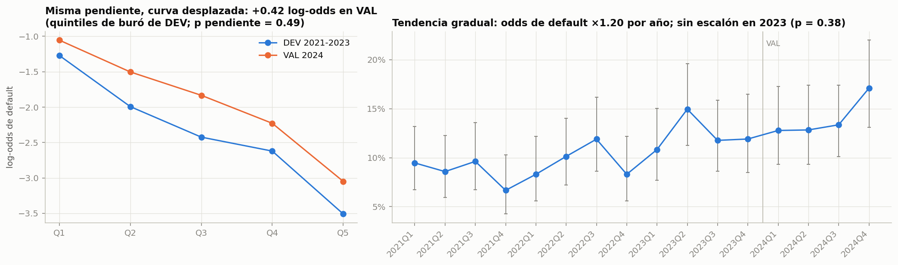
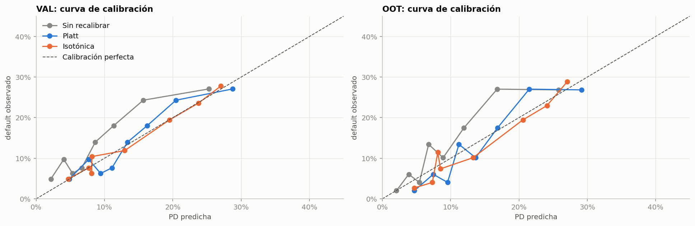
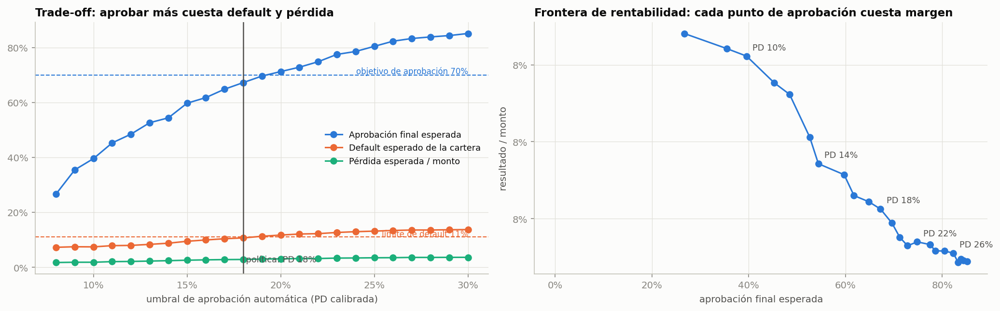
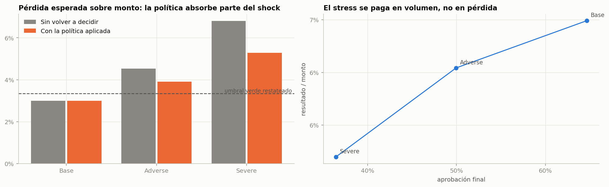
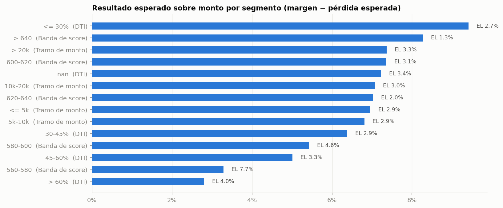
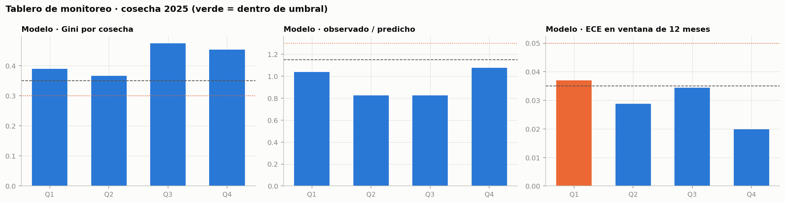

# Informe ejecutivo

## Sistema de scoring y política de crédito · Caso 15 · Caja Rural 360

**Para:** Gerencia de Riesgos y Comité de Riesgos
**De:** Equipo de Credit Risk Analytics
**Fecha:** 2026-09-20 · **Versión:** 1.0
**Producto:** microcrédito rural amortizable, sin garantía, para trabajadores independientes con ingresos parcialmente en efectivo

*Documento generado desde los artefactos del modelo (`python -m src.execreport`). Todas las cifras provienen de las tablas
de resultados y de los artefactos versionados; ninguna se transcribió a mano. El detalle metodológico está en el documento
técnico y la evidencia archivo por archivo, en el anexo de trazabilidad.*

---

## 1. Resumen ejecutivo

**El encargo.** Construir el sistema de decisión de crédito del microcrédito rural: estimar la probabilidad de
incumplimiento, integrarla con exposición y severidad, y convertirla en una política de originación que permita crecer
fuera de agencias **sin excluir a quien no tiene trazabilidad bancaria**.

**Lo que recomendamos.** Aprobación automática cuando la probabilidad de default calibrada no supera **18%**, rechazo por
encima de **20%**, contraoferta automática de monto cuando la cuota no cabe en el ingreso, y revisión manual solo para
cuatro situaciones verificables. En la cosecha 2025 esa política habría aprobado **64.6%**
de las solicitudes con **9.3%** de default esperado, frente a **81.6% y 13.4%** de la política
histórica.

**Qué compra la entidad con eso.** Unos 17 puntos menos de aprobación a cambio de **4 puntos menos de default** y una
pérdida esperada de **2.22%** sobre el monto colocado, dentro del apetito. La evidencia de que el
recorte es el correcto: las solicitudes que la política histórica aprobó y esta no aprobaría automáticamente tenían
**19.4%** de default observado, el doble de las que se mantienen aprobadas
(9.8%).

**El costo, dicho de frente.** Prestar mejor implica prestar menos: la cartera colocada baja de
S/ 9.6 a S/ 6.2 millones y el resultado esperado cae, sobre todo si además se
adopta el pricing por riesgo propuesto. La sección 11 separa cuánto de esa caída es **selección** (decisión de riesgo) y
cuánto es **precio** (decisión comercial del Comité), porque son dos conversaciones distintas.

**Lo que no podemos prometer.** No existe un punto de corte que cumpla a la vez el objetivo de aprobación de 70% y el
límite de default de 11%. La política llega a **67.2%** de aprobación con
10.7% de default. Ese conflicto se resuelve con la regla de precedencia del apetito —el
límite de riesgo prevalece— y se trae al Comité con los números, no se disimula moviendo el corte.

**Tres decisiones que pedimos al Comité** (detalle en la sección 12):

1. Aprobar la política de decisión y sus umbrales.
2. Definir si se amplía la capacidad de verificación o se acepta una aprobación de 67%,
   y decidir el margen objetivo del pricing.
3. Aprobar el marco de gobierno: validación anual, monitoreo trimestral y las dos remediaciones previas al despliegue.

---

## 2. El producto y la cartera hoy

| | |
|---|---|
| Producto | Microcrédito amortizable, sin garantía, cuota fija |
| Cliente | Trabajador independiente rural, con parte del ingreso en efectivo |
| Volumen anual | 1,457 solicitudes en 2025 · S/ 9.6 millones desembolsados |
| Ticket y plazo medios | S/ 8,048 · 26 meses |
| Aprobación histórica | 81.6% en 2025 (82.6% en el periodo completo) |
| Canales | Agencia, app, web y alianzas |

La entidad quiere crecer fuera de agencias. El obstáculo no es la demanda: es decidir bien sin trazabilidad bancaria y
sin un asesor presente que compense con criterio. Eso es lo que este sistema resuelve.

**Una precisión sobre la base de análisis.** De las 7,000 solicitudes del periodo, el modelo se construye sobre las 5,783
que llegaron a tener resultado observable. Las 1,217 rechazadas **no se cuentan como buenas**: nunca se supo cómo habrían
pagado, y tratarlas como buenas habría inflado artificialmente el desempeño del modelo.

## 3. El punto de partida: qué está pasando con la cartera

La tasa de default a 12 meses subió de forma sostenida entre 2021 y 2024 (2021: 8.6%, 2022: 9.7%, 2023: 12.4%, 2024: 14.0%, 2025: 13.4%).

La pregunta importante no es *cuánto* subió, sino *por qué*, porque la respuesta cambia lo que hay que hacer:

- Si subió porque **llega otro tipo de cliente**, la solución es comercial: corregir la mezcla de originación.
- Si subió porque **el mismo cliente incumple más**, la solución es de riesgo: recalibrar el modelo y mover el corte.

Medimos ambas cosas. La composición de la población **no cambió** (los índices de estabilidad de las variables y del score
están en 0.01, cuando la alerta empieza en 0.10). Lo que cambió es el riesgo a igual perfil: a misma característica, la
probabilidad de incumplir es hoy más alta.

**Consecuencia para la gestión.** La calibración del modelo deja de ser un paso de cierre y pasa a ser un **control
permanente**: si no se recalibra, el sistema subestima el riesgo aproximadamente 30% y la entidad aprueba con información
vieja. Esto está incorporado en el monitoreo con un disparador explícito.

Un segundo hallazgo ordena el resto del trabajo: **la pérdida creció por frecuencia, no por severidad**. La proporción de
lo que se pierde cuando un cliente cae en default apenas se movió entre cosechas, mientras la tasa de default subió más de
5 puntos. La palanca de gestión es la probabilidad de incumplimiento, no la recuperación.

---

## 4. El modelo: qué se eligió y por qué

Se compararon seis alternativas bajo las mismas reglas: un scorecard tradicional, una regresión logística ampliada,
Random Forest, XGBoost y dos variantes de LightGBM. Todos con los mismos datos, la misma partición temporal y el mismo
veto de variables sensibles.

**Ganó el más simple: un scorecard de tres características** —score de buró, capacidad de pago después del crédito y
ahorro respecto del monto pedido—. No por preferencia estética:

| Criterio | Scorecard | Modelos de boosting |
|---|---|---|
| Capacidad de ordenar fuera de muestra (Gini) | **0.348** | 0.304 a 0.320 |
| Diferencia entre ajuste y realidad | 9 puntos | hasta 45 puntos |
| Tiempo de respuesta por 1,000 solicitudes | menos de 1 ms | 20 a 40 ms |
| Explicación al cliente | exacta, por puntos | aproximada, requiere librerías |

Los modelos complejos aprendían el ruido de 351 casos de incumplimiento: brillaban en los datos de ajuste y se caían en
los datos nuevos. El scorecard, en cambio, se sostiene: **Gini de 0.440 en desarrollo,
0.348 en validación y 0.424 en la cosecha 2025**, que nunca se usó para
construirlo.

**Qué mira el modelo.** El score de buró explica el 64% del puntaje, la capacidad de pago el 20% y el ahorro el 16%.
Son tres variables que un asesor puede explicar en una agencia y que un cliente puede entender y mejorar.

**Qué no mira.** Región, edad, distancia a la agencia, número de dependientes y proporción de ingreso en efectivo quedaron
fuera por decisión de diseño. Comprobamos además que el modelo **no puede reconstruirlas** a partir de lo que sí usa: no
hay discriminación indirecta por la puerta de atrás.

---

## 5. Qué tan bien funciona

**Ordena bien y de forma estable.** En la cosecha 2025, el 30% de solicitudes más riesgosas concentra el 56% de los
incumplimientos, y el 10% más sano incumple 2.5% contra 13.4% del promedio.

**Subestimaba el nivel, y se corrigió.** Antes de calibrar, el modelo predecía 9.9%
de default donde se observaba 14.0% en 2024 (razón observado/predicho de 1.41).
Se aplicó una corrección estadística estándar, ajustada con los datos de 2024 y probada contra 2025: después de corregir,
lo predicho y lo observado coinciden, con un leve sesgo conservador, que es el lado correcto para provisionar.

**Esto no es un detalle técnico.** Sin esa corrección, cada decisión de aprobación se toma con una probabilidad
subestimada en torno a 30%, y la pérdida esperada de la cartera se subestima en la misma proporción.

---

## 6. Equidad y trato al cliente

El caso pide crecer **sin excluir** a quien no tiene trazabilidad bancaria, así que medimos el impacto de la política por
territorio, ruralidad, informalidad del ingreso, edad y canal.

**Lo bueno.** El score no es un sustituto encubierto de ninguna de esas variables: a partir de lo que el modelo usa no se
puede predecir la región (acierto equivalente al azar) ni la informalidad del ingreso. Por territorio, las regiones que el
caso quiere incluir son hoy **las más aprobadas**, corrigiendo el sesgo de la política histórica.

**El punto a gestionar.** El quintil de clientes con mayor proporción de ingreso en efectivo recibe aprobación automática a
una tasa de **0.74** respecto del grupo más favorecido, por debajo del 0.80 que se usa como alerta. La diferencia no
viene de castigar la informalidad —esa variable no está en el modelo— sino de que ese grupo tiene más carga de deuda y un
default observado de 19.4%. Es una diferencia de riesgo, no de trato.

**Aun así, hay que actuar.** Casi la mitad de los **buenos** clientes de ese segmento no queda aprobada en automático. La
política ya prevé el camino: verificación de ingreso en lugar de rechazo, con lo que el indicador sube a 0.93. La palanca
no es cambiar el modelo, es **hacer barata y rápida la verificación**: visita de campo, evidencia de ventas o movimientos
de billetera digital. Eso convierte revisiones en aprobaciones y es exactamente el objetivo del caso.

---

## 7. La política de crédito recomendada

La decisión no depende solo del score. El orden es el siguiente:

1. **Falta información** (sin score de buró o sin ingreso declarado) → **revisión**, nunca rechazo automático: si el
   insumo principal está imputado, la probabilidad estimada no es confiable.
2. **Riesgo fuera del apetito** (PD calibrada ≥ 20%) → **rechazo**.
3. **Verificación obligatoria** (monto sobre S/ 20,000, o ingreso mayormente en efectivo con ticket alto) → **revisión**.
4. **La cuota no cabe en el ingreso** → **contraoferta automática de monto** hasta que la carga quede en 45% del ingreso,
   recalculando la probabilidad con el monto ofrecido. Exceder la capacidad no manda a analista: dispara una contraoferta.
5. **Zona gris** (PD entre 18% y 20%) → revisión. **El resto** → aprobación automática.

**Cómo se reparte la cartera** (cosecha 2024):

| Salida | Participación | Comentario |
|---|---|---|
| Aprobación automática | 53.3% | de las cuales 12% con contraoferta de monto |
| Revisión manual | 23.2% | casi toda por reglas verificables, no por dudas del modelo |
| Rechazo | 23.5% | riesgo fuera del apetito |

En los aprobados, el sistema ofrece en promedio el **90% del monto pedido**: es
el mecanismo que permite decir que sí con menos exposición, en lugar de decir que no.

**Pricing por riesgo.** La tasa se arma sumando costo de fondos, gasto operativo, prima de riesgo y margen objetivo. En las
bandas que se aprueban va de **18.2% a 22.9%**, frente a 25.4% a 32.1% que cobraba la política histórica. Es decir, el
modelo permite **cobrar menos a los buenos clientes** y sostener el margen por riesgo medido. La contrapartida es directa:
el margen sobre monto cae de 22.0% a 10.3% a lo largo de la vida del crédito. La fórmula fija el piso; **el precio final es
una decisión comercial del Comité**.

---

## 8. Cómo se decide un caso concreto

Tres solicitudes reales de la cartera, tal como las resuelve el sistema hoy:

| | Aprobado | Revisión | Rechazado |
|---|---|---|---|
| Score | 620 | 635 | 573 |
| Probabilidad de default | 8.7% | 6.1% | 24.6% |
| Monto pedido | S/ 4,411 | S/ 6,386 | S/ 5,507 |
| Monto ofrecido | S/ 4,300 | S/ 6,386 | — |
| Tasa | 24.1% | 18.0% | — |
| Razones | Score de buró bajo · Carga de deuda post-crédito alta frente al ingreso | Ahorro bajo frente al monto solicitado · Ingreso no informado: capacidad de pago no verificable | Score de buró bajo · Ahorro bajo frente al monto solicitado |

Tres cosas que muestran estos casos:

- **El aprobado recibe una contraoferta, no un rechazo.** Pidió más de lo que su cuota resiste, así que el sistema le
  ofrece un monto menor en lugar de negarle el crédito.
- **El de revisión no es un cliente malo.** Su probabilidad de default es baja; lo que falta es el ingreso declarado.
  La razón lo dice de forma explícita, para que el analista sepa qué verificar en lugar de revisar todo de nuevo.
- **El rechazado recibe una explicación exacta.** Los puntos que pierde por cada característica suman su score: la carta
  de rechazo se puede reconstruir con una tabla, sin depender de una caja negra.

## 9. Impacto esperado

**Contra la política histórica, en la cosecha 2025:**

| | Aprobación | Default | Pérdida esperada |
|---|---|---|---|
| Política histórica | 81.6% | 13.4% | 3.7% |
| **Política propuesta** | **64.6%** | **9.3%** | **2.2%** |

**Quién entra y quién sale** (cosecha 2024):

| Grupo | Participación | Default observado |
|---|---|---|
| Se mantienen aprobados | 46.9% | 9.8% |
| **Salen** (aprobados antes, ahora no automáticos) | 35.9% | **19.4%** |
| **Entran** (rechazados antes, ahora califican) | 6.3% | — |

El grupo que sale duplica el default del que se mantiene: el recorte no es al azar, ataca la parte de la cartera que
explicaba la pérdida. Y entra un 6.3% de solicitantes que la política anterior rechazaba, en
línea con el objetivo de inclusión.

**Dónde crecer.** La capacidad de pago es la dimensión que más separa rentabilidad: con carga de deuda hasta 30% del
ingreso el resultado es 9.4% sobre monto, contra
2.8% cuando supera el 60%. En cambio, **el tamaño del crédito y la región no
separan rentabilidad**: todos los tramos rinden parecido. El crecimiento sano está en clientes con holgura de cuota, no en
tickets grandes ni en una región en particular.

---

## 10. Pérdida esperada, capital y escenarios

La pérdida esperada integra tres piezas: probabilidad de default, exposición al momento del incumplimiento
(42% del monto) y severidad (69% de lo expuesto, descontada por el tiempo
de recuperación).

**Una precisión contable que cambia el número.** La severidad registrada no descuenta los doce meses que toma recuperar.
Al descontarla —como exigen los estándares de provisiones— sube de 61.6% a
68.6%, y la pérdida esperada sube en la misma proporción. Adoptamos esa base **y restateamos en ella el
umbral del apetito**, de 3.0% a 3.34%: cambiar la métrica sin cambiar el umbral rompería el semáforo por definición y no
por riesgo. Mirado así, la política histórica ya venía incumpliendo el límite en 2024.

**Los tres escenarios** (shocks anclados a lo observado en la propia cartera, no a supuestos redondos):

| Escenario | Qué supone | Aprobación | Default | Pérdida esperada | Capital |
|---|---|---|---|---|---|
| **Base** | nivel de riesgo actual | 64.7% | 10.7% | 2.99% | 9.5% |
| **Adverso** | dos años más del deterioro observado | 50.0% | 12.5% | 3.91% | 10.2% |
| **Severo** | el peor trimestre observado, sostenido | 36.5% | 14.6% | 5.28% | 11.5% |

**El resultado más relevante para la gestión: la política se defiende sola.** Como el corte está expresado en probabilidad
calibrada y no en un puntaje fijo, un deterioro del entorno **reduce automáticamente la originación**. En el escenario
severo la aprobación cae sola de 64.7% a 36.5%
y la pérdida esperada queda en 5.28% en lugar de
6.80% que habría tenido una cartera congelada. Son
**1.5 puntos de pérdida absorbidos** por el diseño.

La contrapartida honesta: **el estrés se paga en volumen**. El resultado sigue positivo en los tres escenarios, pero el
negocio se achica casi a la mitad en el severo.

---

## 11. El caso económico, en soles

Hasta aquí las cifras van sobre el monto colocado. Traducido a soles sobre la cosecha 2025, el panorama es este —y trae una
conversación que el Comité tiene que tener:

| Escenario | Monto colocado | Margen | Pérdida esperada | Resultado |
|---|---|---|---|---|
| Política histórica | S/ 9,627,980 | S/ 2,049,039 | S/ 360,997 | **S/ 1,688,042** |
| Política propuesta, cobrando la tasa histórica | S/ 6,176,001 | S/ 1,344,112 | S/ 184,713 | **S/ 1,159,399** |
| Política propuesta con el pricing por riesgo propuesto | S/ 6,176,001 | S/ 616,443 | S/ 184,713 | **S/ 431,731** |

**Hay que decirlo con claridad: la política propuesta reduce la pérdida, pero también reduce el resultado.** Y conviene
separar los dos efectos, porque son dos decisiones distintas:

- **Efecto selección** (prestar a menos gente, mejor elegida): S/ -528,642.
  Se evitan S/ 176,285 de pérdida esperada, pero se deja de colocar S/ 3,451,980.
  La pérdida por sol prestado baja de 3.75% a 2.99%.
- **Efecto precio** (cobrar según riesgo, con margen objetivo de 5%): S/ -727,668.
  Es una decisión **comercial**, no técnica: el modelo fija el piso de la tasa, no el precio.

**Cómo leerlo.** La entidad venía cobrando tasas muy por encima de lo que su propio riesgo exige, y financiando así una
selección deficiente. El sistema permite dos caminos: trasladar esa mejora al cliente en forma de tasa más baja —lo que
apoya el objetivo de inclusión y competitividad, pero cuesta margen— o conservar parte del precio actual y quedarse con la
mejora. **Recomendamos una posición intermedia**: adoptar la estructura de pricing por riesgo, que es la que corrige la
injusticia de cobrarle igual a un cliente bueno que a uno malo, y calibrar el margen objetivo con el Comité en función de
la competencia, no del modelo.

Tampoco hay que perder de vista lo que no aparece en esta tabla: la política histórica estaba **fuera del apetito de
riesgo** en 2024, y la propuesta está dentro. Parte de ese resultado histórico era prestado.

## 12. Decisiones que pedimos al Comité

| # | Decisión | Opciones | Nuestra recomendación |
|---|---|---|---|
| 1 | Aprobar la política y sus umbrales | Adoptar / ajustar / no adoptar | **Adoptar**, con las dos remediaciones de la sección 13 antes del despliegue |
| 2 | Conflicto crecimiento-riesgo | Aceptar 67% de aprobación · ampliar capacidad de verificación · revisar el apetito | **Aceptar** el nivel actual y evaluar ampliar verificación, que es la única palanca que suma aprobación sin subir el riesgo |
| 3 | Capacidad de revisión | Hoy 20%, la política necesita 23% | Priorizar por valor esperado y medir el cumplimiento del plazo de respuesta durante el primer trimestre |
| 4 | Margen objetivo del pricing | 5% (propuesto) o mantener niveles históricos | Decisión comercial: la fórmula fija el piso, el Comité fija el precio |
| 5 | Base de provisiones | Contable o económica (descontada) | **Económica**, con el umbral del apetito restateado a 3.34% |
| 6 | Marco de gobierno | Validación anual y monitoreo trimestral | **Aprobar**, con reporte trimestral de semáforos al Comité |

---

## 13. Riesgos y condiciones para el uso

Una validación independiente simulada revisó todo el trabajo y levantó **10 hallazgos**, de los cuales
**2 son de severidad alta y deben remediarse antes del despliegue**:

| Id | Hallazgo | Por qué importa | Responsable |
|---|---|---|---|
| V-01 | La exposición al default no es coherente con el calendario de amortización | El factor de exposición de 0.415 puede estar sesgado; afecta pérdida esperada, pricing y provisiones | Dueño del dato + Analytics |
| V-02 | La calibración envejece rápido y el modelo subestima el riesgo sin corrección | Sin recalibración vigente, la PD subestima ~30% y la pérdida esperada de la cartera queda subestimada igual | Analytics |

Los restantes son de severidad media o baja, todos con responsable y plazo asignado: capacidad de revisión por encima de
lo declarado, supuesto no validado sobre el resultado de las revisiones manuales, concentración en un único proveedor de
información externa (el buró explica el 64% del puntaje) y el hecho de que los datos del caso son sintéticos, por lo que
**todo el marco debe revalidarse con datos reales antes de un uso productivo**.

**La conclusión de la validación fue: apto para uso con condiciones.** La metodología es sólida y reproducible; los
hallazgos se concentran en calidad del dato, vigencia de la calibración y supuestos operativos, no en la construcción del
modelo.

---

## 14. Gobierno y monitoreo

**Clasificación.** El modelo decide sobre el 100% de las solicitudes y resuelve sin intervención humana cerca del 77%, así
que se clasifica en la categoría de mayor materialidad: **validación independiente anual, monitoreo trimestral y reporte al
Comité**. Que el modelo sea simple no reduce su materialidad; lo que pesa es qué decide y sobre cuánta cartera.

**Quién responde.** Analytics construye y opera el monitoreo; Riesgos y la validación independiente desafían y aprueban los
cambios de modelo; Auditoría comprueba que todo sea reproducible y trazable. Cada decisión de crédito queda registrada con
identificador único y la versión exacta de modelo, calibración y política que la produjo.

**El semáforo del apetito con la política propuesta (cosecha 2024):**

| Métrica | Tipo | Verde | Política | Estado |
|---|---|---|---|---|
| Aprobación final | Objetivo de negocio | ≥ 70% | 67.2% | No cumple: se escala al Comité |
| Default 12m de la cartera | Límite de riesgo | ≤ 11% | 10.7% | Cumple |
| Pérdida esperada / monto | Límite de riesgo | ≤ 3% (3.34% en base económica) | 2.86% | Cumple |
| Revisión manual | Restricción operativa | ≤ 20% | 23.2% | Excede: se prioriza por valor esperado |

**Los trece indicadores de monitoreo, por bloque:**

| Bloque | Indicadores | Ejemplo de umbral y acción |
|---|---|---|
| Datos | PSI del score, PSI por variable, faltantes de buró, variación de volumen | PSI > 0.10: investigar el cambio de mezcla antes de tocar el modelo |
| Modelo | Gini, KS, observado/predicho, error de calibración en ventana de 12 meses | Observado/predicho fuera de [0.85, 1.15] dos meses: recalibrar |
| Negocio | Aprobación, default de la cosecha, pérdida esperada, cola de revisión, AIR por región y por efectivo | Pérdida esperada > 3.89%: recortar la banda 580-600 y escalar al Comité |

**Qué se vigila.** Trece indicadores separados en tres bloques —datos, modelo y negocio—, cada uno con umbral y **acción
asignada**. El orden de las acciones no es negociable: primero calibración, después punto de corte y solo al final
reentrenamiento, porque la evidencia dice que en esta cartera el problema suele ser de nivel y no de ordenamiento.

**Alerta temprana.** El desempeño del modelo solo puede medirse con cosechas cerradas, y el resultado de una solicitud de
enero se conoce en enero del año siguiente. Por eso el monitoreo de **datos** es diario y mensual: es la única señal
anticipada disponible.

---

## 15. Hoja de ruta

| Plazo | Acción | Responsable |
|---|---|---|
| Antes del despliegue | Remediar los 2 hallazgos de severidad alta | Analytics y dueño del dato |
| Antes del despliegue | Definir el plan de contingencia si el buró no responde | TI y Riesgos |
| Semanas 1 a 4 | Integrar el servicio al canal de originación y capacitar a los asesores en las razones de decisión | TI y Negocio |
| Primer trimestre | Medir la tasa real de aprobación en revisión manual y recalcular la proyección de volumen | Operaciones |
| Trimestral | Semáforos de monitoreo y recalibración si se dispara el umbral | Analytics y Riesgos |
| Anual | Validación independiente completa y revisión del apetito | Validación y Comité |

---

## 16. Anexo de cifras

**Desempeño del modelo campeón:**

| Muestra | Periodo | Gini | KS | Observado/predicho antes de calibrar |
|---|---|---|---|---|
| Desarrollo | 2021-2023 | 0.440 | 0.331 | 1.00 |
| Validación | 2024 | 0.348 | 0.298 | 1.41 |
| Fuera de tiempo | 2025 | 0.424 | 0.338 | 1.31 |

**Parámetros de la política y de la pérdida esperada:**

| Parámetro | Valor | Origen |
|---|---|---|
| Corte de aprobación automática | PD calibrada ≤ 18% | Curva de trade-off sujeta al apetito |
| Corte de rechazo | PD calibrada > 20% | Curva de trade-off sujeta al apetito |
| Tope de carga de deuda para aprobación automática | 45% del ingreso | Política de crédito |
| Tope con validación del analista | 60% del ingreso | Política de crédito |
| Exposición al default | 41.5% del monto | Estimación sobre 671 incumplimientos |
| Severidad (descontada) | 68.6% | Estimación descontada a la tasa de la política |
| Umbral de pérdida esperada (verde) | 3.34% | Apetito restateado a base económica |

**Indicadores de monitoreo:** 13 indicadores en tres bloques (datos, modelo y negocio), cada uno con
umbral y acción asignada. Detalle en `reports/15_monitoring.md`.

---

## 17. Las seis preguntas del Caso 15, respondidas

El enunciado del caso fija seis preguntas mínimas. Esta es la respuesta corta de cada una; el desarrollo está en la
sección indicada.

| Pregunta | Respuesta | Sección |
|---|---|---|
| ¿Qué población se atiende automáticamente y cuál pasa a revisión manual? | 53.3% automático, 23.2% a revisión por reglas verificables y 23.5% rechazo. Sin score de buró o sin ingreso declarado nunca hay rechazo automático. | 7 |
| ¿Qué variables explican el riesgo y cuáles no deberían usarse aunque mejoren una métrica? | Explican: buró, capacidad de pago post-crédito y ahorro sobre monto. Vetadas: región, edad, distancia, dependientes e ingreso en efectivo, incluso para los modelos challenger. | 4 |
| ¿Cuál es el Champion y por qué es superior de forma integral? | El scorecard de tres características: mejor discriminación fuera de muestra, menor sobreajuste, explicación exacta al cliente y latencia de sub-milisegundo. | 4 |
| ¿Qué cut-off, reglas y límites cumplen el Risk Appetite? | PD calibrada ≤ 18% automático y > 20% rechazo; DTI post-crédito 45% con contraoferta y 60% como tope con validación. Cumple los límites de riesgo; el objetivo de aprobación se escala al Comité. | 7 y 12 |
| ¿Cómo cambia la decisión al incorporar EAD, LGD, Expected Loss y stress? | Con base económica de LGD y umbral restateado, la cartera queda en 2.22% de pérdida. En el escenario severo la aprobación cae sola a 36.5% y la política absorbe 1.5 puntos de pérdida. | 10 |
| ¿Cómo se desplegaría, monitorearía y gobernaría en producción? | API con interfaz y artefactos versionados con hash, 13 indicadores de monitoreo con acción y responsable, materialidad Tier 1 con validación anual y 10 hallazgos con plan de remediación. | 11 y 14 |

---

## 18. Glosario mínimo

| Término | Qué significa aquí |
|---|---|
| **PD** | Probabilidad de que el crédito llegue a 90 días de mora dentro de 12 meses |
| **Calibración** | Ajuste para que la probabilidad estimada coincida con el default que realmente ocurre |
| **Gini / KS** | Medidas de cuán bien el modelo separa a quien incumple de quien paga |
| **EAD** | Cuánto se debe en el momento del incumplimiento, como fracción del monto prestado |
| **LGD** | Qué proporción de lo expuesto se pierde después de la recuperación |
| **Pérdida esperada** | PD × EAD × LGD: la pérdida promedio anticipada de la cartera |
| **Apetito de riesgo** | Los límites que la entidad se fija y el objetivo de negocio que persigue |
| **Swap-in / swap-out** | Solicitudes que entran o salen al cambiar de política |

---

## 19. Dónde está cada cosa

| Documento | Para qué sirve |
|---|---|
| `reports/documento_tecnico.md` | Desarrollo completo: decisiones, supuestos, métricas y limitaciones |
| `reports/16_anexo_trazabilidad.md` | Cada requisito contra el archivo que lo evidencia, verificado |
| `reports/independent_validation_report.md` | Los 10 hallazgos con evidencia y plan de remediación |
| `models/model_card_scorecard_pd.md` | Ficha del modelo: qué hace, qué no debe hacer y quién responde |
| `reports/dashboard_cartera.html` | Tablero de cartera, segmentos y escenarios |
| `reports/dashboard_monitoreo.html` | Tablero de monitoreo con semáforos y acciones |
| `http://localhost:8000/` | Servicio de scoring con interfaz para evaluar una solicitud en vivo |
